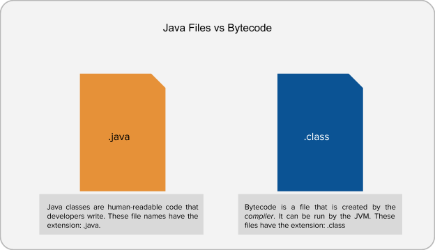
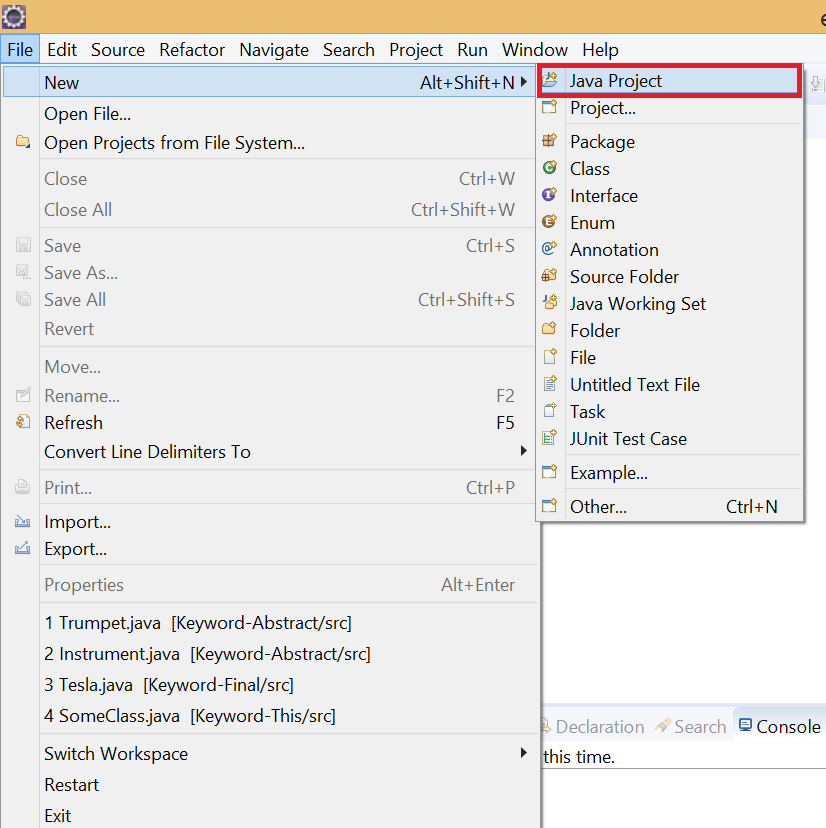
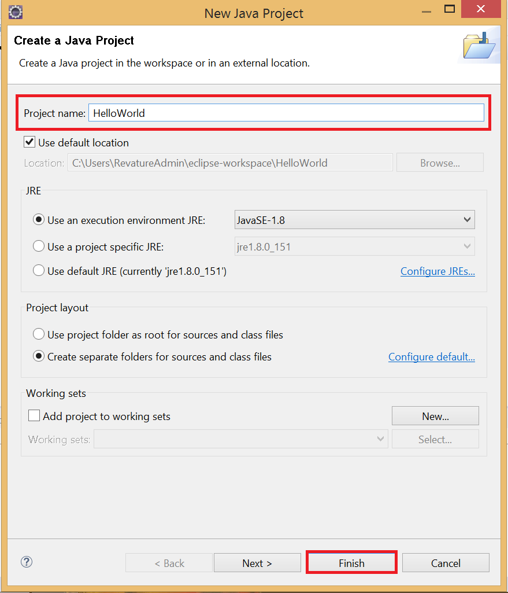
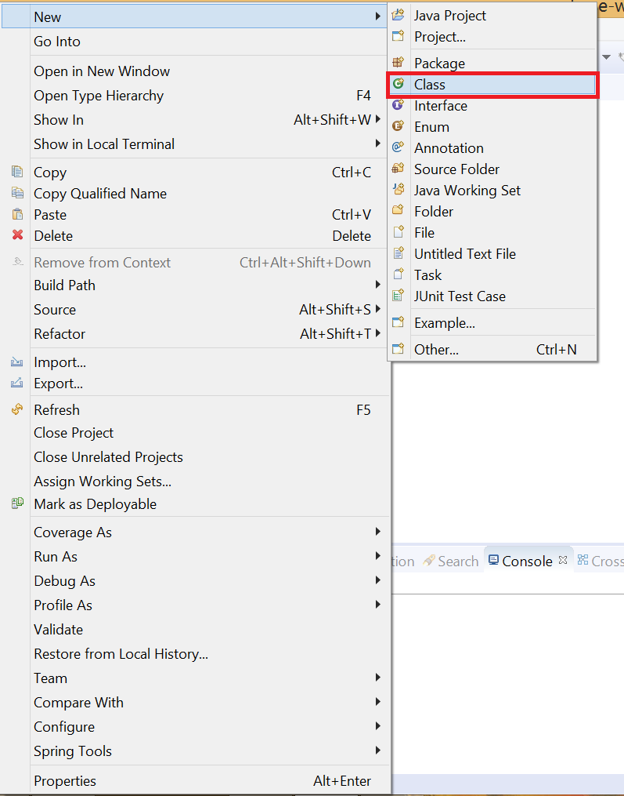
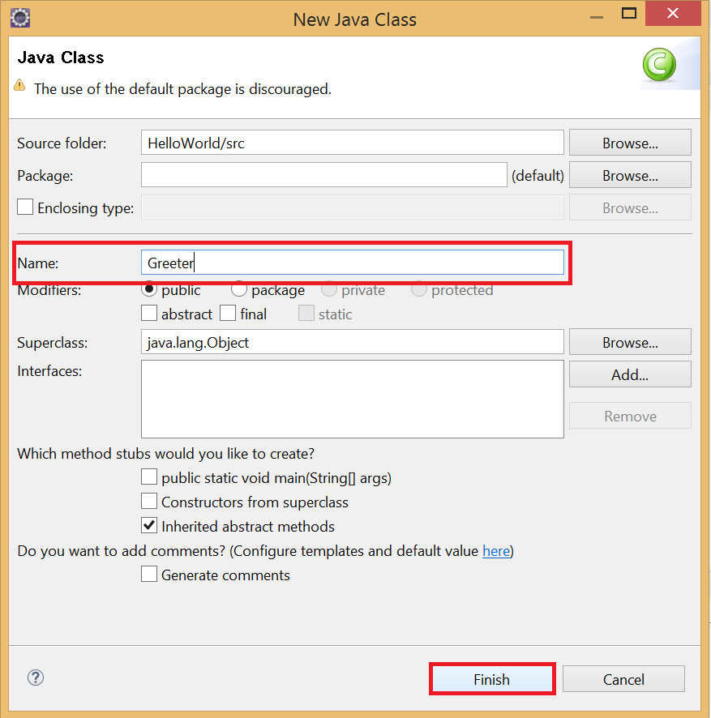
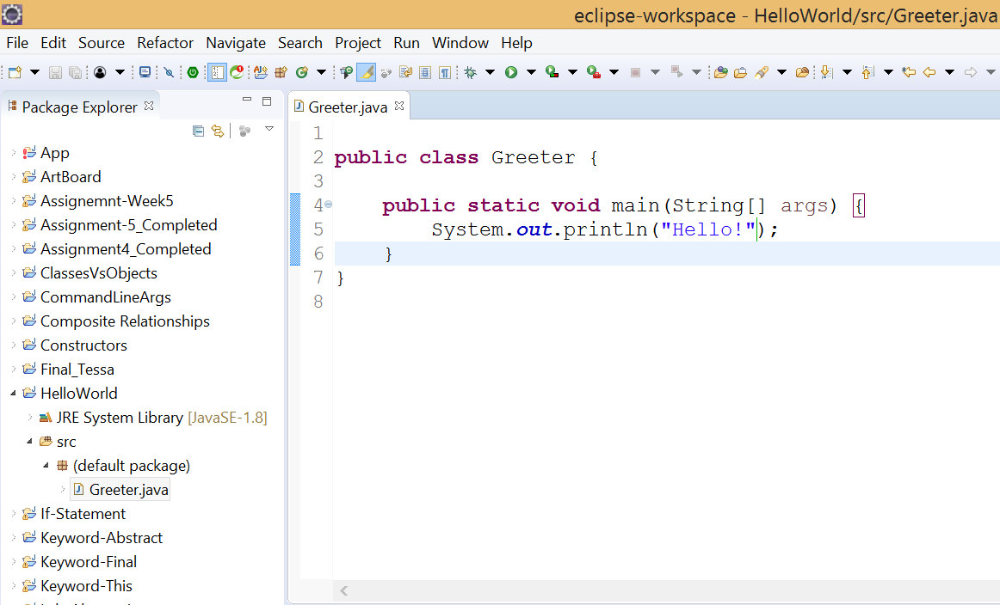
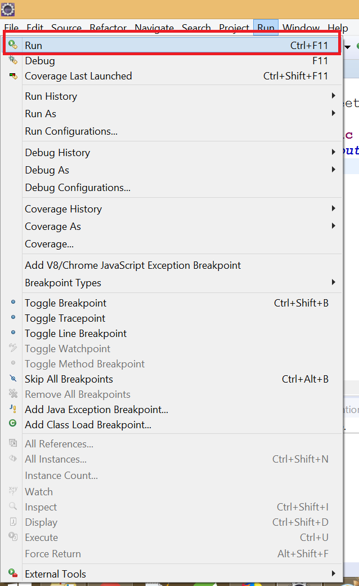
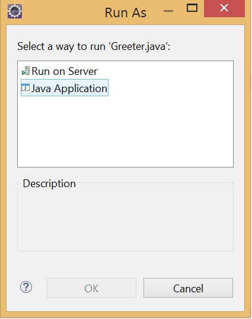
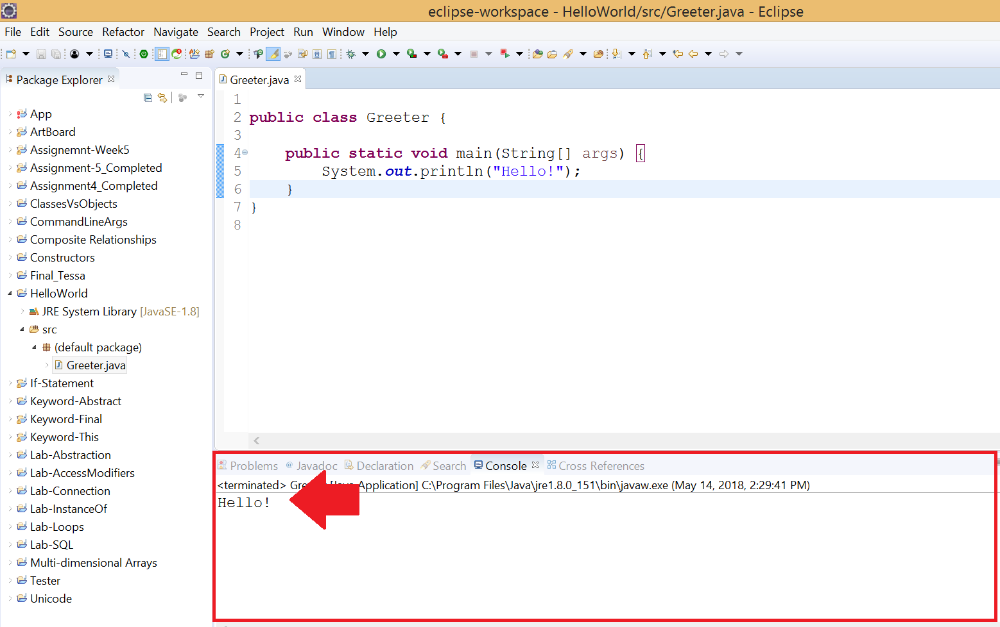

# Lab: Edit, Compile, Execute

## Objectives
- To understand the process of a program from beginning to end from the perspective of the developer

**NOTE**: If you followed along the Writing Java Code video, then you can skip this activity.

## The Process of Writing a Program

As you’ve seen in the video already, a program has different steps in the process of writing and executing it.

The first thing you should understand is that you write Java class files. These files have the extension of .java. Your IDE (Eclipse is our choice), will handle adding the extension to your classes. All you have to do is provide the name of the class.

The second thing in your programs is that you must define a main method for all classes that you run directly. In the first half of this course, all of your files will have main methods. It will not be until later, when we have projects with multiple files where some will not define their own main method.

> ***NOTE**:*
>
> *You’ll learn later that we can create classes without main methods and still run its code. For now, think of the main method as the entry point into your program, a START HERE sign.*

After, you’ve written your class file, it needs to be compiled. Again, this is something that your IDE does for you automatically. It will translate the .java file into bytecode which is the .class file that is understood by the Java Virtual Machine (JVM). Think of the JVM as a program that can read .class files and talks to your operating system and tells it what to do.



Typically, to run a .class file, you would type the following statement in a command line or terminal:

```bash
java ClassName
```

Of course, what does Eclipse do? It’ll do that for you once you click the little run button. See why developers use IDEs like Eclipse?

That’s the entirety of the process to create a small Java program and running it.

---

#### Opening Eclipse
So let’s go over the creation, compilation and execution of a Java program together.

First. Open Eclipse (double-click the eclipse.exe program). Eclipse will be in the location on your computer where you downloaded it.

On first time, your Eclipse will ask you to choose a workspace. Go ahead and select the default location and click the checkbox to use this as your default workspace.

After several moments, Eclipse will open and take you to your workspace.

#### Creating a new Java Project
The next thing to do is to create a new Project. A project will handle all of the files under one roof for you. For large applications, you may have one or more projects with hundreds of classes. For the purpose of this class however, we’ll typically only write a handful of classes per project.

There are multiple ways to create a project. The easiest is to goto **File** under the top menu bar and select **New** and then select **Java Project** from there.

From there, another dialog will appear. Here you can provide the name of your new class. Type in HelloWorld (no spaces) and then click the Finish button.



> ***NOTE**: You cannot have names that have spaces in them.*




#### Creating a new Java Class

You should now see your new project in the panel on the left-hand side of the screen.

Right-click your new project and select New > Class from the dialog that pops up.



In the New Java Class Dialog, type in the name of your class that you wish to run. Let’s make it Greeter. Afterwards, just click the Finish button.



Eclipse will now create the default information that goes with a class. You will be free to click inside the Editor window that will display and edit the contents of your new class.

#### Editing your Class File

To edit your class’s contents, left-click anywhere inside of the editor window. A cursor will display just like a text editor program. Type out the following code as you see it below, so that your class looks exactly like it.



Save the file, by going to Edit > Save or using the shortcut keys (Ctrl +S \ Cmd + S).

#### Running your Program
Now that you have your class setup AND it has a main method, you can run it. There are multiple ways to run a class. One way is to select **Run** from the top menu bar and then select Run.



Afterwards, a dialog may display asking whether you wish to run it on the server or as a Java Application. As we aren’t using any servers, you should always select **Java Application**.



After a moment, Eclipse will execute your code and the phrase “Hello” will print to the console.



That’s it for this exercise.