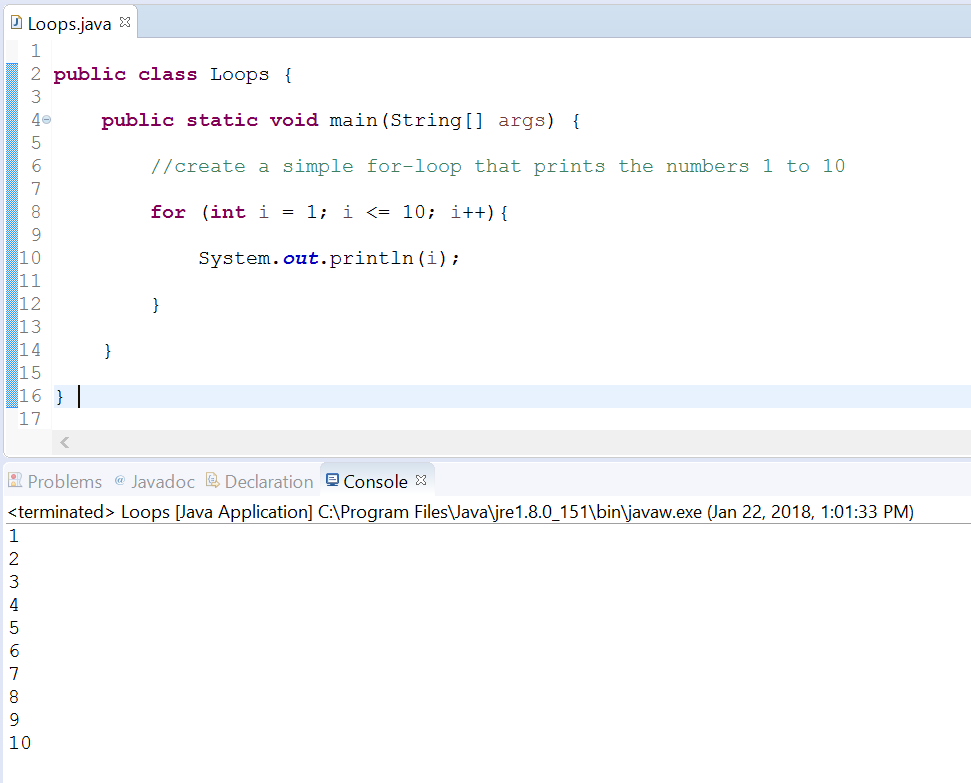

# For-Loop

## Background

In this exercise, you'll practice creating a for-loop.  

You'll learn its specific syntax and how to use it to generate a list of numbers.

Recall that a for-loop has the following syntax:

```java
for (declaration statement; condition statement; increment statement) {
    //enclosed statements
}
```

### Declaration statement

In the _declaration statement_, you typically declare a variable to loop over. Most loops will declare a new variable and assign it a value.  

Example declaration statement:

```java
int i = 0;
```

### Condition Statement

All for-loops must specify a _condition statement_ which is checked during each iteration to decide whether to continue executing the enclosed statements or not.

You'll typically use the variable that you defined in the declaration statement in your condition statement.

Example condition:

```java
i < 10;
```

### Increment Statement

The _increment statement_ is a statement that is executed at the end of each iteration of the for-loop. Typically, you'll increment (or decrement) your variable that you defined in the declaration statement by some amount.  

Example increment statement

```java
i++
```

> You don't need to place a semi-colon at the end of the _increment statement_ of a for-loop.

## Instructions

Now that you have some background on the different parts of a for-loop, we'll guide you through creating a class that uses one.  

We'll create a loop that counts from 1 to 10, inclusively, and prints the number during each iteration.

### Project Setup

1. Open your IDE (Eclipse), and select File > New > Java Project.    
2. Provide the name, Lab-ForLoops and click OK.    
   a. Don't create a module if your IDE asks for one. 
3. Right-click on the project and select New > Class.
4. Provide the name **Loops** for the class and click Finish. Open the class file and edit its contents to specify the following:
    
```java
public class Loops {

    public static void main(String[] args) {
    	//create a simple for-loop that prints the numbers 1 to 10     
    	for (int i = 1; i <= 10; i++){
    		System.out.println(i);
        }
    }
}
```

Excellent. Save the file and run the project as a Java Application. 

You'll see output like the following:



You can see that with our usage of a for-loop we printed the numbers 1 through 10 by using only 3 lines of code (ignoring our class setup).

One important note is that we used the variable, `i` (which we defined in our declaration statement) _inside_ of our loop. Because the _increment statement_ increases the value by one each time, we are effectively counting from 1 to 10 and storing that value in the variable `i` during each iteration of the loop. So that's why we used it _inside_ the loop and printed its value? 

This brings us to an interesting question. Can you use that same variable `i` _outside_ of the for-loop?

The answer is no. 

We cannot use our variable outside of the loop because it does not exist there. We defined the variable as _part of the for-loop_. It is said to have only that _scope_ and therefore cannot be accessed outside of its scope or outside of the for-loop. 

If you're still trying to understand how our for-loop works, then you can review the following table which walks through the steps that our program takes when using a for-loop.

Steps of the for loop
| Step | Statement | Description |
| ---- | --------- | ----------- |
| 1    | `for (int i = 1; i <= 10; i++ ){` | This line of code defines the initial setup of our for-loop. <br/><br/>3 things are actually happening:   <br/>1 The variable `i` is created and assigned a value of 1. <br/> 2. We then test if `i` is less than or equal to 10. It evaluates to true (1 is less than 10), so we'll begin executing the lines inside of the for-loop. <br/>3. We then create our increment statement `i++`. This line will execute _after_ all other lines inside of our for-loop have executed once. <br/><br/>The current value of `i` is 1. |
| 2 | `System.out.println(i);` | This line will display the current value of `i` to the console. <br/><br/>The current value of `i` is 1; thus, 1 is printed to the console. |
| 3 | `}` | Our for-loop has now executed all enclosed statements. It will next run the _increment_ statement (`i++`).<br/><br/>The current value of `i` is now 2. |
| 4 |  | After one complete run or iteration of the for-loop we now check the condition (`i <=_ 10`).<br/><br/>The condition evaluates to true (since 2 is less than or equal to 10) . We will begin our execution of all enclosed statements. |
| 5 | `System.out.println(i);` | This line will output to the console the current value of `i`. <br/>The current value of `i` is 2; thus, 2 is printed to the console.|
| 6 | | Our for-loop has executed all enclosed statements. It will now run the increment statement (`i++`) again. <br/><br/> The current value of `i` is now 3. |
| ... |  | Our program will continue looping through the code until `i` no longer satisfies the condition. This happens when `i` is equal to 11. |
| ...  |  | At this point, when `i` is equal to 11, the condition statement fails. 11 is **not** less than or equal to 10. <br/> The loop will now exit and the Java program will execute any lines after the closing parentheses of the for-loop. As part of its cleanup, any variables declared inside of the for-loop or as part of the _declaration statement_ are now erased. |


This concludes the lap.