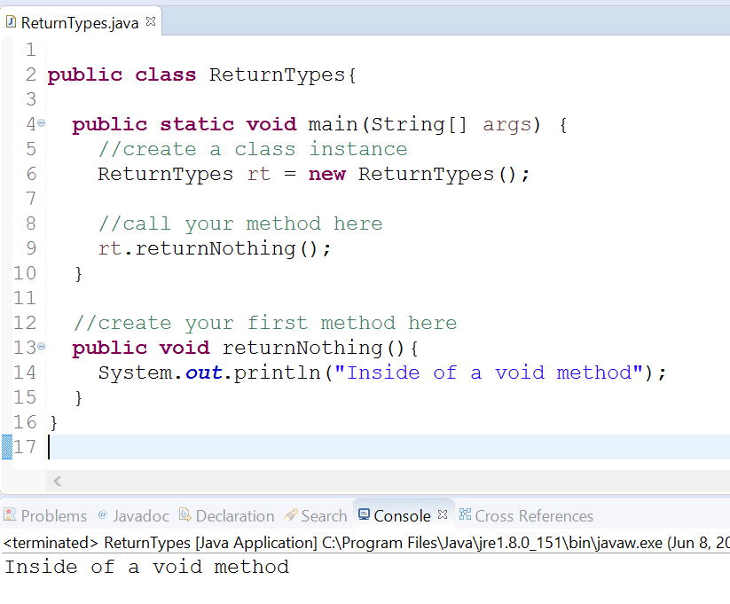
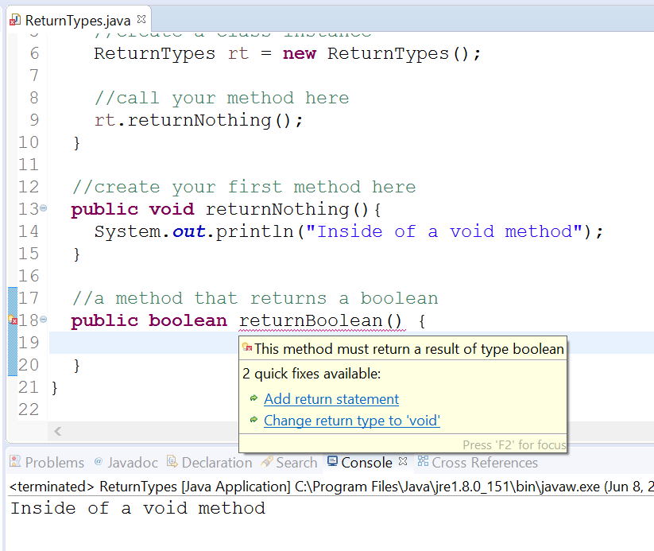
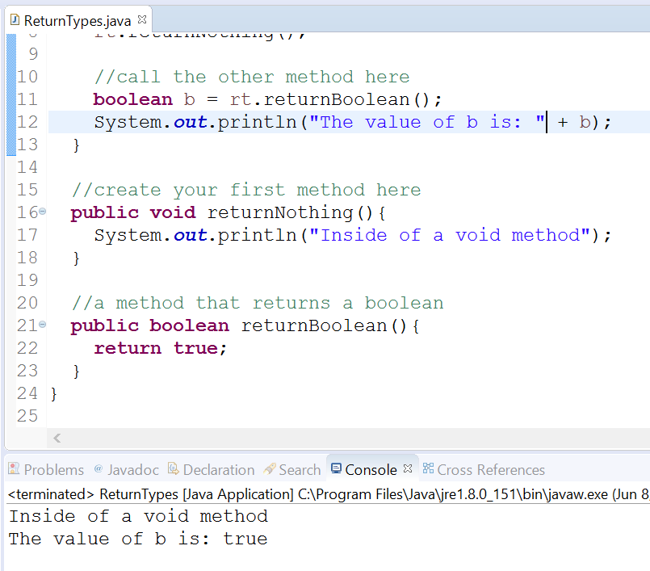

# Methods with Return Types

## Objectives

* Explore how write simple methods with return types
    
## Background

In this exercise, you'll practice writing a simple method that returns data in your class.

Most often, you'll write a method to compute a value based on given inputs. The computed value is said to be _returned_ from that method. In this lab, we'll walk you through writing a method in your class and how to call it from the `main()` method.

A method has several parts:

*   modifier
*   return\_type
*   methodName
*   parameters
*   exceptions
*   method body
    
Methods resemble the following format:

```java
modifier return_type methodName(parameters) exceptions {
    //method body
}
```

## Return Type

The return type is a specified data type that your method will return. It can be any primitive (`boolean`, `int`, `char`, etc.) or class type (ex. `String`).

If your method doesn't return anything, you must use the keyword **void** as the return type.

## Guided Practice

Now that you have some background on the basics of methods, let's write a few together. 

### Project Setup

Open your IDE (Eclipse), and select File > New > Java Project.

Provide the name, Lab-MethodReturnType and click OK.

Right-click on the newly created project and select New > Class.

Provide the class the name, ReturnTypes and click OK.

Now edit the file so that it looks like the following:

```java
public class ReturnTypes{

    public static void main(String[] args) {
        //create a class instance
        ReturnTypes rt = new ReturnTypes();

        //call your method here
    }

    //create your first method here
}
```

## Method with a Return Type

Let's create a method that doesn't return a value. It should declare **void** as its return type.

```java
public class ReturnTypes{

    public static void main(String[] args) {
        //create a class instance
        ReturnTypes rt = new ReturnTypes();

        //call your method here
    }

    //create your first method here
    public void returnNothing(){
        System.out.println("Inside of a void method");
    }
}
```

The next thing we'll do is call the method in our `main()` method.

```java
public class ReturnTypes{

    public static void main(String[] args) {
        //create a class instance
        ReturnTypes rt = new ReturnTypes();

        //call your method here
        rt.returnNothing();
    } 

    //create your first method here
    public void returnNothing(){
        System.out.println("Inside of a void method");
    }
}
```

Save the file.

Run the class as a Java application. You'll see output like the following:



So that's a method that doesn't return any data. It has a **void** return type.

Let's create one that does return a value.

Edit your class to resemble the following. We'll add a new method called `returnBoolean` and specify its return type as boolean.

```java
public class ReturnTypes{

    public static void main(String[] args) {
        //create a class instance
        ReturnTypes rt = new ReturnTypes();

        //call your method here
        rt.returnNothing();
    }

    //create your first method here
    public void returnNothing(){
        System.out.println("Inside of a void method");
    }

    //a method that returns a boolean
    public boolean returnBoolean(){
    
    }
}
```

Save the file.

You should notice the name of the method gets underlined in red. If you hover your mouse over the underline, then Eclipse will suggest a fix for this method. As it stands you've specified a return type on the method that is not void and haven't returned anything. This indicates a compiler error.



To fix this, all you need to do is use the `return` keyword and return a variable or value that is a `boolean`.

Edit your code to look like the following:

```java
public class ReturnTypes{

    public static void main(String[] args) {
        //create a class instance
        ReturnTypes rt = new ReturnTypes();

        //call your method here
        rt.returnNothing();
    }

    //create your first method here
    public void returnNothing(){
        System.out.println("Inside of a void method");
    }

    //a method that returns a boolean
    public boolean returnBoolean(){
        return true;
    }
}
```

Save the file and the underline should disappear.

Now, let's edit the file to call this method from within `main`. We'll set it equal to a variable and then print out the value of that variable.

```java
public class ReturnTypes{

    public static void main(String[] args) {
        //create a class instance
        ReturnTypes rt = new ReturnTypes();

        //call your method here
        rt.returnNothing();

        //call the other method here
        boolean b = rt.returnBoolean();

        System.out.println(“The value of b is: “ + b);
    }

    //create your first method here
    public void returnNothing(){
        System.out.println("Inside of a void method");
    }

    //a method that returns a boolean
    public boolean returnBoolean(){
        return true;
    }
}
```

Save the file and execute the class. You'll see that you can easily store the value returned in a variable that is defined within the main method.



This concludes the lab.