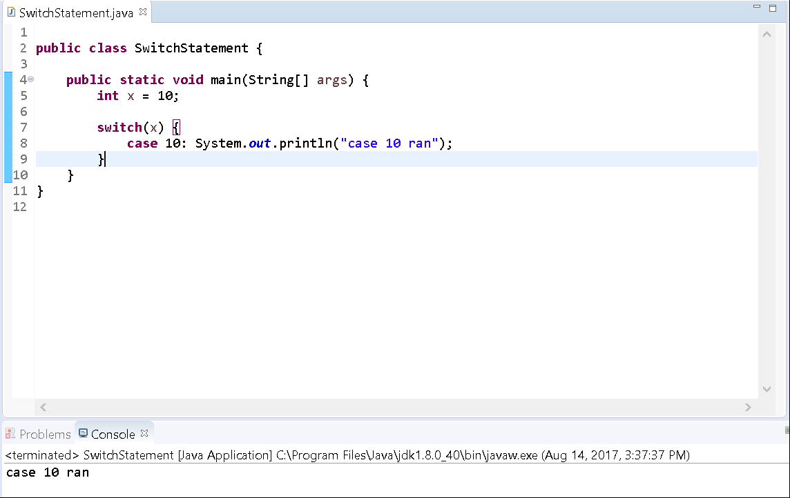
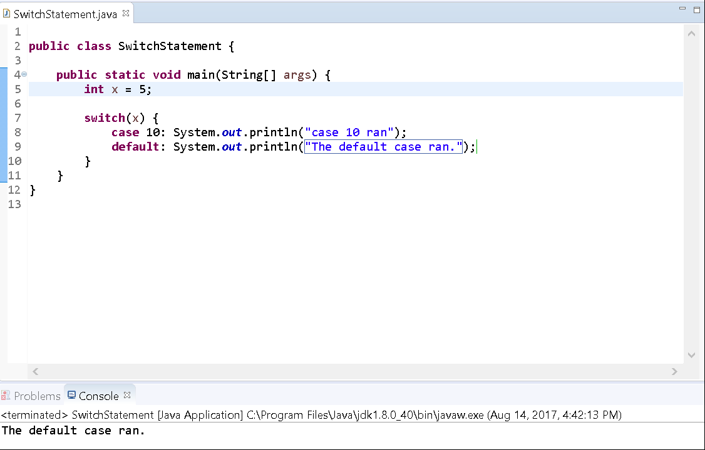
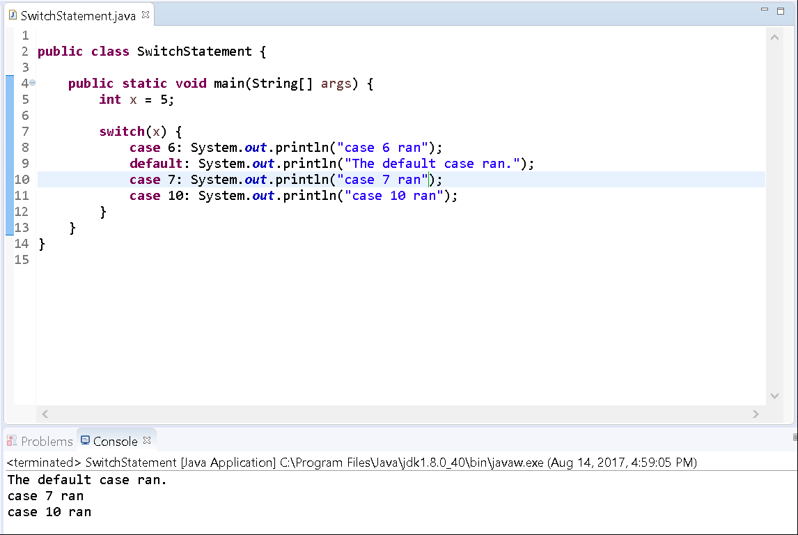
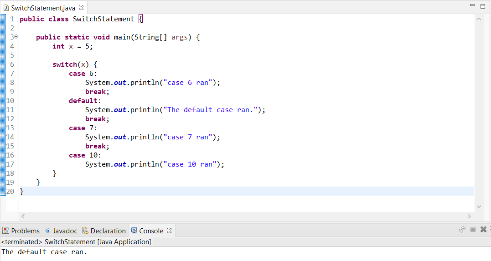

# Switches and Fall-through Logic

## Background

In this exercise, you'll practice using a `switch` statement and understand what _fall-through_ logic means.

Recall that a `switch` statement is a conditional block that will execute code if a value is equivalent to a specified `case`. If a `case` matches, then that block of code executes. It operates very much like an if-statement. 

Below is an example of a switch statement:

```java
int x = 5;

switch (x) {
    case 1: ...
    case 2: ...
    default: ...
}
```

## Guided Practice

In the following steps, we'll walk you through creating a small project to define and operate a `switch` statement. 

### Project Setup

1. Open your IDE (Eclipse), and select File > New > Java Project.
2. Provide the name, _Lab-Switch_ and click **Finish**.
   a. If a module dialog appears, click **Don't Create**. 
3. Right-click on the newly created project and select New > Class.
4. Provide the class the name, SwitchStatement and click Finish. 
5. Now edit the file so that it looks like the following:
    
```java
public class SwitchStatement {

	public static void main(String[] args) {
		int x = 10;
	}
}
```

> If you run into any compiler errors, try just typing out the above instead of copy/pasting.

This will setup our class and we'll use our variable `x` to switch on.

Edit the class to add a `switch` statement and a `case` for the value 10:

```java
public class SwitchStatement {

    public static void main(String[] args) {
        int x = 10;

        switch(x) {
        	case 10: System.out.println("case 10 ran");
        }
    }
}
```

Execute the program by clicking the Run button and selecting Java Application in the Run As dialog. 

You'll see that our statement associated with the case executes:



### Default Case

Now we'll add a `default` case to execute whenever the value is not 10. Change the initial value of the variable `x` to be 5 and add a `default` case to the switch statement. 

Edit the program, so that it resembles the following:

```java
public class SwitchStatement {

	public static void main(String[] args) {
		int x = 5;

		switch(x) {
			case 10: System.out.println("case 10 ran");
			default: System.out.println("The default case ran.");
		}
	}
}
```

Execute the program. You'll notice that once our program reaches the first case statement (case 10), then it skips that case because `x` is _not_ equal to 10. Next, our program reaches the `default` case and executes. 

> Think of the `default` case as a catch-all or "everything else" block that will run if no other specific cases are matched beforehand.



## Fall-through

What do you think will happen if we change the order of the positions of the two cases (case 10 and `default`)?

Edit the file to switch the two cases so that the `default` case appears first:

```java
public class SwitchStatement {

	public static void main(String[] args) {
		int x = 5;

		switch(x) {
			default: System.out.println("The default case ran.");
			case 10: System.out.println("case 10 ran");
		}
	}
}
```

Execute the program.

The most curious thing occurs! You'll find that both cases executed their statements. Why is that?

Well, switch statements support _fall-through_ logic which means that whatever case is met first, all other cases below it will execute. In this scenario, case 10 was after the `default` case. The `default` case was the first to match the condition and thus both cases executed.

Let's test this out a little more by adding additional cases before and after the `default` case:

```java
public class SwitchStatement {

    public static void main(String[] args) {
        int x = 5;

        switch(x) {
            case 6: System.out.println("case 6 ran");
            default: System.out.println("The default case ran.");
            case 7: System.out.println("case 7 ran");
            case 10: System.out.println("case 10 ran");
        }
    }
}
```

Execute the program.

You'll again notice that all cases after the default one (which matched the value) executed.



### Using break

In most scenarios, however, you'll use a `break` statement to exit a particular case to avoid _fall-through_ logic.

Edit the file to place `break` statements after each case:

```java
public class SwitchStatement {

    public static void main(String[] args) {
        int x = 5;

        switch(x) {
            case 6:
                System.out.println("case 6 ran");
                break;
            default:
                System.out.println("The default case ran.");
                break;
            case 7:
                System.out.println("case 7 ran");
                break;
            case 10:
                System.out.println("case 10 ran");
        }
    }
}
```

> The last case doesn't need a `break` statement as there are no other cases below it. 
> We also added line breaks (we skipped a line) to better organize our code to clearly visualize which lines of code belong to each case. 

Run the program.

You'll notice that the console displays output from only the single case that was matched and executed.



> You can also use curly braces to group statements. Thus, the above code could be rewritten as follows:

```java
public class SwitchStatement {

    public static void main(String[] args) {
        int x = 5;

        switch(x) {
            case 6: {
                System.out.println("case 6 ran");
                break;
            }
            default:{
                System.out.println("The default case ran.");
                break;
            }
            case 7:{
                System.out.println("case 7 ran");
                break;
            }
            case 10:{
                System.out.println("case 10 ran");
                break;
            }
        }
    }
}
```

This concludes the lab.