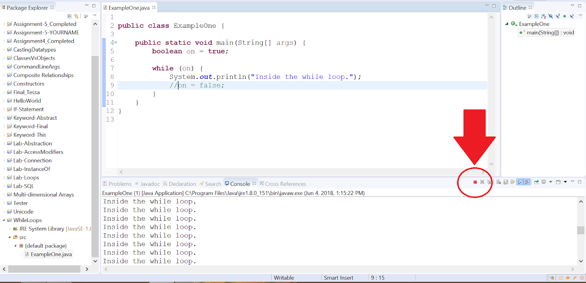

# While Loop

## Objectives

* Create statements that utilize while loops 

## Background

A **while loop** is used to repeat a group of statements until a condition becomes false.

The following is the basic syntax for a while-loop:

```java
while (condition){
    ...
}
```

The keyword `while` is a reserved word in Java; it indicates the start of a while loop. The _condition_ refers to a boolean expression (a variable or statement that can be evaluated as a boolean; it will either be `true` or `false`).

## Writing While Loops

Together we'll write out a simple while loop. 

### Project Setup

1. Open your IDE (Eclipse), and select File > New > Java Project.
2. Provide the name, _Lab-While_ and click **Finish**.
   a. If a module dialog appears, click **Don't Create**. 
3. Right-click on the newly created project and select New > Class.
4. Provide the class the name, ExampleOne and click Finish. 
5. Now edit the file so that it looks like the following:

In ExampleOne, create a `main` method, so that your class looks like the following:

```java
public class ExampleOne {

	public static void main(String args[]){

    }
}
```

Now, I want you to create a boolean variable named, `on`, and set its initial value to `true`.

```java
public class ExampleOne {

    public static void main(String args[]){
        boolean on = true;
    }
}
```

Now create a while loop, by first specifying the keyword, `while`. Afterwards type a set of parentheses and use the variable `on` inside it.

```java
public class ExampleOne {

    public static void main(String args[]){
    	boolean on = true;

        while (on)
	}
}
```

The `on` variable is used to indicate whether or not to execute any statements associated with the while loop (which will be added in the next step). If we set the value of the variable to `false`, then those statements will be skipped. It is very similar to how if-statements use a condition to determine whether or not to skip a block of code. 

Next, we need a set of curly braces to indicate which statements belong to the while loop. Type out a set of curly braces.

```java
public class ExampleOne {

    public static void main(String args[]){
    	boolean on = true;

    	while (on){
    		
    	}
	}
}
```

Inside of the while loop, let's use a simple print statement to print "Inside the while loop" to the console.

```java
public class ExampleOne {

    public static void main(String args[]){
        boolean on = true;

        while (on){
            System.out.println("Inside the while loop");
        }
    }
}
```

There is one last thing we need to do. We need to tell our while loop when to stop. As of this moment, if you ran your code, then you would get a program that executes an _infinite loop_. This is a loop that runs forever. You would have to manually terminate/stop your program. I'll show you what this looks like in just a moment. For now, let's get this loop working the proper way.

After your print statement, type another line to assign `false` to the variable `on`.

```java
public class ExampleOne {

    public static void main(String args[]){
    	boolean on = true;

    	while (on){
    		System.out.println("Inside the while loop");
    		on = false;
    	}
	}
}
```

Now our code is complete. Run it. You should get output like the following:


Excellent. You've correctly written and executed a while loop in your program. Next we'll learn what it means to build and execute an _infinite loop_. 

## Dealing with infinite loops

Now, we'll comment out code and show you what happens when your program executes an _infinite loop_. Comment out the line where we assign `false` to the variable `on`.

Your code should look like the following:

```java
public class ExampleOne {

    public static void main(String args[]){
        boolean on = true;

        while (on){
            System.out.println("Inside the while loop");
            //on = false;
        }
    }
}
```

Run your code. You'll notice that the phrase, "Inside the while loop" continuously prints to the console.

To stop this, you must manually terminate your program. If you're using Eclipse, then you can click on the little red button just above the console. Typically it is on the right-hand side of the window. (See the screenshot below).



When using loops, be sure that your code at some point changes the condition, so that your program won't stall. Otherwise, you'll have to terminate your program when it reaches a point of infinitely looping and identify what code block caused it.

This concludes the lab.