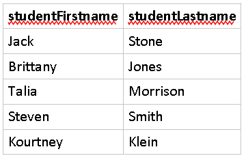
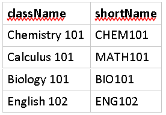
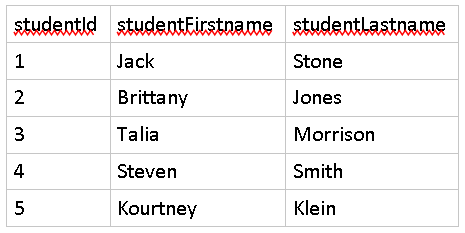
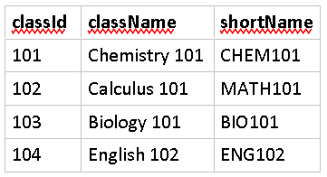
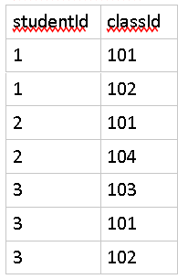

# Many-to-Many Relationships

Background
==========

Recall that in a RDBMS (Relational Database Management System) tables are the structures that manage related data and they also support associations between other tables. Typically, you'll house information in one or more columns of one table that are directly associated to a column that identifies records in another table.

There are three types of relationships, one of which is a many-to-many relationship.

In this type of relationship, one or more records in a table can be associated to one or more records in another.

Instructions
============

In this exercise we will walk through creating two tables that will support a many-to-many relationship.

Let's say we wanted to create tables to represent a link between Students and their Classes. We can set that up with two tables as such

Students Table
--------------

Classes Table
-------------

In their current structure, the two tables are standalone representations of each entity and don't represent any relationship between one another.

The first thing we'll need to do is design a way to uniquely identify each record. The easiest way to do that is to create an extra column in both that is an ID. This ID will count from 1 on up, providing a new number for each row.

The below tables now have identifiers for each record. For example, Brittany Jones is the student with id of 2.

Students Table
--------------

We'll do the same to Classes.

Classes Table
-------------

Now that we have a way to identify individual records in each table, we need to provide a way to create the association or relationship. Since we're dealing with relational databases, the best way to do that is to create another column to essentially copy over data from one table into another.

Instead of placing an identifier directly in either table as we did with one-to-one and one-to-many relationships, we need to have a separate table to manage the relationships; otherwise, we can't associate many classes to many students.

So, we'll create an additional table to manage the association.

Student\_Classes Table
----------------------

In the above table, we have a column that identifies a student (studentId) and a column that identifies a class (classId). Multiple records can exist for a single student to indicate they are taking multiple classes and the same goes for classes having multiple students.

The way to read this table is to first identify the student by their id (say 1) then find that student in the Students table (Jack) and then in the same record you have the class (101) and you take that and look it up in the Classes table (CHEM101). This way you can see that one of Jack's classes is Chemistry 101. Following that method, you can see that he is also taking Calculus 101.