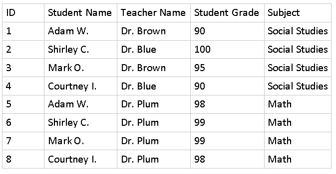
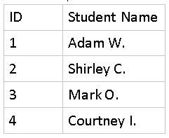
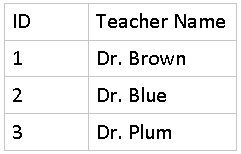
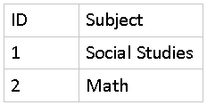
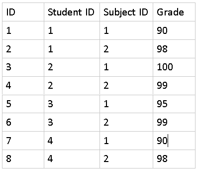
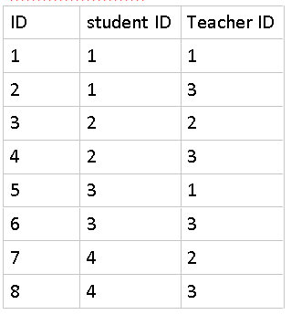

# Normalization

Background
----------

Recall that normalization is the process of designing your database in such a way that you have no composite columns, little to no redundant data, and that your data dependencies make sense.

There are 3 main normalized forms.

1.  To reach First Normal Form, we must get rid of composite columns, and we must have a primary key
    
2.  To reach Second Normal Form, we create separate tables to track data that causes duplication of otherwise unique data.
    
3.  To get to Third Normal Form, you promise that, every column will describe the key, the whole key, and nothing but the key!
    

Instructions
============

In this exercise we will walk you through taking one large table and normalizing it to reach third normal form. We'll look at the design only and not necessarily creating the actual tables.

Original Table (Student Grades)

Looking at this data, we can see that we're tracking student grades per class per test.

To get to first normal form we must have a primary key and no composite columns. Currently, we don't have any composite so nothing to change there, but we don't have any primary keys.

So, we would need to create one and we could simply name it ID. This way we have a value in each row that uniquely identifies that record. We would change the structure of the table to the following:

Second Normal Form
------------------

To get to second normal form we would need to create additional tables to remove duplicate data to the best of our ability.

In this scenario, Student Names, Teacher Names and Subjects are all duplicated values. So it may be best to create separate tables for these data values.

So, we would redesign our database to have 4 tables now:

### Students:

Teachers:

Subjects:

The above 3 are easy to visualize as they fully describe a single entity (a student, a teacher or a subject)

Test Grades

Student\_Teacher

The last 2 tables are association tables which describes the relationship between the other tables. It's typically easy to tell if a table is an association table because column names will have IDs for other tables (ex. StudentID, TeacherID, etc.)

In this scenario we could've added the teacherID column to our 4th table and removed the need for a 5th one. This way we would only have 4 tables. For this simple scenario, that would be fine since, we're only recording grades per class. If we wanted to track grades per test, then we would probably have 5 tables (or more) in order to keep each test grade separate per subject instead of one large table to track everything. Decisions like these should be based on the common queries that your database needs to support and other factors such as performance.

Third Normal Form

To get to third normal form, we ensure that every column in a record is directly associated with the key. For example, our students Table, each column describes an individual student. Even if we had additional information like Student Age, Student Height, etc. that would be fine because they uniquely describe a student. If we had information like Student lunch period, that doesn't necessarily describe an individual student (as many will have the same lunch period), but it is more of an association between a student and their assigned hour to eat lunch.

Reviewing our tables, we'll see that they are all in Third Normal Form, so no additional editing is needed.

Common Pitfalls
---------------

In some cases, you won't be able to fully realize a normalized form. In such cases, the design should support business decisions and constraints. For example, it doesn't make sense to have a separate grades table as this may reduce redundancy, but it doesn't describe anything useful on its own. Grades are always associated with a test taken by a student, so it would be a better design to have a table show that.

This concludes the lab.