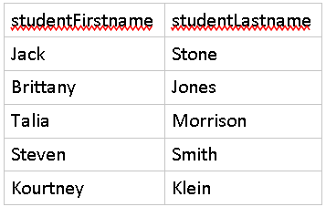
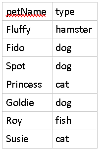
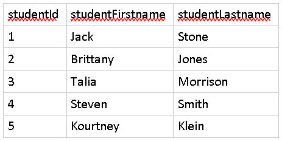
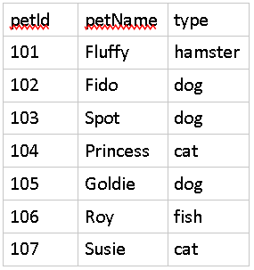
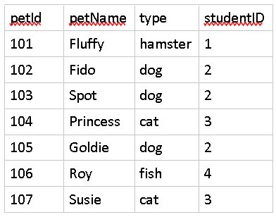
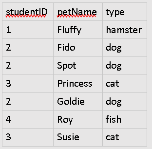

# One-to-Many Relationships

Background
==========

Recall that in a RDBMS (Relational Database Management System) tables are the structures that manage related data and they also support associations between other tables. Typically, you'll house information in one or more columns of one table that are directly associated to a column that identifies records in another table.

There are three types of relationships, one of which is a one-to-many relationship.

In this type of relationship, one record in a table is associated directly to only one or more records in another. Records in the other table, however, only refer back to at most one record in the former table.

Instructions
============

In this exercise we will walk through creating two tables that will support a one-to-many relationship.

Let's say we wanted to create tables to represent a link between Students and their Pets. We can set that up with two tables as such

Students Table
--------------

Pets Table

In their current structure, the two tables are standalone representations of each entity and don't represent any relationship between one another.

The first thing we'll need to do is design a way to uniquely identify each record. The easiest way to do that is to create an extra column in both that is an ID. This ID will count from 1 on up, providing a new number for each row.

The below tables now have identifiers for each record. For example, Brittany Jones is the student with id of 2.

Students Table
--------------

We'll do the same to the Pets table.

Pets Table
----------

Now that we have a way to identify individual records in each table we need to provide a way to create the association or relationship. Since we're dealing with relational databases, the best way to do that is to create another column to essentially copy over data from one table into another.

We'll update Pets to have a studentID column that can point to data in the Students table.

Pets Table
----------

Looking at the above table you can clearly see which student is associated with which pet because there is a column with the studentId stored in it. You'll notice that a studentID is repeated across some records to indicate that the specified student has multiple pets. Also, notice that a student may also not have a pet. Student with id 5 is not listed in the pets column.

Choosing the relationship table
===============================

Why didn't we specify the petId on the Students table?

That would mean that multiple Students could be assigned to a single pet! This is the opposite of what our design needs. That would represent a many-to-one relationship as opposed to a one-to-many.

In this scenario, a Pet would not exist without a Student (since in real life, a Student must exist in order to house and own a Pet). Because of this condition, it is a better design to place the relationship field on the Pets table.

This way each Pet can only ever point back to one student, but this also allows one student to have multiple Pets.

Alternative design?
===================

Why would we not want to have the petId field be the same as the studentId field?

Example:

Pets Table
----------

In the example above, Pets do not define their own id, but borrows one from the Students table that points back to the individual who owns the account.

This is a poor design choice however, because we can no longer uniquely identify a pet. For example, we couldn't distinguish Jack got another hamster and named it Fluffy. There would be no label to identify the first Fluffy from the second one. Thus, it is best to keep the identifier column in a one-to-many relationship.