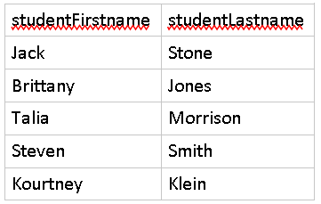
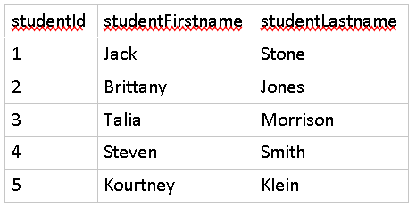
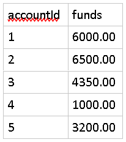
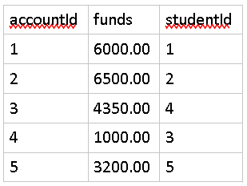
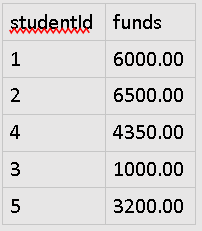

# One-to-One Relationships

Background
==========

Recall that in a RDBMS (Relational Database Management System) tables are the structures that manage related data and they also support associations between other tables. Typically, you'll house information in one or more columns of one table that are directly associated to a column that identifies records in another table.

There are three types of relationships, one of which is a one-to-one relationship.

In this type of relationship, one record in a table is associated directly to only one record in another and vice versa.

Instructions
============

In this exercise we will walk through creating two tables that will support a one-to-one relationship.

Let's say we wanted to create tables to represent a link between Students and their Savings Account. We can set that up with two tables as such

Students
--------

Accounts
--------

In their current structure, the two tables are standalone representations of each entity and don't represent any relationship between one another.

The first thing we'll need to do is design a way to uniquely identify each record. The easiest way to do that is to create an extra column in both that is an ID. This ID will count from 1 on up, providing a new number for each row.

The below tables now have identifiers for each record. For example, Brittany Jones is the student with id of 2.

NOTE:  
This is an important concept as we'll later talk about primary keys which are columns that uniquely identify a row/record. There can be multiple students named Brittany Jones, so we need a way to distinguish between them; having a column with a numerical identifier is a great way to do so.

Students
--------

We'll do the same to Accounts.

Accounts
--------

Now that we have a way to identify individual records in each table, we need to provide a way to create the association or relationship. Since we're dealing with relational databases, the best way to do that is to create another column to essentially copy over data from one table into another.

We'll update Accounts to have a studentID column that can point to data in the Students table.

Accounts
--------

Looking at the above table you can clearly see which student is associated with which account because there is a column with the studentId stored in it.

Choosing the relationship table
-------------------------------

Why didn't we specify the accountId on the Students table? We certainly could've represented the relationship that way.

In this scenario, however, an Account would not exist without a Student (since in real life, a Student must exist in order to open an Account at a bank). Because of this condition, it is a better design to place the relationship field on the Accounts table.

This way only one Account can only ever point back to one student and only one student has an account.

Alternative design
------------------

An alternative design to promote is to have the StudentID be the identifier in the Accounts table.

Example:

Accounts
--------

In the example above, Accounts do not define their own id, but borrows one from the Students table that points back to the individual who owns the account.

This is another manner to create a one-to-one relationship.

This concludes the lab. No need to upload anything.