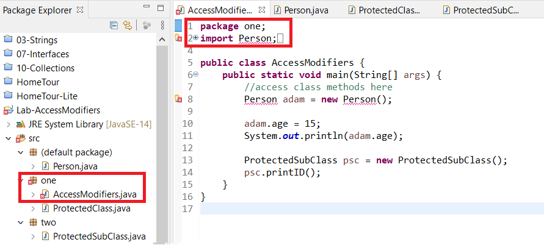

# Access Modifiers

## Objectives

* Learn how to control access for class state and behavior

## Background

Access modifiers control the access to a class, a method, a field or constructor in one class compared to another.

* **public** means the construct is available to all classes in any package   
* **protected** means the construct is available to any class in the same package or a subclass in any package.   
* **private** means the construct is only available to the current class.   
* default is the given access when no modifier is specified and it means that only classes in the same package have access to it.
    
In this exercise, we'll practice using different modifiers.

## Guided Practice

Follow the instructions below to setup a new project that we'll use to practice using access modifiers. 

### Project Setup

Open your IDE (Eclipse), and select File > New > Java Project. Provide the name, Lab-AccessModifiers and click OK.(Select "Don't Create" if a window comes up asking to "Create a module-info.java" file.)  Right-click on the newly created project and select New > Class. Provide the class the name, AccessModifiers and click OK. Now edit the file so that it looks like the following:

```java
public class AccessModifiers{

    public static void main(String[] args) {
        //access class methods here
    }
}
```

The first thing to notice is that the main method that you've always written uses the **public** access modifier. This indicates that the main method of this class can be invoked by any other class. 

Now create another class, Person. We'll specify the field `age` and declare it **public**.

```java
public class Person{
    public int age;
}
```

Next, we'll access this variable in our AccessModifiers class.

Update the AccessModifiers class to create an instance of the Person class and to set resulting object's age instance variable.

```java
public class AccessModifiers{

    public static void main(String[] args) {
        //access class methods here
        Person adam = new Person();
        adam.age = 15;

        System.out.println(adam.age);
    }
}
```

Run the program.

You'll see the output of the instance variable `age`.


Notice we were able to directly set the value of the `age` property from within the AccessModifiers class. 

In general, however, you don’t want to support this approach. The disadvantage is that any class has access to public properties and can change it without notice. Typically, you'll mark the property protected or private and you'll provide public methods that allow manipulation of the field.

### protected

Marking a field **protected** will allow classes in the same package or subclasses in any package to access it.

So let's create another package to test this.

Right-click on the src/ folder of the project and select New > Package. Provide the name **_one_** and click Finish. Now we'll create a class to place in this package. Right-click on the package and select New > Class. Give the name ProtectedClass.

Edit the contents of the class to resemble the following:

```java
package one;

public class ProtectedClass {
    protected long id = 1L;
    protected void printID() { System.out.println(this.id); }
}
```

Now create another package and label it **_two_**. Right-click on this package and select New > Class. Provide the name ProtectedSubClass. Edit the contents of this new class to resemble the following:

```java
package two;

import one.ProtectedClass;

public class ProtectedSubClass extends ProtectedClass {

}
```

Notice that our class **extends** ProtectedClass, but it is empty.

You'll learn more about the keyword **extends** in another lesson. For now, we're using it to demonstrate that you need a special keyword on a class in order to access protected members of another. 

Open up your AccessModifiers class again and edit it to be like the following:

```java
public class AccessModifiers{

    public static void main(String[] args) {
        //access class methods here
        Person adam = new Person();

        adam.age = 15;
        System.out.println(adam.age);

        ProtectedSubClass psc = new ProtectedSubClass();
        psc.printID();
    }
}
```

Notice that our ProtectedSubClass is underlined in red. This means that our code won't compile.


Hover your mouse cursor over either of the two words and you'll see a dialog box appear with a message pertaining to the error and possible fixes.


The message "ProtectedSubClass cannot be resolved to a type" simply means that we don't have a definition for this object; we're missing the class somewhere. To fix this issue you can either type in the import statement or click on the first option Import 'ProtectedSubClass' (two) and Eclipse will generate the line for you. Go ahead and write in an import statement. 

Save the file. Your code should now look like this:


Notice that the `printID()` method is underlined in red. Why? The method is marked protected so shouldn't ProtectedSubClass have access to it?

Not exactly. ProtectedSubClass does have access, but only within the context of the protected scope which means that the method can only be called by a class in the same package or a subclass in any package. **Here, we're trying to call the method on the subclass reference but in a different package**.

### Changing Packages

In Eclipse we can easily change a file's package by clicking and dragging the file (from within the Package Explorer window) and dropping it under a new package. Go ahead and click and drag on AccessModifiers.java and move the file from the default package to one. Eclipse should automatically update the file to display its package.



Note that it also created an import statement for the Person class (which it references). The other import statements are hidden by default because Eclipse will automatically hide other import statements in the Editor when multiple exist. To expand the list simply click on the expand button to the left of the visible import statement. You can click the same button to collapse the list again. 


Now drag the Person.java file to the same package, one. A dialog appears specifying there are potential problems with this operation.


Whenever a file contains code that is referenced somewhere else in the project and you attempt to move it, Eclipse will present this window notifying you that there are references to code in this file and those references will have to be updated.

Luckily, updating the references occurs automatically. Click Continue.

You'll find that Person.java has been successfully moved to one and that the import statement on AccessModifiers.java has been removed (since they are in the same package). Also, the compiler errors have disappeared.

Run the file and you'll see the expected output of our printID() method now, since the method is being called within the scope of the defined method.


### private

Fields marked **private** are only visible within the class that define them.

Let's test this by making our `age` field in the Person class private. Open Person.java and change the public modifier on the `age` field to be private.


Open up AccessModifiers.java and you'll see that on lines 11 and 13 display errors where we try to access the private field. This indicates that the class AccessModifiers cannot directly manipulate the age field on the Person class. It must be public (or protected and exist in the same package). 


Change the modifier back to public. Save the file.


Congratulations, you've reached the end of this lab.