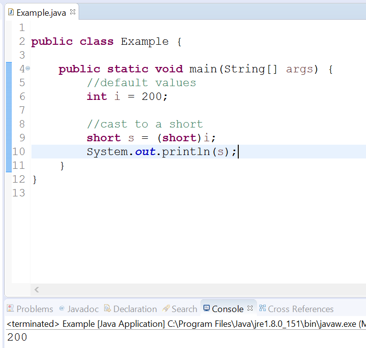
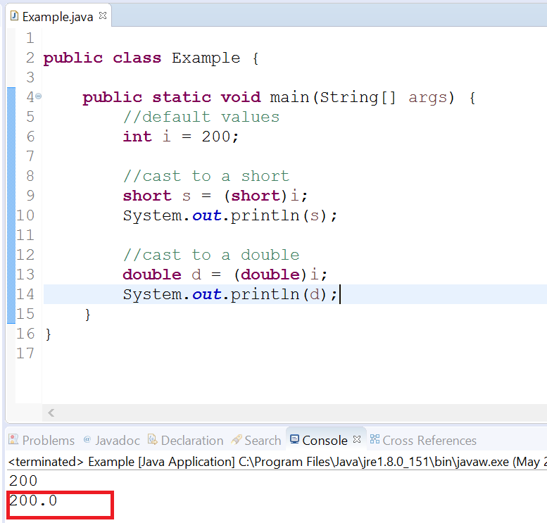
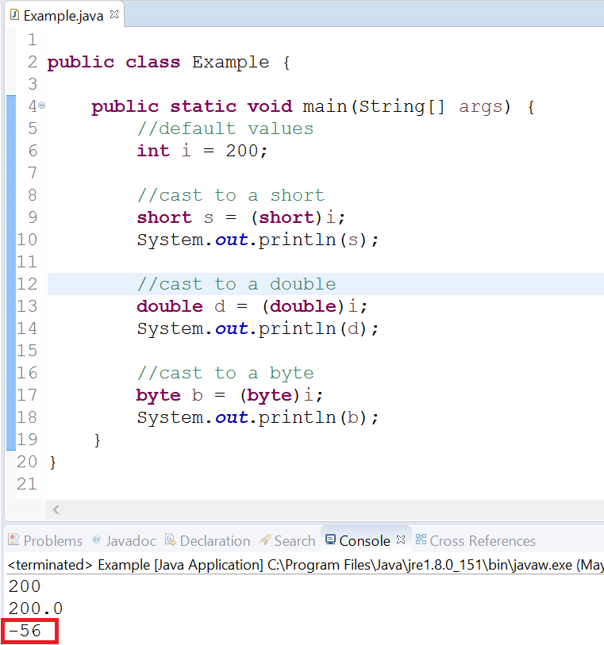

Objectives
==========

*   Create statements that utilize casting to convert one datatype to another.
    

  
 

Background
==========

Casting a data type to another allows you to convert one similar type to another. Really, this is only used for numbers as you can’t cast an int to a boolean.

To cast one type to another, you’ll specify the type that you want to cast to in parenthesis in front of the variable that you are converting.

For example, look at the following:

long a = 10393L;

int i = (int)a;

In the second statement, we’ve casted the variable a to an int type, and stored the value in a new variable labeled, i. To cast, you specify a datatype in parentheses in front of the variable that you're converting. 

Upcasting vs. Downcasting
=========================

There is an important distinction to be aware of when casting to a type that encompasses a larger range (upcasting) or to a type with a smaller range (downcasting).

When upcasting, you won’t have to worry about data loss, because you will have extra bits of information to store the number in. For example, when casting from a float to a double, you move from 32 bits to 64 bits.

When downcasting, however, you can potentially lose some data depending upon the range of the type that you’re casting to. For example, if you cast from an int to a byte, any number larger than 127 (8 bits, using two’s complement), will be truncated and you’ll lose some bits of information.

Casting an int to a short
=========================

Open Eclipse.

Start a new project labeled, CastingDatatypes, and create a new class called Example. The default package will be fine for this example.

Copy the following code into your editor:

public class Example {

   public static void main(String\[\] args){

        //initial values

       int i = 200;

            //cast to a short

short s = (short)i;

System.out.println(s);

   }

}       

Save the file and run the program.

You’ll see that the output is the number 200.

Nothing special here. A short can represent 200 without any issues.

  
 

Casting an int to a double
==========================

Next, we’ll cast the same value to a double. Recall a double is a 64-bit floating point number, so it can easily represent the value 200.

Edit your class to add code to create a double variable labeled d and set its value to i.

public class Example {

public static void main(String\[\] args) {

//default values

int i = 200;

//cast to a short

short s = (short)i;

System.out.println(s);

//cast to a double

double d = (double)i;

System.out.println(d);

}

}

Save your file and execute the class. You should see output like the following:

Notice the decimal point? This confirms that we’ve successfully converted the integer value (200), to the floating point number (200.0) which is stored as a double.

Casting an int to a byte
========================

So, let’s see what happens when we cast our value to a type that cannot hold all of the bits of information. A byte is an 8-bit number that follows two’s complement system. This means its range of values is from -128 to 127. 200 is outside of this range. What do you think will happen in our program? Will it compile?

Edit your class to cast our variable value to a new variable that is a byte.

public class Example {

public static void main(String\[\] args) {

//default values

int i = 200;

//cast to a short

short s = (short)i;

System.out.println(s);

//cast to a double

double d = (double)i;

System.out.println(d);

//cast to a byte

byte b = (byte)i;

System.out.println(b);

}

}

Save your file and execute the program.

You’ll notice that no compiler error occurs and no runtime errors occur. Something peculiar does happen though.

Notice that the value -56 is printed to the console.

How did this happen?

In order to understand this, we need to think back to how Java interprets numbers using bits. An integer is a 32-bit binary number; meaning we have 32 bits each representing a power of 2.

So, the number 200 as a 32-bit binary number is represented as:

0000 0000 0000 0000     0000 0000 1100 1000.

When we convert this number to a byte (which is an 8-bit type), we must truncate the extra bits. This leaves us with:

1100 1000.

A byte follows two’s complement numbering system, thus the leading 1 indicates a negative number. To find out what number this is we must find the two’s complement by inverting the bits and adding 1 to the number.

Inverting the bits gives us:

0011 0111.

Adding one gives us:

0011 1000.

This value represents (32 + 16 + 8 or 56). Thus, our number 1100 1000 represents -56.

Thus, you can clearly understand why downcasting can cause issues in some calculations, because you may lose important data due to truncating bits.

Congrats! This lab is complete.
