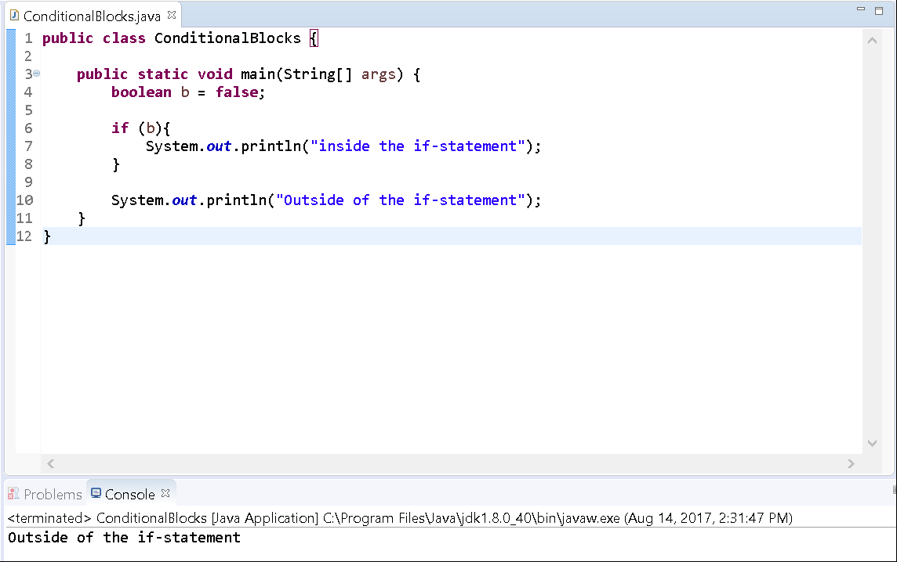

Background
==========

In this exercise, you'll practice creating conditional statements and understanding the logical flow changes when using if-statements.

Recall that an if-statement is a block that determines whether or not to skip the next section of code. It serves as a type of switch, that when on, tells the runtime machine to go ahead and execute the following code.  Typically, you can either place a boolean expression, or a simple boolean value to determine whether or not the associated code should execute. 

For example, the following is a valid use of an if-statement. In this case, the enclosed code will _always_ execute because true is always true. 

if (true) {  
//code to execute

...  
}


Guided Practice
===============

The following instructions will guide you through writing a small program that uses if-statements to skip a block of code. 

Project Setup
-------------

1.  Open your IDE (Eclipse), and select File > New > Java Project.
    
2.  Provide the name, Lab-ConditionalBlocks and click OK.
    
3.  Right-click on the newly created project and select New > Class.
    
4.  Provide the class the name, ConditionalBlocks and click OK.
    
5.  Now edit the file so that it looks like the following:
    
```
public class ConditionalBlocks {  
  
 public static void main(String[] args) {  
   boolean b = false;  
 }  
  
}
```


Above, you can see that we have a simple class with a main() method. In our main() method, we've created a boolean variable b which is associated with the value false.

Now edit the code to use a simple if-statement:
```
public class ConditionalBlocks {  
  
 public static void main(String[] args) {  
   boolean b = false;  
  
   if (b){  
  System.out.println("inside the if-statement");  
   }  
  
   System.out.println("Outside of the if-statement");  
 }  
  
}
```


Run the program.

You'll see that only the code inside of the if-statement did not execute as expected.



  
  
In further lessons we'll explore a variety of flavors of how to use if-statements. Here, we wanted to demonstrate how a line of code can be skipped by using an if-statement. 

Try the following on your own:

Change the value of the boolean variable _b_ to be **true** and re-run your program. What are the results of this small change?

This concludes this lab.
