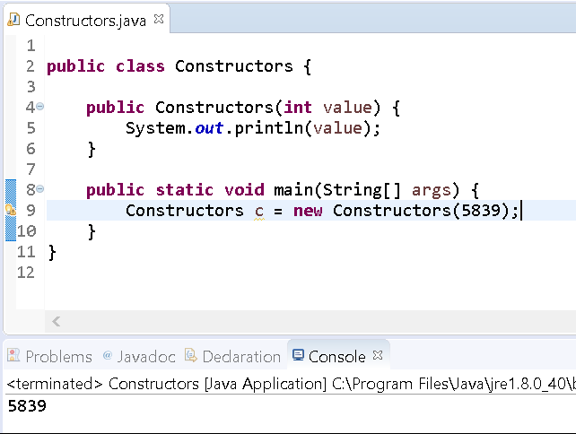
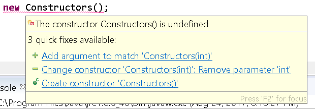
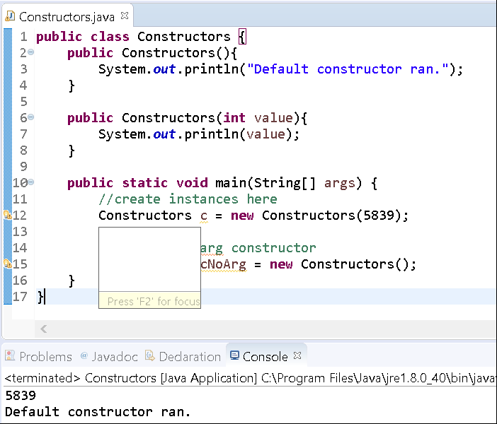

# Writing Simple Constructors

## Objectives

* Explain how to write a constructor

## Background

A **constructor** is a block of code that is executed when a class is instantiated. This block of code is executed once per object that is created. A constructor always have the same name as the class and can accept any number of parameters. By default, if you create a class and don't specify a constructor the compiler will generate one for you. The one generated is called the default no-arg constructor.

For example, say you have the following class

```java
public class DefaultClass{

    public static void main(String[] args) {
        //create a new class instance
        DefaultClass dc = new DefaultClass();
    }
}
```

We have NOT specified a constructor, so the compiler will update your code and create a default, no-arg constructor. It'll be as if you wrote your file like the following:

```java
public class DefaultClass{

    public DefaultClass(){ }

    public static void main(String[] args) {
        //create a new class instance
        DefaultClass dc = new DefaultClass();
    }
}
```

## Guided Practice

Now that we have some background on constructors we'll walk through creating a class with different constructors.

Follow the instructions below to setup a new project. 

### Project Setup

Open your IDE (Eclipse), and select File > New > Java Project. Provide the name, Lab-Constructors and click OK. Right-click on the newly created project and select New > Class. Provide the class the name, Constructors and click OK. Now edit the file so that it looks like the following:

```java
public class Constructors {

    public static void main(String[] args) {
        //create instances here
    }
}
```

Now let's create a constructor that takes in an int.

```java
public class Constructors {

    public Constructors(int value){
        System.out.println(value);
    }

    public static void main(String[] args) {
        //create instances here
    }
}
```

In the main method instantiate a new Constructors object using the new keyword. The keyword **new** will invoke the constructor that matches the given arguments. 

```java
public class Constructors {

    public Constructors(int value){
        System.out.println(value);
    }

    public static void main(String[] args) {
        //create instances here
        Constructors c = new Constructors(5839);
    }
}
```

This new line creates a Constructors object passing it the value 5839 and assigns the object to the variable `c`.

Run the program.

You'll see that the constructor that we've specified executes its body.



Now edit the file to add a line to use the default no-arg constructor.

```java
public class Constructors {

    public Constructors(int value){
        System.out.println(value);
    }

    public static void main(String[] args) {
        //create instances here
        Constructors c = new Constructors(5839);

        //use the no-arg constructor
        Constructors cNoArg = new Constructors();
    }
}
```

The line that attempts to create a new Constructors object using the no-arg constructor is underlined in red. If you hover your mouse over the line, you'll see the message, The constructor Constructors() is undefined.



Why is this?

Typically the compiler creates a no-arg constructor, however, if you specify one (as we defined one with a single int parameter), then the compiler will not add the default no-arg constructor.

Edit the file to specify a no-arg constructor:

```java
public class Constructors {

    public Constructors(){
        System.out.println("Default constructor ran.");
    }

    public Constructors(int value){
        System.out.println(value);
    }

    public static void main(String[] args) {
        //create instances here
        Constructors c = new Constructors(5839);

        //use the no-arg constructor
        Constructors cNoArg = new Constructors();
    }
}
```

Run the program.

You should observe the following output:



Excellent.

Notice that we can overload constructors just like we can with methods. The exact same rules apply for overloading constructors as with methods. In general, you must change the parameter list. 

You've reach the end of this lab.

Mark this activity complete.