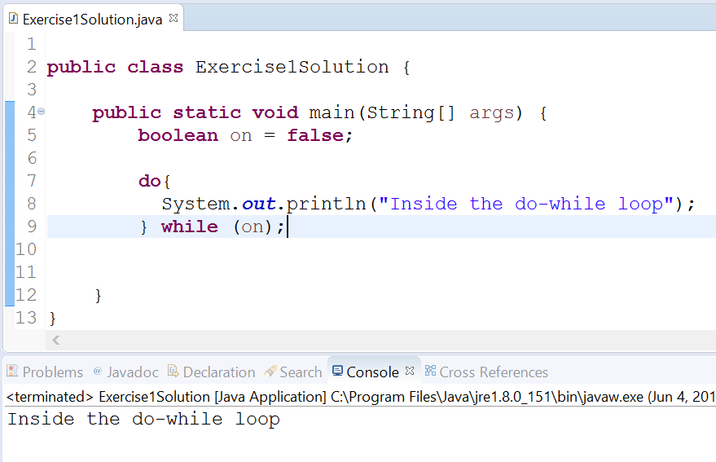

# Do-While Loop

## Objectives

* Create statements that utilize do-while loops

## Background

Much like the `while` loop, a `do-while` loop is a block of code used to repeat a group of statements until a condition becomes false.

The syntax for a `do-while` loop is as follows:

```java
do {
    ...
}while (condition)
```

The main differences between a while loop and a do-while loop are in the syntax (the condition in a do-while loop occurs _after_ the statements) and the fact that a `do-while` loop will execute its block of statements _at least once_ regardless of the value of the condition. 

The keyword `do` is another one of the reserved words in Java; just like `while`. In the above example, _condition_ refers to a boolean expression (a variable or statement that can be evaluated as a boolean; it will either be `true` or `false`).

## Writing Do-While Loops

Together we'll write out a simple `do-while` loop expression. 

### Project Setup

1. Open your IDE (Eclipse), and select File > New > Java Project.
2. Provide the name, _Lab-DoWhile_ and click **Finish**.
   a. If a module dialog appears, click **Don't Create**. 
3. Right-click on the newly created project and select New > Class.
4. Provide the class the name, ExampleOne and click Finish. 
5. Now edit the file so that it looks like the following:

```java
public class ExampleOne {

	public static void main(String args[]){
    
	}
}
```

Now, I want you to create a boolean variable with the name, `on`. Set its initial value to be `false`.

```java
public class ExampleOne {

    public static void main(String args[]){
    	boolean on = false;
    }
}
```

Now create a `do-while` loop by first specifying the keyword, `do`. Afterwards type a set of curly braces and place a print statement that says "Inside the do-while loop".

```java
public class ExampleOne {
	public static void main(String args[]){
		boolean on = true;
        
        do{
        	System.out.println("Inside the do-while loop");
        }
    }
}
```

Next, we need to specify the while condition. Type the keyword `while` followed by parentheses enclosing the variable `on`.

```java
public class ExampleOne {

    public static void main(String args[]){
    	boolean on = false;
    	
    	do{
    		System.out.println("Inside the do-while loop");
    	} while (on);
	}
}
```

Now our code is complete. Run it.

You should get output like the following:



Although we've specified our condition as `false`, the program will execute the statement associated with our `do-while` loop. It should be stated again, `do-while` loops always execute _at least once_.

This concludes the lab. 