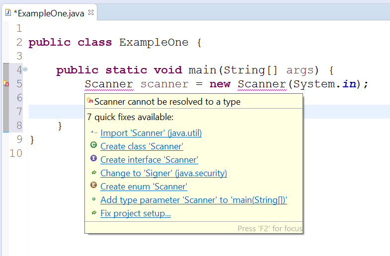
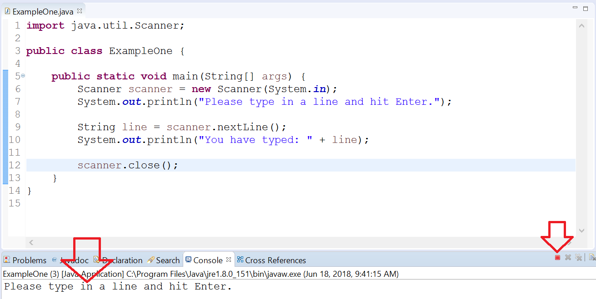
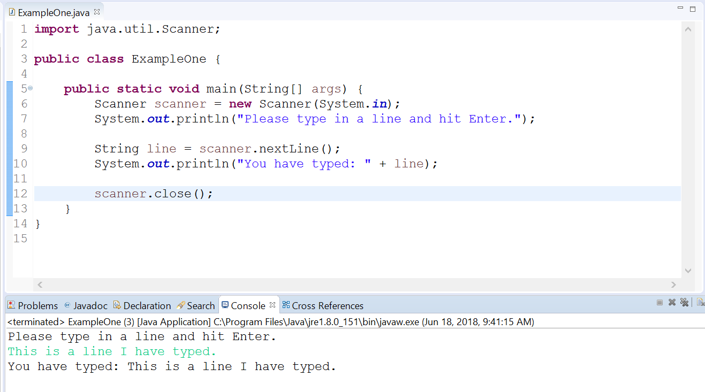
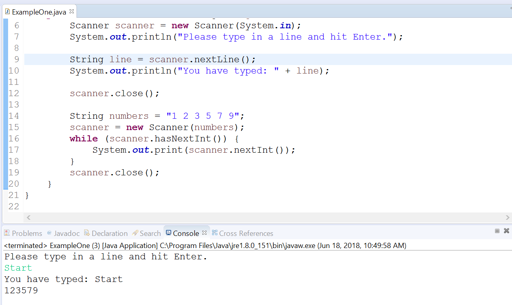

# Gathering User Input

## Objectives

* Explore how to process user input from the console using the Scanner class
    

## Background

Recall that you can gather user input from a variety of sources including files, the console, website forms, etc. In this exercise, we'll explore how to use the Scanner class to read input from the console and pre-defined Strings.

**NOTE**: The Scanner class is in the java.util package, so it must be imported wherever used.

## Guided Practice

Follow the instructions below to setup a new project to practice using the Scanner class. 

### Project Setup

1. Open your IDE (Eclipse), and select File > New > Java Project.
2. Provide the name, **Lab-Scanner** and click OK.
3. Right-click on the newly created project and select New > Class.
4. Provide the class the name, ExampleOne and click OK.
5. Now edit the file so that it looks like the following:

```java
public class ExampleOne {

 public static void main(String[] args) {

 }

}
```

The first thing we'll do is create an instance of Scanner. We'll then pass in the System.in object as an argument to Scanner's constructor. This will tell Scanner to listen to the console for input (as opposed to a file or a String variable).

```java
Scanner scanner = new Scanner(System.in);
```

**NOTE**: System.in is an object just like System.out. _out_ is a PrintSteam object that we typically use to print text to the console. In similar manner, _in_ is an InputStream that we can use to read text from the console.

Because Scanner is not in the default package (java.lang), you will see an error in Eclipse.



Notice the first suggestion is to Import `Scanner` (java.util). If you click that, then Eclipse will add the following code to the top of the file.

```java
import java.util.Scanner;
```

Save your work. The error will now disappear.

The next thing we need to do is use our scanner object to open the InputStream for the program to allow users to type to the console and then we can process that input.

First print a line to the console to prompt the user for input

```java
System.out.println("Please type in a line and hit Enter.");
```

Secondly, call the `nextLine()` method on our scanner object and grab the input once the user is finished typing it in. We're using `nextLine()` because we want to grab the entire line. If you used `next()`, then each word would be considered separately.

Afterwards, print the input to the console as confirmation.

```java
String line = scanner.nextLine();

System.out.println("You have typed: " + line);
```

Finally, we'll call the `close()` method on the scanner object so that our program will release those resources back to the operating system.

**NOTE**: When resource objects like streams, file readers and others utilize system resources, you should build a habit of closing those resources when no longer needed within your program.

The overall class should resemble the following:

```java
import java.util.Scanner;

public class ExampleOne {

    public static void main(String[] args) {
        Scanner scanner = new Scanner(System.in);
        System.out.println("Please type in a line and hit Enter.");

        String line = scanner.nextLine();
        System.out.println("You have typed: " + line);

        scanner.close();
    }
}
```

Save the file and execute the program.



Notice that the program remains in a suspended state (the red terminate box remains lit). As a user, you must click inside the console and type a line and hit Enter in order for the program to continue execution.

After doing such, your program will resemble the following.



Excellent. So that is a quick example. Let's explore another that uses the `hasNext()` method.

Update your code to create a String of numbers separated by spaces. Then create a new instance of Scanner and pass in the String as an argument. You can use the same reference variable that we created earlier.

```java
String numbers = "1 2 3 5 7 9";

scanner = new Scanner(numbers);
```

The next part, we'll create a while-loop to iterate over the different **tokens** that scanner will find within our String. A token is simply the parsed input. In our case, each value (separated by spaces) is a token. We'll use the `nextInt()` to convert the parsed token to an int. Although we could just use `next()` to grab the subsequent token, here we'll call nextInt which will automatically convert the token to an int as opposed to a String.

Afterwards, print the numbers to the console to demonstrate we've parsed the numbers successfully.

```java
while (scanner.hasNextInt()) {

System.out.print(scanner.nextInt());

}
```

Remember to close the stream again. Add the following line to your program:

```java
scanner.close();
```

Your file should resemble the following:

```java
import java.util.Scanner;

public class ExampleOne {

    public static void main(String[] args) {
        Scanner scanner = new Scanner(System.in);
        System.out.println("Please type in a line and hit Enter.");

        String line = scanner.nextLine();
        System.out.println("You have typed: " + line);

        scanner.close();

        String numbers = "1 2 3 5 7 9";

        scanner = new Scanner(numbers);

        while (scanner.hasNextInt()) {
            System.out.print(scanner.nextInt());
        }

        scanner.close();
    }
}
```

Save the file. Execute your program.

After typing some input and hitting Enter to run the former code, you'll see our new numbers parsed and printed.



Congratulations you've used the Scanner class.