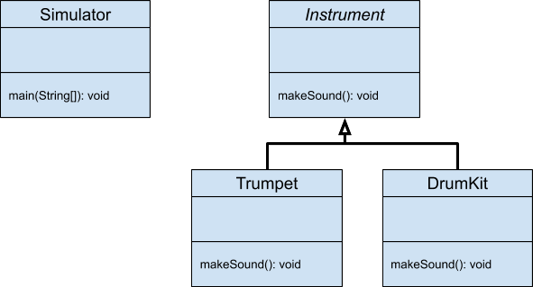
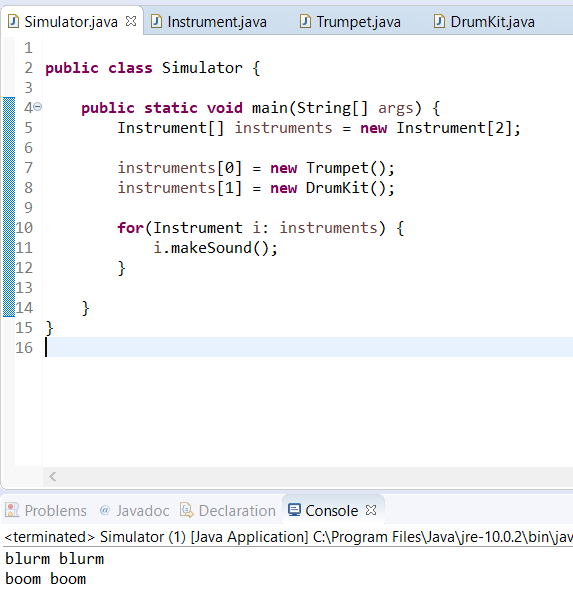

# Polymorphism

* This lab will guide you through an example of using Polymorphism within a Java application.

# Objectives

* Create a Java application that makes use of polymorphic calls on class methods

# Class Hierarchy

We’ll use the following UML Class Diagram as a guide for defining the classes that we’ll create:



As you can see, there is an inheritance hierarchy between Instrument (abstract class that is the parent) and Trumpet (child) and DrumKit (child).

What isn’t depicted is that in main() in Simulator we’ll create two instances of Instrument but the object type will be Trumpet and DrumKit. In main() we’ll also call their makeSound() methods to employ the use of Polymorphism.

At this point, you can open Eclipse and define a project, Lab-Polymorphism, and create the classes.

You can declare the makeSound() method in Instrument abstract which will force the subclasses to override it. Feel free to simply create a System.out.println(...) statement inside of makeSound() of the subclasses and print any “noise” that you want.

You can use the example code below:

  
**Simulator.java**

```java
public class Simulator {

  public static void main(String[] args) {
    Instrument[] instruments = new Instrument[2];

    instruments[0] = new Trumpet();
    instruments[1] = new DrumKit();

    for(Instrument i: instruments) {
      i.makeSound();
    }
  }
}
```

  
**Instrument.java**

```java
public abstract class Instrument {

  public abstract void makeSound();

}
```

  
**Trumpet.java**

```java
public class Trumpet extends Instrument {

  @Override
  public void makeSound() {
    System.out.println("blurm blurm");
  }
}
```

  
 

**DrumKit.java**

```java
public class DrumKit extends Instrument {

  @Override
  public void makeSound() {
    System.out.println("boom boom");
  }
}
```

  
 

Save your work and run the Simulator class. You’ll find that it’ll print the phrases from our _Instrument subclasses_.



So you see it’s easy to take advantage of an established hierarchy of classes and functionality. 

We were able to polymorphically refer to these specific instruments via the Instrument reference type. Because DrumKit and Trumpet had overridden the method makeSound, our single line i.makeSound() referred polymorphically to different implementations of the method.  

This concludes your lab. 

