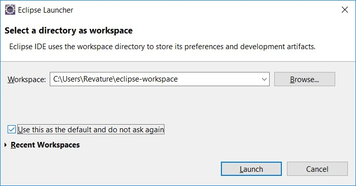
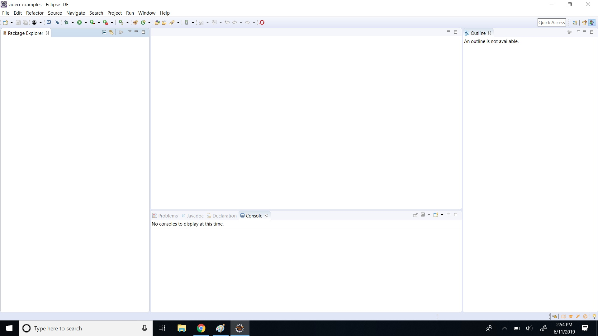
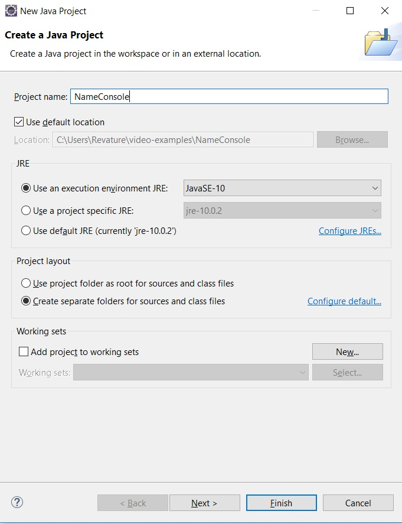
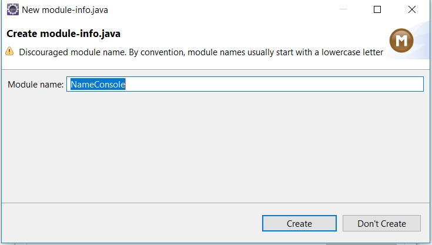
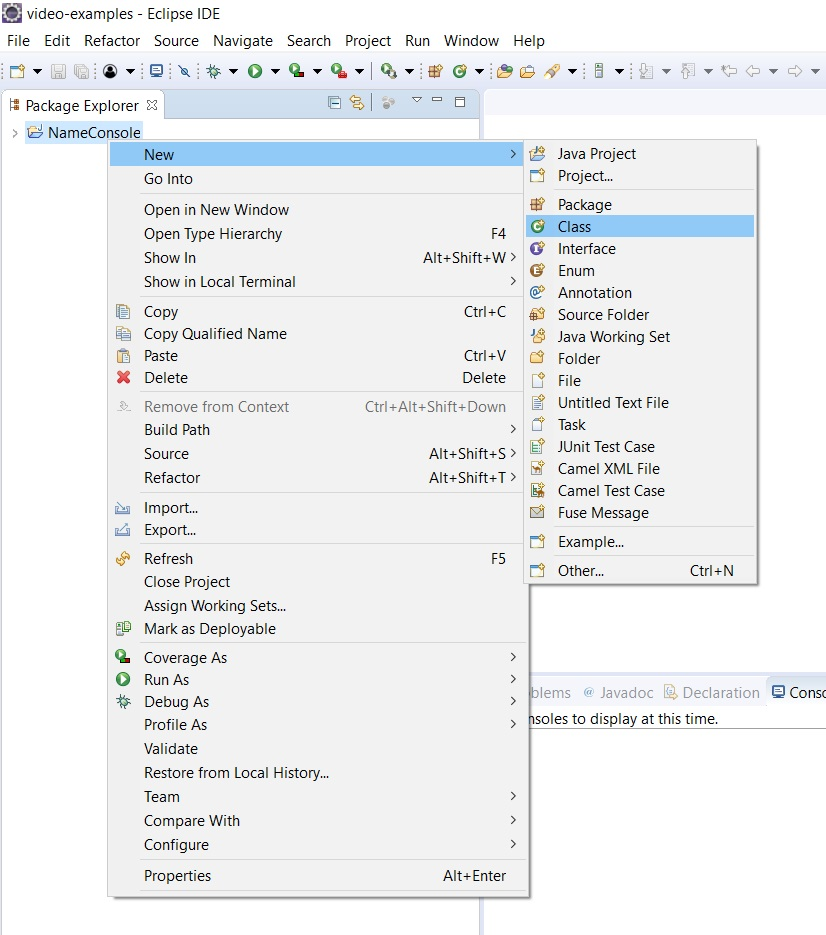
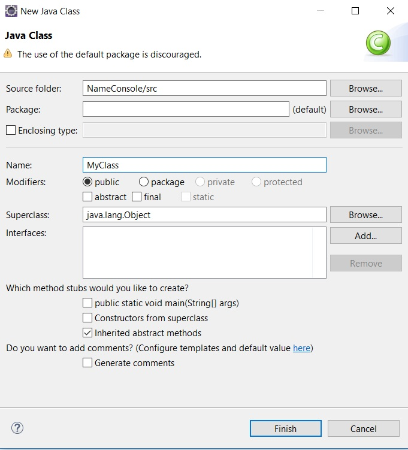
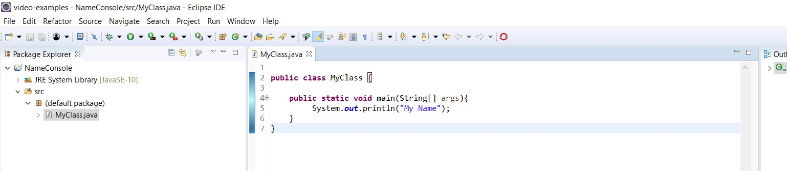
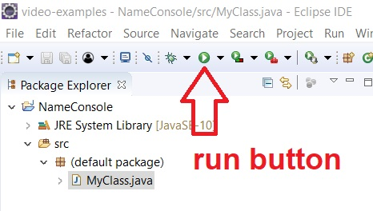
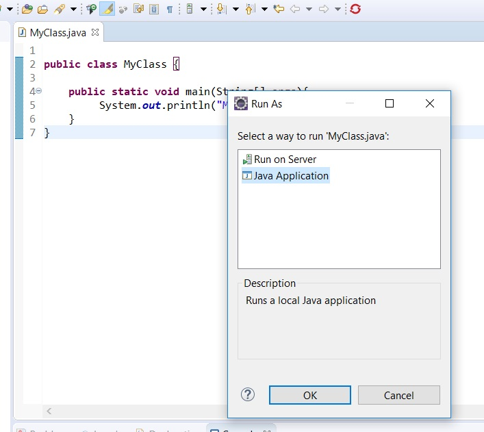
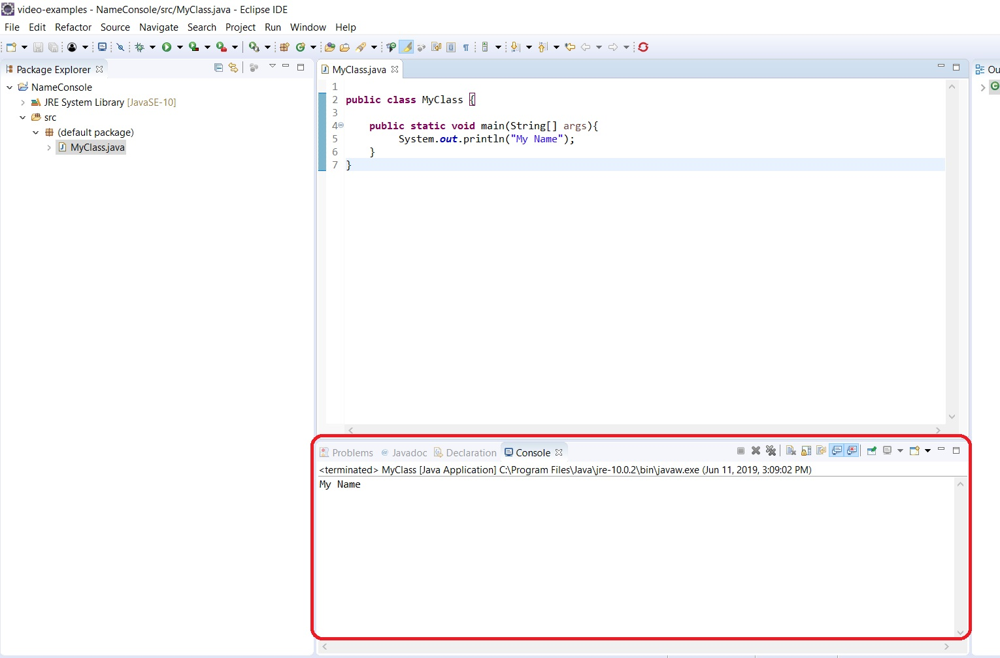

# Print Your Name

## Instructions

Now that you know how to write a simple program to print, "Hello World", we will modify the program to print your name. 

1\. Open your IDE (Eclipse). On first startup, Eclipse will ask for your default workspace. Go ahead and click on the checkbox that reads "**Use this as the default and do not ask again**". Then click **Launch**. 



When Eclipse loads, it'll show a workspace like the following image:



To start a new project, you'll need to locate the top menu bar. Then select File > New > Java Project. 


Provide the name, **NameConsole** and click **Finish**.



If Eclipse asks you to create a module, go ahead and click on **Don't Create**. We won't use modules in this course. 



Once the project loads, right-click on the newly created project and select New > Class.



Provide the class the name, **MyClass** and click **Finish**.



Now edit the file so that it looks like the following:

```java
public class MyClass {

    public static void main(String[] args){
            System.out.println("My Name");
    }
}
```

Replace the words, "My Name" with your actual name.



Now run the program and note the output! It should display your name on the console!



If Eclipse asks which way to run the program, then select **Java Application**. 



The console should display in Eclipse and show the information that you added to print. 



That's all there is to writing and running small Java programs in Eclipse!

This concludes the lab.