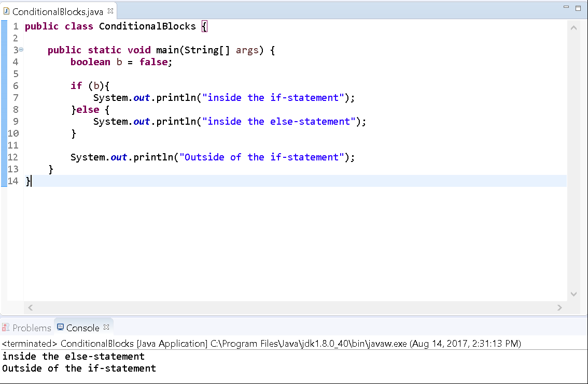
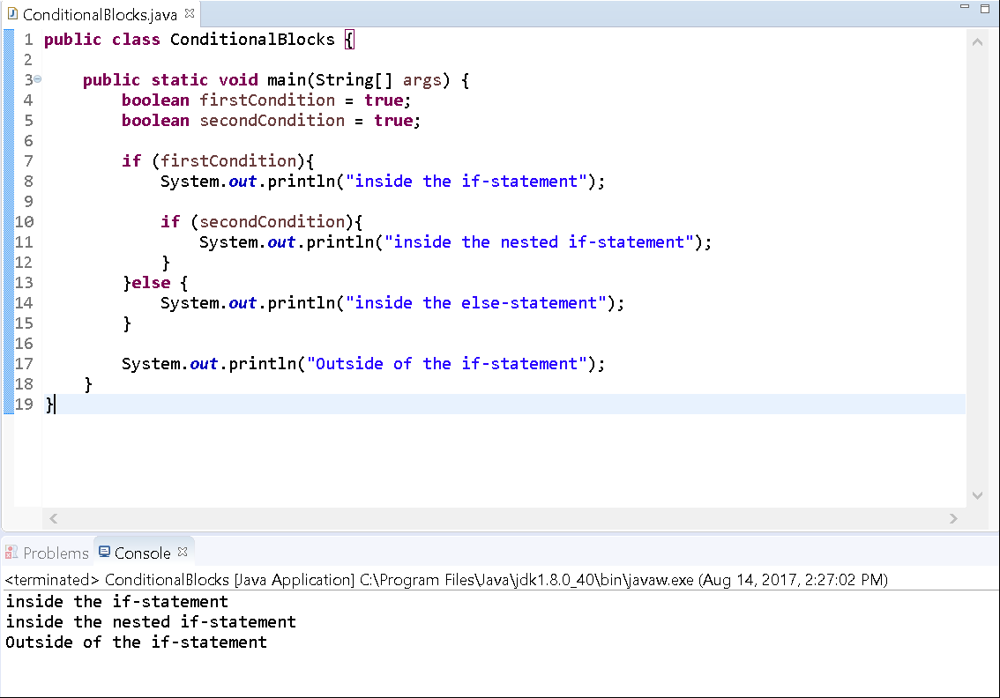
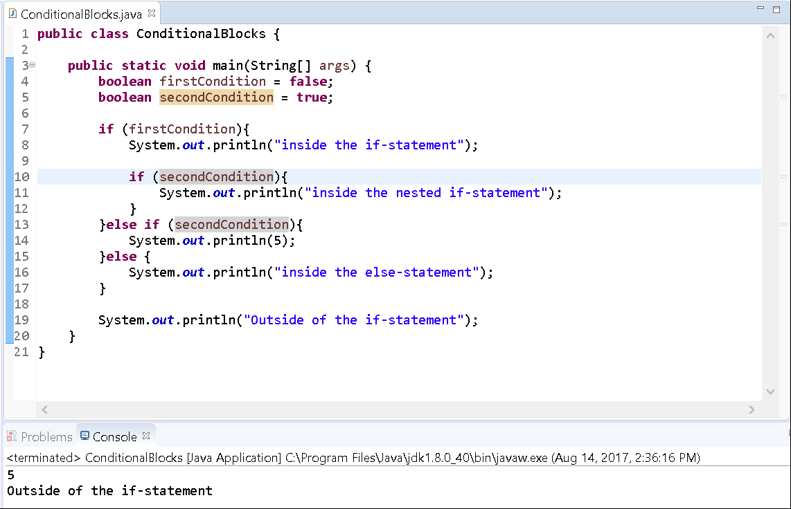

In this lab we will revist our code from the lab on If-Statements (Writing Conditional Blocks).

Please open that project in Eclipse and proceed with the following. If you've lost your work, simply create a new project called Conditional Statements and create a new class with the following details:

```java
public class ConditionalBlocks {

  public static void main(String[] args) {
    boolean b = false;

    if (b){
      System.out.println("inside the if-statement");
    }

    System.out.println("Outside of the if-statement");
  }
}
```

Else Statements
---------------

Below you will see how to add an else-statement to our previously declared if-statement. 

Edit the code in your class file to resemble the following:

```java
public class ConditionalBlocks {

  public static void main(String[] args) {
    boolean b = false;

    if (b){
      System.out.println("inside the if-statement");
    }else {
      System.out.println("inside the else-statement");
    }

    System.out.println("Outside of the if-statement");
  }
}
```


Execute the program.

You'll find that the statement "inside the else-statement" displays along with our previous sentence "Outside of the if-statement". This should be as expected, since the value of the variable is false.



Nested If-Statement
-------------------

Our code is pretty straightforward at the moment. Say we wanted another block of code to execute based on another condition, however, and only if the first condition is true? We can accomplish this by using a **nested** if-statement (an if-statement that resides inside another).

Rename the variable to be _firstCondition_, set its value to true and create another variable, _secondCondition_ and set its value to true. Add an if-statement with the secondCondition as the expression inside of the first if-statement:

```java
public class ConditionalBlocks {

  public static void main(String[] args) {
    boolean firstCondition = true;
    boolean secondCondition = true;

    if (firstCondition){
      System.out.println("inside the if-statement");

      if (secondCondition){
        System.out.println("inside the nested if-statement");
      }
    }else {
      System.out.println("inside the else-statement");
    }

    System.out.println("Outside of the if-statement");
  }
}
```
Please pay close attention to where you place your curly braces. You can alter the flow of the program by changing where they end and begin. 

Execute the program.

You'll find that our nested block executes accordingly to our set values.



Try executing the program again, but this time with the variable secondCondition value set to false and you'll see that our nested statement does not run.

Else-If-Statements
------------------

Another powerful asset to conditional statements is the else-if statement. This construct can only be used after an if-statement.It allows you to test for an additional condition whenever any previous ones fail. Say that we want to print the number 5, but only if the first condition is false AND if the second condition is true.

We can alter our program to include an else-if-statement between the if- and else-statements:

```java
public class ConditionalBlocks {

  public static void main(String[] args) {
    boolean firstCondition = false;
    boolean secondCondition = true;

    if (firstCondition){
      System.out.println("inside the if-statement");

      if (secondCondition){
        System.out.println("inside the nested if-statement");
      }
    }else if (secondCondition){
      System.out.println(5);
    }else {
      System.out.println("inside the else-statement");
    }

    System.out.println("Outside of the if-statement");
 }
}
```

Execute the program.

You'll find two sentences in our console: "5" and "Outside of the if-statement".



When using if-statements, only one of the major cases will execute (either the if-block, the else-if block or the else-block). Even if a further case below would evaluate to true, only the first case met that evaluates to true will execute. Hence, we skipped the else block.

  
 

You've reached the end of this lab.
