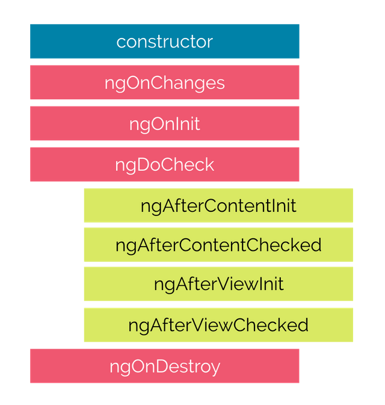

# Angular Components

Components are the basic building blocks in the Angular application. Components contain the data & UI logic that defines the view and behavior of the web application.

Components in Angular are defined using a [@Component](https://angular.io/api/core/Component) decorator. It includes a selector, template, style, and other properties, and it specifies the metadata required to process the component.

Angular applications can have multiple components. Each component handles a small part of UI. These components work together to produce the complete user interface of the application. An Angular application has one **root component** (AppComponent) which is specified in the bootstrap array under the main **ngModule** module defined in the **app.module.ts** file.

## `@Component` Decorator

In *src/app*, we can find the below files referred to as a root component of the application.

* **app.component.css** -  holds all the CSS styles 
* **app.component.html**  -  this is template contains typical HTML elements and alters the HTML based on our app's logic and DOM manipulations. 
* **app.component.ts** -  contains typescript code to control the component behavior.

Let's have a look at the app.component.ts file under app folder and understand the code behind the root component of the application.

```typescript
import { Component } from '@angular/core';
 @Component ({
 selector: 'app-root',
 templateUrl: './app.component.html' ,
 styleUrls: ['./app.component.css']
 })
 export class AppComponent {
 title = 'myfirstapp';
 } 
```
In this file, we export the *AppComponent* class, and we decorate it with the `@Component` decorator, imported from the `@angular/core` package, which takes a few metadata, such as:

* **selector:** A CSS selector that tells Angular to create and insert an instance of this component wherever it finds the corresponding tag in template HTML. For example, if an app's HTML contains `<app-root></app-root>`, then Angular inserts an instance of the AppComponent view between those tags.

* **templateUrl:** The module-relative address of this component's HTML template. Alternatively, you can provide the HTML template inline, as the value of the **template** property. 

* **styleUrls:** This is an array of relative paths to where the component can find the styles used to style the HTML view. Alternatively, you can provide the CSS Style inline, as the value of the **styles** property.

The template is an HTML file in Angular. Let's have a look at the app.component.html file under app folder.
```html
<h3> Hello World </h3>
<p> {{ title}} app is running...</p>
```
The `title` inside the double curly bracket used for rendering the view. Angular looks for a title property in our component and binds the property to our view. This is called **data binding**.

AppComponent uses an inline template and style to render the view of the application:

```typescript
import { Component } from ‘@angular/core’;
 @Component ({
 selector: 'app-root',
 template: `
 <h3> Hello World</h3>
 <p> {{ title}} app is running... </p>
 ` ,
 styles: ['h3:{ background-color : red;}', 'p{font-weight:bold}']
 })
 export class AppComponent {
    title = 'myfirstapp';
 } 
 ```

> **Note:** In the case of a Multi-line template, you can use BackTicks/graves (`` ` ``) to enclose the template string.

**How to create a component in Angular?**

Run the `ng generate component <component_name>` or `ng g c <component-name>` command in the terminal to create a component
 

For example: When we run `ng g c server` in the terminal, CLI creates a component and registers this component in the AppModule. Now, you're able to see a *server* folder inside *src/app*. This *server* folder contains 4 files - *server.component.html*, *server.component.spec.ts*, *server.component.ts* and *server.component.css*.

## Components Life Cycle Hooks

Angular creates a component; renders it; creates and renders its children; checks it when it’s data-bound properties change; and destroys it before removing it from the DOM. These events are called **"Lifecycle Hooks"**. These Lifecycle hooks have eight different function calls which correspond to the lifecycle event. Every angular component has a life cycle event carried out in 2 different phases -  one linked to the component itself and the other linked to the children of that component.

## Eight lifecycle hooks in Angular

The below diagram illustrates the order in which the eight hooks are executed.



**constructor()** - The constructor of the component class gets executed first, before the execution of any other lifecycle hook events. If we need to inject any dependencies into the component, then the constructor is the best place to do so.

**ngOnChanges()** - Called whenever the input properties of the component change. It returns a *SimpleChanges* object which holds any current and previous property values.

**ngOnInit()** - Called once to initialize the component and set the input properties. It initializes the component after Angular first displays the data-bound properties. 

**ngDoCheck()** - Called during all change-detection runs that Angular can't detect on its own. Also called immediately after the `ngOnChanges()` method.

**ngAfterContentInit()** - Invoked once after Angular performs any content projection into the component’s view.

**ngAfterContentChecked()** - Invoked after each time Angular checks for content projected into the component. It's called after `ngAfterContentInit()` and every subsequent `ngDoCheck()`.

**ngAfterViewInit()** - Invoked after Angular initializes the component's views and its child views.

**ngAfterViewChecked()** - Invoked after each time Angular checks for the content projected into the component. a It called after `ngAfterViewInit()` and every subsequent `ngAfterContentChecked()`.

**ngOnDestroy()** - Invoked before Angular destroys the directive or component.

## Refereneces
* [Angular Docs - Hooking into the component lifecycle](https://angular.io/guide/lifecycle-hooks)
* [Angular Docs - Introduction to components and templates](https://angular.io/guide/architecture-components)


