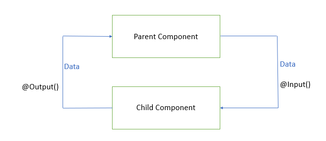
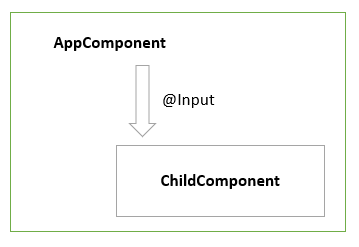
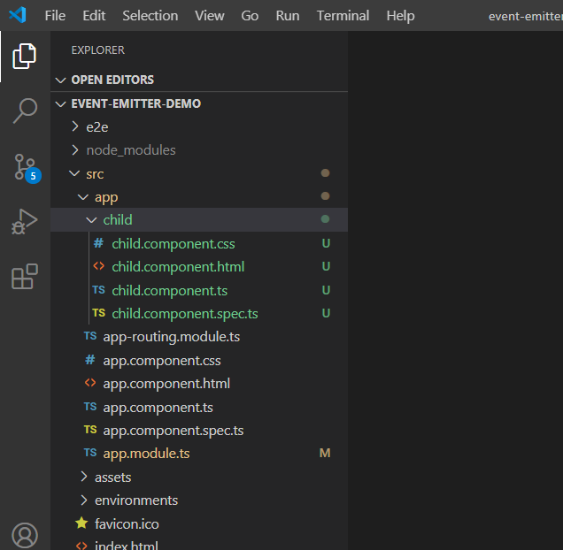
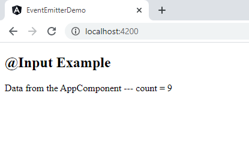
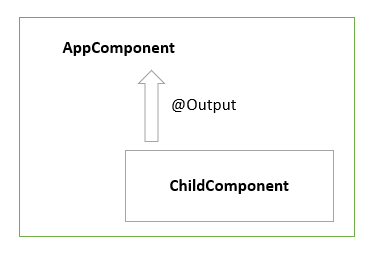
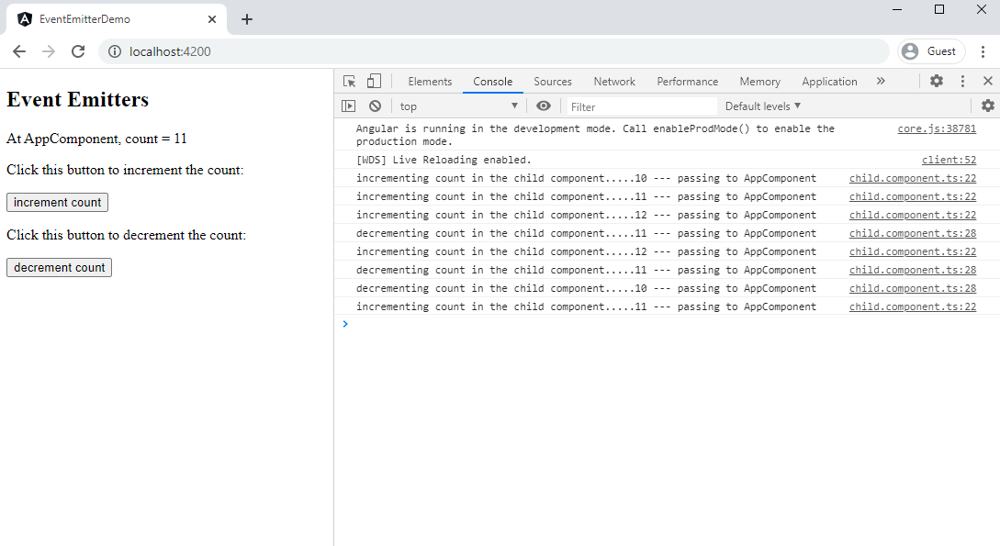

# Event Emitters in Angular

An [EventEmitter](https://angular.io/api/core/EventEmitter) is used to emit custom events synchronously or asynchronously, and register handlers for those events by subscribing to an instance.

Angular uses `@Input` and `@Output` decorators to flow data between components. We can also use Angular services to flow data between the components. If we have to pass data into a component we use the `@Input` decorator, and if we have to emit the event or data from a component we use `@Output` decorator with the `EventEmitter` API.



## `@Input` decorator

In Angular, the [`@Input`](https://angular.io/api/core/Input) decorator is defined in the [@angular/core](https://angular.io/api/core) package that marks a class field as an **input property** and supplies configuration metadata.



**Example:** Let us create an angular application with at least one child component. Run the `ng new event-emitter-demo` CLI command to create an Angular application. Here, we already have an AppComponent considered as a parent component. Run the `ng g component child` CLI command to create an child component for the AppComponent.



In `child.component.ts`, we create a `count` property and decorate with the `@Input()`, which implies that value of `count` property will be set outside from the ChildComponent.

```typescript
import { Component, Input } from '@angular/core';

@Component({
  selector: 'app-child',
  template: `
    <p> Data from the AppComponent --- count = {{count}}</p>
  `
})
export class ChildComponent {
  @Input() count: number;
}
```

In `app.component.ts`, we use **property binding** to pass the `count` property  value from the AppComponent to the ChildComponent.

```typescript
import { Component } from '@angular/core';

@Component({
  selector: 'app-root',
  template: `
    <h2>@Input Example</h2>
    <app-child [count]='count'></app-child>
  `
})
export class AppComponent {
  count = 9;
}
```

When we run this application, we are able to see the below output:



## Component events with EventEmitter and `@Output`

In Angular, a component can emit an event using [`@Output`](https://angular.io/api/core/Output) and [EventEmitter](https://angular.io/api/core/EventEmitter) API in the [@angular/core](https://angular.io/api/core) package.

`@Output` decorator that marks a class field as an **output property** and supplies configuration metadata.



**Example:**  To emit data and event out from a component, we create an instance of EventEmitter and annotate that property and with `@Output` decorator. This instance calls `emit()` method to emit a payload which can be received by an event object `$event`.

In `child.component.ts`, we create a `change` property and decorate with the `@Output()`and bound a new instance of `EventEmitter` to it.

Also, we have two methods - `increment()` and `decrement()` which updates the value of the `count` property based on the event (clicking on the increment count/ decrement count buttons) and emits the event changes to its parent component.

Here, the `change` property calls the `emit()` method that emits the `count` value which can be received by event object `$event`.

```typescript
import { Component, Input, Output, EventEmitter } from '@angular/core';

@Component({
  selector: 'app-child',
  template: `
    <p> Click this button to increment the count: </p>
    <button (click)='increment()'>increment count</button> <br>
    <p> Click this button to decrement the count: </p>
    <button (click)='decrement()'>decrement count</button>
  `
})
export class ChildComponent {
  @Input()
  count: number = 0;

  @Output()
  change: EventEmitter<number> = new EventEmitter<number>();

  increment() {
    this.count++;
    this.change.emit(this.count);
    console.log("incrementing count in the child component....." + this.count + " --- passing to AppComponent");
  }

  decrement() {
    this.count--;
    this.change.emit(this.count);
    console.log("decrementing count in the child component....." + this.count + " --- passing to AppComponent");
  }
}
```

In `app.component.ts`, we use **event binding** to get the `count` property value from the ChildComponent to the AppComponent.

The `.emit()` method emits the changes to our `(change)` event listener we set up in the AppComponent, to which our `countChange($event)` callback will be invoked, and the data associated with the event will be given to us via the `$event` property.

We assign `this.count` with the `event` that’s passed back inside the `countChange()` method.

```typescript
import { Component } from '@angular/core';

@Component({
  selector: 'app-root',
  template: `
    <h2>Event Emitters</h2>
    <p> At AppComponent, count = {{ count }} </p>
    <app-child [count]='count' (change)= 'countChange($event)'></app-child>
  `
})
export class AppComponent {
  count = 9;
  countChange(event) {
    this.count = event;
  }
}

```

When we run this application, we are able to see the below output:



In this example, we use property binding to send `count` value from the parent component to child component and we use custom event binding to get the updated `count` value from  the child component to parent component.

### References

* [Component interaction with @Input, @Output and EventEmitter](https://blog.hackages.io/angular-component-interaction-with-input-output-and-eventemitter-72526422b95c)
