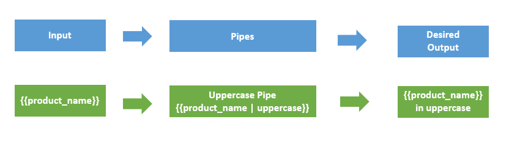

# Pipes

Pipes provide a way to transform values in an Angular template. Pipes are used with a Pipe (`|`) character, and take integers, strings, arrays, and date as input and returns a desired formatted output which can be displayed in the browser.

For example, a Date object shows the date in this format: `Sat Aug 03 2019 19:48:11 GMT+0530 (India Standard Time)` which is not easy for the normal users to understand. It’s better to have the date in this format `Saturday, 03 Aug 2019 07:50 PM`. This can be achieved using pipes. 

**Syntax:** `{{title | uppercase}}`



Pipes can be easily used in HTML templates. For example,

```typescript
lastLoggedInTime = new Date(2018, 5, 25);
```
Here, the difference in using pipes.

```html
<h3> Without date Pipe </h3>
<div>
    Last Logged in @ {{lastLoggedInTime}}
    <!-- OUTPUT  Last Logged in @ Mon Jun 25 2018 11:48:11 GMT+0530 (India Standard Time) -->
</div>Copy
<h3> With date Pipe </h3>
<div>
    Last Logged in @ {{lastLoggedInTime | date}}
    <!-- OUTPUT  Last Logged in @ Jun 25, 2018 -->
</div>
```
### Parameterizing a pipe

Pipes accept the any number of optional parameters to fine-tune their output. To add parameters to a pipe, follow the pipe name with a colon ( : ) and then the parameter value. For example,

```html
<p>Date Of birth : {{ birthday | date:"MM/dd/yy" }} </p>
<!-- OUTPUT Date Of birth : 05/19/87 -->
```
### Chaining pipes

We can chain pipe together in effective combinations. For example,

```html
<p>Date Of birth : {{ birthday | date | uppercase}} </p>
<!-- OUTPUT Date Of birth : MAY 19, 1997 -->
```

## Built-in pipes

Angular has the following built-in pipes:

* **Date pipe** - Used for formatting dates.

* **Decimal pipe** - Used for formatting numbers. 
The syntax for Decimal Pipe: `{{ value_expression | number : digitInfo }}` where, `digitInfo` is optional. 
The represntaion of `digitInfo`: `{minIntegerDigits}.{minFractionDigits}-{maxFractionDigits}`.
Where,
`minIntegerDigits` - minimum integers before the decimal point (default is 1).
`minFractionDigits` - minimum digits after the decimal point (default is 0).
`maxFractionDigits` - maximum after the decimal point (default is 3).
If `minFractionDigits` and `maxFractionDigits` value is 0, then the number is rounded off to nearest value.
*Example:*
```html
<p>{{3.676 | number}}</p>
<!--output '3.676'-->
<p>{{ 3.67 | number:'3.4-6'}}</p>
<!--output '003.1400'-->
<p>{{-2.5 | number:'1.0-0'}}</p>
<!--output '-3'-->
```

* **Currency pipe** - Used for formatting currencies.
*Example:*
```html
<p>{{75 | currency}}</p>
<!-- output '$75.00' --> 

<p>A: {{ 75 | currency:'CAD'}}</p>
<!-- output 'CA$75.00' -->

<p>A: {{ 75 | currency:'CAD':'code'}}</p>
<!-- output 'CAD75.00' -->
```

* **Percent pipe** - Used for formatting percentage values.
*Example:*
```html
<p>{{ 26 | percent}}</p>
<!--output '26%'-->

<p>{{ 134.95 | percent:'4.3-5'}}</p>
<!--output '134.950%'-->
```

* **Slice pipe** - Used for Slicing strings.
*Example:*
```html
<p>{{'abcdefghij' | slice:0:4}} </p>
<!-- output 'abcd' -->

<p>{{'abcdefghij' | slice:4:0}} </p>
<!-- output '' -->

<p>{{'abcdefghij' |slice:-4}} </p>
<!-- output 'ghij' -->
```

* **Lowercase pipe** - Used for converting strings into lowercase.
*Example:*
```html
<p>{{'tHIs is sUndAY' | lowercase}}</p> 
<!-- output "this is sunday" --> 
```
* **Uppercase pipe** - Used for converting strings into uppercase.
*Example:*
```html
<p>{{'tHIs is sUndAY' | uppercase}}</p> 
<!-- output "THIS IS SUNDAY" --> 
```
* **Titlecase pipe** - Used for converting strings into title case.
*Example:*
```html
<p>{{'tHIs is a sUndAY' | titlecase}}</p> 
<!-- output "This Is Sunday" --> 
```
* **Json pipe** - Used for Converting values into a JSON-format representation. 
*Example:*
```typescript
@Component({
  selector: 'json-pipe',
  template: `<div>
    <p>With JSON pipe: {{object | json}} </p>
    <!-- With JSON pipe: { "foo": "bar",  "xyz": 3, "numbers": [ 1, 2, 3, 4, 5 ]  } --> 

    <p>Without JSON pipe: {{object}} </p>
    <!-- Without JSON pipe: [object Object] -->
  </div>`
})
export class JsonPipeComponent {
  object: Object = { "foo": "bar",  "xyz": 3, "numbers": [ 1, 2, 3, 4, 5 ]};
}
```
* **Async Pipe**  - Used for unwrapping values from an asynchronous primitive. The async pipe subscribes to an *Observable* or *Promise* and returns the latest value it has emitted. 
*Example: Here, we bind the Promise with the template. Clicking the Resolve button resolves the promise.*
```typescript
@Component({
  selector: 'async -pipe',
  template: `<div>
    <h3> Async Pipes for Promise</h3>
    <button (click)="clicked()">{{ arrived ? 'Reset' : 'Resolve' }}</button>
    <p>Wait for it... {{ logMessage | async }}</p>
  </div>`
})
export class AsyncPipeComponent {
  logMessage: Promise<string>|null = null;
  arrived: boolean = false;
 
  private resolve: Function|null = null;
 
  constructor() { this.reset(); }
 
  reset() {
    this.arrived = false;
    this.logMessage = new Promise<string>((resolve, reject) => { this.resolve = resolve; });
  }
 
  clicked() {
    if (this.arrived) {
      this.reset();
    } else {
      this.resolve !('Hello User!!!!');
      this.arrived = true;
    }
  }
}
```
## Custom Pipes

We can create custom pipes using the `ng g pipe <pipe-name>` command in the terminal with the Angular CLI.

**For example**, we create a custom pipe to count words by running the `ng g pipe wordcount` command in the terminal. The CLI creates 2 files - *wordcount.pipe.spec.ts* and *wordcount.pipe.ts* under *src/app* folder and updates the *app.module.ts* file.

**app.module.ts**
```typescript
import { BrowserModule } from '@angular/platform-browser';
import { NgModule } from '@angular/core';
import { AppComponent } from './app.component';
// Custom Pipe imported here by Angular CLI
import { WordcountPipe } from './wordcount.pipe';

@NgModule({
  declarations: [
    AppComponent,
    WordcountPipe  
  ],
  imports: [
    BrowserModule
  ],
  providers: [],
  bootstrap: [AppComponent]
})
export class AppModule { }
```
In *wordcount.pipe.ts* file, we write the logic for word count.

```typescript
import { Pipe, PipeTransform } from '@angular/core';

@Pipe({name: 'wordcount'})
export class WordcountPipe implements PipeTransform {
  transform(value: any, args?: any): number {
    return value.trim().split(' ').length;
  }
}
```

* We import the `@Pipe` decorator from the core Angular library. If the Class is decorated with the `@Pipe` decorator, Angular knows that class is a pipe.

* In the `@Pipe` decorator, we define the pipe *name* that used within template expressions. 

* The pipe class implements the **PipeTransform** interface to perform a transformation.

* There is a **transform** method that accepts an input value followed by optional parameters and returns the transformed value.

```typescript
interface PipeTransform {
  transform(value: any, ...args: any[]): any
}
```
In *app.component.html* file,
```html
<p> {{ "Angular is an application design framework" | wordcount}} </p>
<!--output '6' -->
```

We can have additional arguments to the **transform** method for each parameter passed to the pipe.

*Example:*
```typescript
@Pipe({name: 'powerUp'})
export class powerUpPipe implements PipeTransform {
  transform(value: number, power?: number): number {
    return Math.pow(value, isNaN(power) ? 1 : power);
  }
}
```
In *app.component.html* file,
```html
<p> {{ 2 | powerUp }} </p>
<!--output '2' -->
<p> {{ 2 | powerUp : 3}} </p>
<!--output '8' -->
<p> {{ 5 | powerUp : 2}} </p>
<!--output '25' -->
```

## References
* [Angular Docs - Pipes](https://angular.io/guide/pipes)
* [Built-In Pipes](https://angular.io/guide/pipes)
* [Angular Docs - Custom Pipes](https://angular.io/guide/pipes#custom-pipes)
* [Custom Pipes](https://codecraft.tv/courses/angular/pipes/custom-pipes/)
