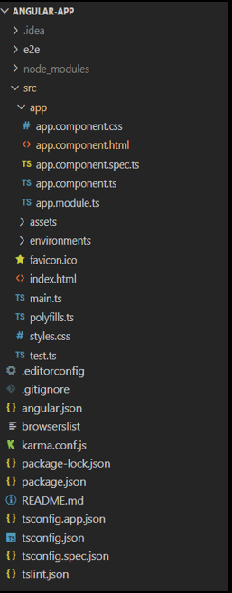

## Angular Review

Angular is a **TypeScript-based open-source framework** used to develop **dynamic web applications**.

Angular is a Single Page Application (SPA) Framework. An SPA is a web application that fits on a single page. All our code (JavaScript , HTML , CSS ) is retrieved with a single page load. Navigation between pages is performed without refreshing the whole page.

##### AngularJS vs Angular

[AngularJS](https://en.wikipedia.org/wiki/AngularJS) is a **JavaScript-based open-source front-end web framework**. It doesn't support the features of a server-side programming language, nor dynamic loading of the page.

[Angular](https://en.wikipedia.org/wiki/Angular_(web_framework)) is a **complete rewrite** of AngularJS. AngularJS was completely based on **controllers** and **scopes** whereas, Angular uses **component hierarchy** as its main architecture.

##### Angular CLI

The [Angular CLI](https://cli.angular.io/) is a command-line interface for Angular that helps us to get started with creating an Angular application. Angular CLI creates an Angular application and uses the [Typescript](./modules/typescript/README.md) programming language, [Webpack](./webpack.md) for Module bundling, Karma for unit testing, and Protractor for end-to-end testing. The Angular CLI takes care of the configuration and initialization of various libraries. It also allows us to add components, directives, services, etc, to already existing Angular applications.

##### Angular File Structure

Generally, We use Visual Studio Code or Webstrom as a Code Editor for creating and editing Angular Applications. You can download and install Visual Studio Code from this website: [https://code.visualstudio.com/download](https://code.visualstudio.com/download)

The file structure of the Angular application described below:

The **e2e** folder at the top level contains source files for a set of end-to-end tests and test-specific configuration files. The **node_modules** folder provides npm packages to the entire workspace. The **src** folder contains the source files which give information about application logic, data, and assets.

* **app** - this folder contains the component files.

	* **app.component.ts** - used to define the logic for the app's root component (AppComponent).

    * **app.component.html** - used to define the HTML template associated with the root AppComponent.

    * **app.component.css** - used to define the base CSS stylesheet for the root AppComponent.

    * **app.component.spec.ts** - used to define the unit test for the root AppComponent.

    * **app.module.ts** - used to define the root module (AppModule) and helps the Angular to assemble the application. All components, including the AppComponent, must be declared inside the AppModule.

* **assets** - this folder contains image and other asset files.

* **environments**  - this folder contains build configuration options for particular target environments.

* **favicon.ico** - An icon to used for an application in the bookmark bar.

* **index.html** - The main HTML page that is served when someone visits your site. The CLI automatically adds all JavaScript and CSS files when building your app, so you typically don't need to add any `<script>` or `<link>` tags here manually.

* **main.ts** -	The main entry point for an application. Compiles the application with the JIT compiler and bootstraps the application's root module (AppModule) to run in the browser.

* **polyfills.ts** - Provides polyfill scripts for browser support.

* **styles.css** - Lists CSS files that applies the styles for a project.

* **test.ts** - The main entry point for unit tests used in the application.

* **.editorconfig** - this file contains configuration for code editors.

* **.gitignore** - it specifies untracked files that Git should ignore.

* **angular.json** - holds CLI configuration defaults for all projects in the workspace. It includes configuration options for the build, serve, and test tools.

* **browserslist** - used to configure the sharing of target browsers and Node.js versions among various front-end tools.

* **karma.conf.js** - it contains application-specific Karma configuration.

* **package-lock.json** - this provides version information for all packages installed into node_modules by the npm client.

* **package.json** - used to configure npm package dependencies that are available to all projects in the workspace.

* **README.md** - An introductory documentation for the root app.

* **tsconfig.app.json** - it holds application-specific TypeScript configuration, including TypeScript and Angular template compiler options.

* **tsconfig.json** - holds default TypeScript configuration for projects in the workspace.

* **tslint.json** - holds default TSLint configuration for projects in the workspace. TSLint is an extensible static analysis tool that checks TypeScript code for readability, maintainability, and functionality errors.

##### TypeScript

* [Typescript](https://www.typescriptlang.org/) is a **typed superset of JavaScript**.
* It is used by Angular.
* It is an **open-source** and  **object-oriented programming language** that supports classes, interfaces, inheritance, modules, etc., developed by **Microsoft**.
* It can be used to **manipulate the DOM** for adding or removing elements, similar to JavaScript.
* It is **portable** across browsers, devices, and operating systems.
* It supports **strong typing** or **static typing**, unlike JavaScript.
* TypeScript files are saved with a `.ts` extension and then "transpiled" into JavaScript using the TypeScript compiler.
* TypeScript gets compiled to JavaScript, which can run on any JavaScript runtime environment.(Eg: Node.js)

##### Angular Components

Components are the basic building blocks in the Angular application. Components contain the data & UI logic that defines the view and behavior of the web application.

Components in Angular are defined using a [@Component](https://angular.io/api/core/Component) decorator. It includes a selector, template, style, and other properties, and it specifies the metadata required to process the component.

Angular applications can have multiple components. Each component handles a small part of UI. These components work together to produce the complete user interface of the application. An Angular application has one **root component** (AppComponent) which is specified in the bootstrap array under the main **ngModule** module defined in the **app.module.ts** file.

##### @NgModule

Every Angular application consists of at least one module, the root module. We bootstrap that module to launch the application.

NgModules are TypeScript classes decorated with the [@NgModule](https://angular.io/api/forms/NgModel) decorator imported from the `@angular/core` package.

NgModule takes metadata and describes how to compile a component's template and how to create an injector at runtime. It identifies the module's own components, directives, and pipes and makes them public through the export property which can be used by external components.

##### Angular Routing

In Single Page Applications, only one page is requested from the server, and it provides multiple views dynamically rather than loading the new pages from the server.

The Router mechanism in Angular provides a way to navigate from one view to another view in the application.

Angular provides a `RouterModule` that has the necessary service providers and directives for navigating through application views. The **router** defines navigation of views on a single page and interprets URL links to determine which views to create or destroy, and which components to load or unload.
A **routing component** imports the Router module, and its template contains a `RouterOutlet` element where it can display views produced by the router.

##### Conclusion

Angular is a great tool for building web applications. You will be using it to display dynamic web pages which link back to your backend. It can be hard to navigate but provides quality tools for testing, storing objects, communicating with backend and stylizing.
