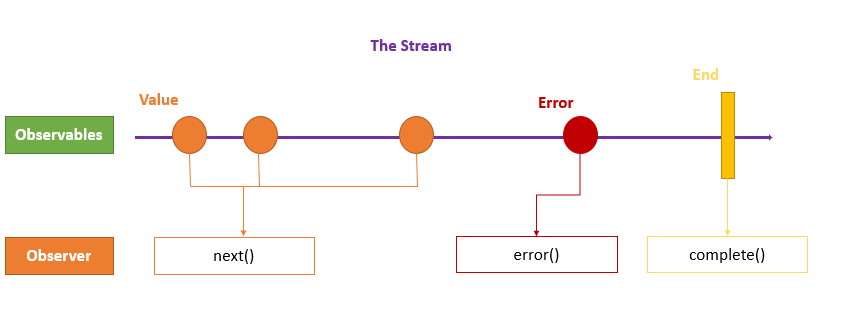

## Observables

Observables provide support for passing messages between parts of your application. We can use observables for event handling, asynchronous programming, and handling multiple values.

The obserser pattern is similar to the [publish/subscribe](https://en.wikipedia.org/wiki/Publish%E2%80%93subscribe_pattern) design pattern. Observables define a function for publishing values, but it is not executed until a consumer subscribes to it. The subscribed consumer then receives notifications until the function completes, or until they unsubscribe.

An observable can deliver multiple values of any type (literals, messages, or events). The API for receiving values is the same whether the values are delivered synchronously or asynchronously and the setup and the logic are both handled by the observable. We'll only concentrate on subscribing to consume values, and when done, unsubscribing. The observer subscribes to the observable to receive the value. To execute the observable we have created and begin receiving notifications, we call its `subscribe()` method, passing an observer. The `unsubscribe()` method is called to stop receiving notifications.  


The observer defines three callback methods -  `next()`, `error()`, and `complete()`. The observable invokes the `next()` callback whenever the value arrives in the stream. It passes the value as the argument to the next callback. If the error occurs, then the `error()` callback is invoked. It invokes the `complete() `callback when the stream completes.



**Example:** 
```typescript
import {Observable, of } from "rxjs";

export class AppComponent {
// Create simple observable that emits three values
myObservable = of(1, 2, 3);

// Create observer object
myObserver = {
  next: x => console.log('Observer got a next value: ' + x),
  error: err => console.error('Observer got an error: ' + err),
  complete: () => console.log('Observer got a complete notification'),
};

// Execute with the observer object
constructor(){
  this.myObservable.subscribe(this.myObserver);
}
// Logs:
// Observer got a next value: 1
// Observer got a next value: 2
// Observer got a next value: 3
// Observer got a complete notification
  
}
```

> **NOTE:**  The `of(...items)`returns an *Observable instance* that synchronously delivers the values provided as arguments.

### Promises vs Observables

In Angular, we can use either Promises or Observables for handling asynchronous data. 

**The difference is** - a Promise emits a single value while Observable can emit multiple values. So, while handling a HTTP request, a Promise can manage a single response for the same request, but if there are multiple responses to the same request, then we have to use an Observable.

**Example:** 
```typescript
const promise = new Promise((data) =>{ 
    data(1);
    data(2);
    data(3);    }).then(element => console.log('Promise '+ element));
// Logs:
// Promise 1

const observable = new Observable((data) => {
    data.next(1);
    data.next(2);
    data.next(3);   }).subscribe(element => console.log('Observable ' + element));

// Logs:
//Observable 1
//Observable 2
//Observable 3
```

## RxJS - Subjects

**R**eactive E**x**tensions for **J**ava**S**cript([RxJS](https://rxjs.dev/guide/overview)) is a framework for reactive programming using observables that makes it easier to write asynchronous code.

An RxJS Subject is a special type of Observable that allows values to be multicasted to many Observers.

By default an RxJS Observable is unicast, i.e. each subscribed observer has an independent execution of the Observable, whereas multicast means that the Observable execution is shared by multiple Observers. 

Every Subject is an Observer. It is an object with the methods `next(v)`, `error(e)`, and `complete()`. To feed a new value to the Subject, just call `next(theValue)`, and it will be multicast to the Observers registered to listen to the Subject. We subscribe to the Subject to recieve values normally.


**Example:**  Here, we have two Observers attached to a Subject and we feed some values to the Subject.

```typescript
import { Subject } from "rxjs";
export class AppComponent implements OnInit{
  ngOnInit(){
      const subject = new Subject();
      //First Observer
      subject.subscribe({
         next: (data) => console.log('First observer prints '+ data)
      });
      subject.next(1);
      //Second Observer
      subject.subscribe({
         next: (data) => console.log('Second observer prints '+ data)
      });
      subject.next(34);
      subject.next(14);
   }
//Logs:
//First observer prints 1
//First observer prints 34
//Second observer prints 34
//First observer prints 14
//Second observer prints 14
}
```
In this example, we have two observers for the subject that returns data values. If we notice, the second observer did not receive the very first `next` value because the subject simultaneously holds and efficiently distributes the values according to scope and definition. 

## Subject Variants

There are 3 subject variants:

### Behavior subject
It used to temporarily store the current data value of any observer declared before it. 
**Example:**
```typescript
ngOnInit(){
   const subject = new BehaviorSubject(0);
   //First Observer
   subject.subscribe({
      next: (data) => console.log('First observer prints '+ data)
   });
   subject.next(1111);
   subject.next(2222);
   //Second Observer
   subject.subscribe({
      next: (data) => console.log('Second observer prints '+ data)
   });
   subject.next(3333);
}
//Logs:
//First observer prints 0
//First observer prints 1111
//First observer prints 2222
//Second observer prints 2222
//First observer prints 3333
//Second observer prints 3333
```
Here, subject stores last data value '2222' and then reports by the new observer even though it was defined after the reference to it. Also, the new constructor takes an initial value.

### Replay subject

Replay Subject provides a option to choose how many values we want to emit from the last observer. This subject stores and then passes the last specificed option values to the new observer.
**Example:**
```typescript
ngOnInit(){
   const subject = new ReplaySubject(2);
   //First Observer
   subject.subscribe({
      next: (data) => {
         return console.log('First observer prints ' + data);
      }
   });
   subject.next(1111);
   subject.next(2222);
   //Second Observer
   subject.subscribe({
      next: (data) => {
         return console.log('Second observer prints ' + data);
      }
   });
   subject.next(3333);
}
//Logs:
//First observer prints 1111
//First observer prints 2222
//Second observer prints 1111
//Second observer prints 2222
//First observer prints 3333
//Second observer prints 3333
```
Here, subject stores last 2 data values ('1111' & '2222') and then reports them to the new observer.

### Async subject
A Async Subject emits the last value to observers when the sequence is completed.
```typescript
ngOnInit(){
   const subject = new AsyncSubject();
   //First Observer
   subject.subscribe({
      next: (data) => console.log('First observer prints '+ data)
   });
   subject.next(1);
   subject.next(2);
   //Second Observer
   subject.subscribe({
      next: (data) => console.log('Second observer prints '+ data)
   });
   subject.next(3);
   subject.complete();
}
//Logs:
//First observer prints 3
//Second observer prints 3
```
Here, we execute the subject only after a `complete` method is called. 

## References
* [Angular Docs - Observables Overview](https://angular.io/guide/observables)
* [RxJS Docs - Subjects Overview](https://rxjs-dev.firebaseapp.com/guide/subject)

