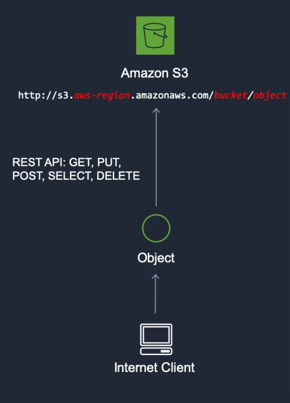
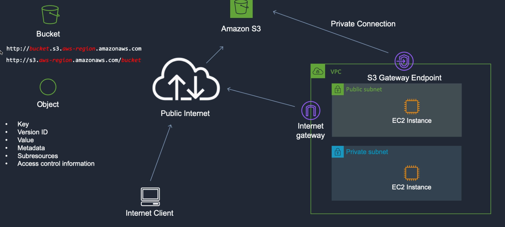

## Intro to Amazon Simple Storage Service (Amazon S3)
Amazon Simple Storage Service (Amazon S3) is an **object storage service** that offers industry-leading scalability, data availability, security, and performance. This means customers of all sizes and industries can use it to store and protect any amount of data for a range of use cases, such as data lakes, websites, mobile applications, backup and restore, archive, enterprise applications, IoT devices, and big data analytics. 

### S3 as an Object Storage System
Amazon S3 is an object storage system which means the data is stored as individual objects rather than in some kind of hierarchy like you would see in a file system or directory structure.

* Each individual object is put into a **bucket** and you connect to Amazon S3 using a URL.
* The URL will have the name of your object and the name of your bucket. The bucket is just the container in which you put your objects.
* You use what's called a REST API to connect to S3 using a URL.
* Your browser does an HTTP PUT request and it puts the objects in the bucket.



### Use Cases for S3
You can store any type of file in S3.

* Backup and Storage 
* Application Hosting
* Media Hosting
* Software Delivery - host software apps that your customers can download
* [Static Website Hosting](./static-site-hosting.md) - You can configure a static website to run from an S3 bucket.



## AWS S3 Bucket Configuration
* To upload your data (photos, videos, documents etc.) to Amazon S3, you must first create an S3 bucket in one of the AWS Regions. You can then upload your data objects to the bucket.
* Every object you store in Amazon S3 resides in a bucket. You can use buckets to group related objects in the same way that you use a directory to group files in a file system.
* Amazon S3 creates buckets in the AWS Region that you specify. You can choose any AWS Region that is geographically close to you to optimize latency, minimize costs, or address regulatory requirements. 

### To Create a Bucket
1. Sign in to the AWS Management Console and open the Amazon S3 console at https://console.aws.amazon.com/s3/.
2. Choose `Create bucket`.
3. In `Bucket name`, enter a DNS-compliant name for your bucket.  

    The bucket name must:
    * Be unique across all of Amazon S3.
    * Be between 3 and 63 characters long.
    * Not contain uppercase characters.
    * Start with a lowercase letter or number.  
<br />
4. In `Region`, choose the AWS Region where you want the bucket to reside.
5. In `Bucket settings for Block Public Access`, uncheck the `Block Public Access` settings that you want to apply to the bucket.
6. Choose `Create bucket`.

### Deleting a Bucket
Follow the steps provided in the [AWS User Guide for deleting a bucket](https://docs.aws.amazon.com/AmazonS3/latest/user-guide/delete-bucket.html)

**Once you have created a bucket, you can use it to [host static websites](./static-site-hosting/md).**


## Hosting Static Sites on S3
You can use Amazon S3 to host a static website. On a *static website*, individual webpages include static content.

> By contrast, a *dynamic website* relies on server-side processing, including server-side scripts such as PHP, JSP, or ASP.NET. Amazon S3 does not support server-side scripting, but AWS has other resources for hosting dynamic websites. To learn > more about website hosting on AWS, see [Web Hosting](https://aws.amazon.com/websites/).

* To configure your bucket for static website hosting, you can use the AWS Management Console without writing any code.
* You can also create, update, and delete the website configuration programmatically by using the AWS SDKs. The SDKs provide wrapper classes around the Amazon S3 REST API. If your application requires it, you can send REST API requests directly from your application.
* To host a static website on Amazon S3, you [configure an Amazon S3 bucket for website hosting](./s3-bucket-configuration.md) and then upload your website content to the bucket.

### Steps to Host a Static Website on your Previously Created S3 Bucket
1. Click on your bucket in your S3 Management Console
2. Select `Overview` > `Create Folder` - this is where you will upload static HTML files from your computer to be hosted on the S3 bucket.

3. Copy and Paste the following dummy HTML text into a file titled `index.html` on your computer. 

```html
<html>
<head>
    <title>Here's a title, displayed at the top of the window.</title>
</head>
<body>
    <h1>A main heading, usually the same as the title.</h1>
    <p>Be <b>bold</b> in stating your key points. Put them in a list: </p>
    <ul>
        <li>The first item in your list</li>
        <li>The second item; <i>italicize</i> key words</li>
    </ul>

    <p>Add a link to your favorite <a href="https://revature.com/learn-to-code/">Web site</a>.
        Break up your page with a horizontal rule or two. </p>
    <hr>
    <p>Finally, link to <a href="page2.html">another page</a> in your own Web site.</p>
    <!-- A copyright notice.-->
    <p>&#169; Revature 2020</p>
</body>

</html>
```

4. Select `Upload` and upload the `index.html` file you just saved to your computer.
5. Select `Properties`
6. Select `Static website hosting`
7. Select `Use this bucket to host a website` > enter the name of the file we're hosting: `index.html`.
8. Return to your bucket > click on the uploaded `index.html` file > click `Make public`.
9.  Visit the `Object URL` and you will see your static webpage hosted on your configured S3 bucket!


### References
* [S3 Documentation](https://docs.aws.amazon.com/AmazonS3/latest/dev/Welcome.html)
* [Configuring a bucket as a static website using the AWS Management Console](https://docs.aws.amazon.com/AmazonS3/latest/dev/HowDoIWebsiteConfiguration.html)
