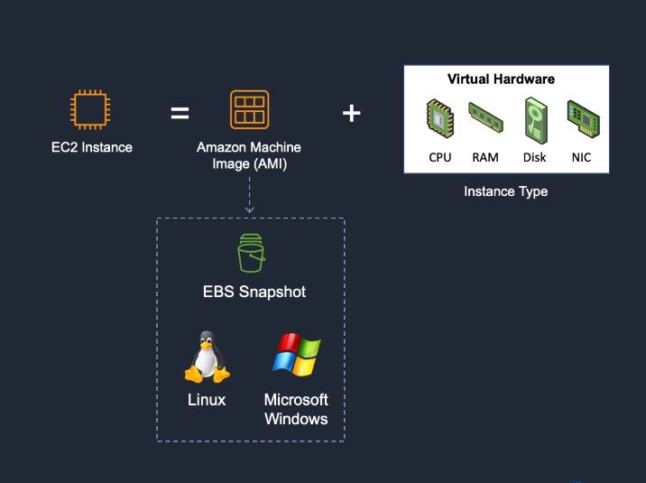
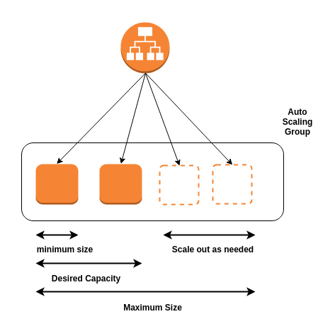
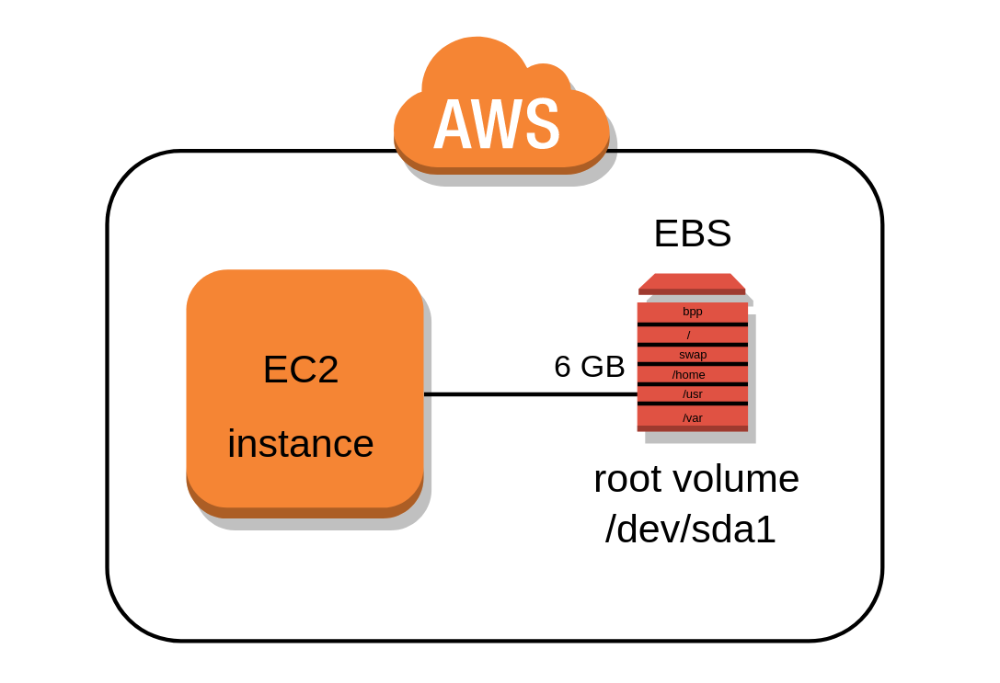
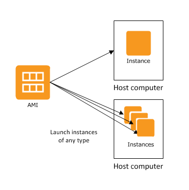

## AWS Elastic Compute Cloud (EC2)
Amazon Elastic Compute Cloud (Amazon EC2) is a web service that provides secure, resizable compute capacity in the cloud. It is designed to make web-scale cloud computing easier for developers.

##### Amazon EC2 provides:
* Virtual computing environments, known as instances
* Preconfigured templates for your instances, known as **Amazon Machine Images (AMIs)**, that package the bits you need for your server (including the operating system and additional software)
* Various configurations of CPU, memory, storage, and networking capacity for your instances, known as **instance types**
* Secure login information for your instances using key pairs (AWS stores the public key, and you store the private key in a secure place)
* A firewall that enables you to specify the protocols, ports, and source IP ranges that can reach your instances using **security groups**

### Elastic Web-Scale Computing
You can increase or decrease capacity within minutes and commission one to thousands of instances simultaneously.

### Completely Controlled
AWS EC2 give you complete control including root accessto each instance and can stop and start instances without losing data and use web service APIs.

### Flexible Cloud Hosting Serices
You can choose from multiple instance types & operating systems as well as instances with varying memory, CPU, and storage configurations.

#### Elasticity
The “Elastic” nature of the service allows developers to instantly scale to meet spikes in traffic or demand. When computing requirements unexpectedly change (up or down), Amazon EC2 can instantly respond, meaning that developers have the ability to control how many resources are in use at any given point in time.

#### Instances
An instance is a virtual server in the cloud. Its configuration at launch is a copy of the AMI that you specified when you launched the instance.

You can launch different types of instances from a single AMI. An instance type essentially determines the hardware of the host computer used for your instance. Each instance type offers different compute and memory capabilities. Select an instance type based on the amount of memory and computing power that you need for the application or software that you plan to run on the instance. For more information about the hardware specifications for each Amazon EC2 instance type, see [Amazon EC2 Instance Types](https://aws.amazon.com/ec2/instance-types/).

### Create an EC2 Instance
1. Sign into AWS as a root user.  Go to **EC2 Dashboard**. Select `Launch Instance`.
2. Choose an **Amazon Machin Image (AMI)** - select `Amazon Linux 2 AMI (HVM), SSD Volume Type` - 64 bit (x86).
3. Choose an **Instance Type** - select t2 micro (Free tier eligible)
4. Skip through steps 3-5 until you get to `6. Configure Security Group`.
5. **Configure Security Group**: configure your security group so that you can access your EC2 instance from SSH - change `Source` to `Anywhere`.
6. Proceed to launch until you are prompted to `Select an existing key pair or create a new key pair`.
7. Name your key pair `mynewkeypair`.  Click `Download`, then click `Launch Instance`.
8. Your EC2 Instance has now been launched. Go to the [SSH Into EC2 Instance](./ssh-into-ec2.md) to learn how to connect to your EC2 through SSH client.

## EC2 Autoscaling
Amazon EC2 Auto Scaling helps you maintain application availability and allows you to automatically add or remove EC2 instances according to conditions you define. 

### Benefits

1. Improve Fault Tolerance
2. Increase Application Availability
3. Lower Costs

##### Improve Fault Tolerance
Amazon EC2 Auto Scaling can detect when an instance is unhealthy, terminate it, and replace it with a new one.  

##### Increase Application Availability
Amazon EC2 Auto Scaling ensures that your application always has the right amount of compute, and also proactively provisions capacity with Predictive Scaling.

##### Lower Costs
Amazon EC2 Auto Scaling adds instances only when needed, and can scale across purchase options to optimize performance and cost.

### Auto-Scaling Groups
**Groups** are collections of EC2 instances with similar charcteristics.  Using the auto scaling groups you can increase the number of instances to improve your application performance and also you can decrease the number of instances depending on the load to reduce your cost. The auto-scaling group also maintains a fixed number of instances even if an instance becomes unhealthy.

### Launch Configuration
The launch configuration is a template used by auto scaling group to launch EC2 instances. You can specify the Amazon Machine Image (AMI), instances type, key pair, and security groups etc.. while creating the launch configuration.

### Scaling Plans
Scaling plans tells Auto Scaling when and how to scale. Amazon EC2 auto-scaling provides several ways for you to scale the auto scaling group.

* Schedules Scaling
* Dynamic Scaling
* Predictive Scaling

### How to Configure Autoscaling
In order to configure autoscaling, you must create an AMI and launch template.  You can find [full autoscaling documentation here](https://docs.aws.amazon.com/autoscaling/ec2/userguide/GettingStartedTutorial.html#gs-tutorial-next-steps).  The basic steps are as follows:

1. Create a launch template
2. Create an Auto Scaling group
3. Verify your Auto Scaling group
4. Customize Auto Scaling plan.
5. (Optional) Delete your scaling infrastructure

## Amazon Elastic Block Store (Amazon EBS)
Amazon Elastic Block Store (Amazon EBS) provides block level storage volumes for use with EC2 instances.

* EBS volumes behave like raw, unformatted block devices. You can mount these volumes as devices on your instances.
* EBS volumes that are attached to an instance are exposed as storage volumes that persist independently from the life of the instance. 
* You can create a file system on top of these volumes, or use them in any way you would use a block device (such as a hard drive). 
* You can dynamically change the configuration of a volume attached to an instance.
* With Amazon EBS, you pay only for what you use. 

### EBS Volumes
An Amazon EBS volume is a durable, block-level storage device that you can attach to your instances. After you attach a volume to an instance, you can use it as you would use a physical hard drive. You can use EBS volumes as primary storage for data that requires frequent updates, such as the system drive for an instance or storage for a database application.

* EBS volumes are created in a specific **Availability Zone**, and can then be attached to any instances in that same Availability Zone.

### EBS Snapshots
ou can back up the data on your Amazon EBS volumes to **Amazon S3** by taking point-in-time snapshots. Snapshots are incremental backups, which means that only the blocks on the device that have changed after your most recent snapshot are saved. 

### How to Create an EBS Volume for AWS EC2
1. Sign into AWS using your administrator account.
2. Navigate to the EC2 Console.
3. Choose a EC2 setup region from the Region drop-down list at the top of the page.
4. Select `Volumes` in the Navigation pane.
5. Click `Create Volume`.
6. Click `Create`.
7. Choose `Actions→ Create Snapshot`.
8. Type `EBS.Backup` in the Name field, type `Test Backup` in the Description field, and then click `Create`.
9. Click `Close`. The volume is ready to use.

When you finish this example, you can delete the volume you created by selecting its entry in the list and choosing Actions →Delete Volume. In a real-world setup, you can attach this volume to any EC2 instance or detach it when it’s no longer needed.

## Amazon Machine Image (AMI)
An Amazon Machine Image (AMI) provides the information required to launch an instance.  Think of it as a template for an EC2 Instance.

#### An AMI includes the following:
* One or more EBS snapshots.
* Launch permissions that control which AWS accounts can use the AMI to launch instances.
* A block device mapping that specifies the volumes to attach to the instance when it's launched.

## Security Groups
A **security group** acts as a virtual firewall for your EC2 instances to control incoming and outgoing traffic based on their IP address. 

* Security group rules enable you to filter traffic based on protocols and port numbers.
* Security groups are stateful — if you send a request from your instance, the response traffic for that request is allowed to flow in regardless of inbound security group rules. Responses to allowed inbound traffic are allowed to flow out, regardless of outbound rules.
* You can add rules to each security group that allow traffic to or from its associated instances. You can modify the rules for a security group at any time. 

*When demoing configuring an EC2 instance, you should set the security groups before you launch your instance.  You can set your first Security Group to `Anywhere`, so that it is easiest to connect from any IP address.*

### Changing an instance's security groups
After you launch an instance into a VPC, you can change the security groups that are associated with the instance. You can change the security groups for an instance when the instance is in the running or stopped state.

#### To change the security groups for an instance using the console

1. Open the Amazon EC2 console at https://console.aws.amazon.com/ec2/.
2. In the navigation pane, choose `Instances`.
3. Open the context (right-click) menu for the instance and choose `Networking` > `Change Security Groups`.
4. In the `Change Security Groups` dialog box, select one or more security groups from the list and choose `Assign Security Groups`.

### References
* [AWS EC2 Documentation](https://docs.aws.amazon.com/AWSEC2/latest/UserGuide/concepts.html)
* [AWS EBS Documentation](https://aws.amazon.com/ebs/?ebs-whats-new.sort-by=item.additionalFields.postDateTime&ebs-whats-new.sort-order=desc)
* [AMI Types](https://docs.aws.amazon.com/AWSEC2/latest/UserGuide/ComponentsAMIs.html)
