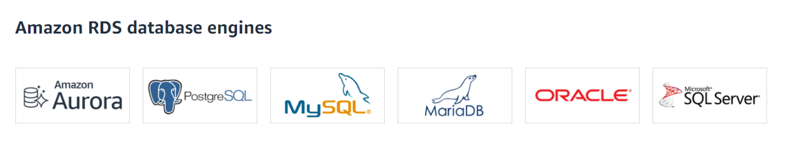
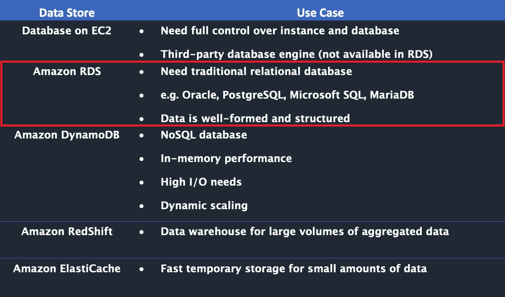
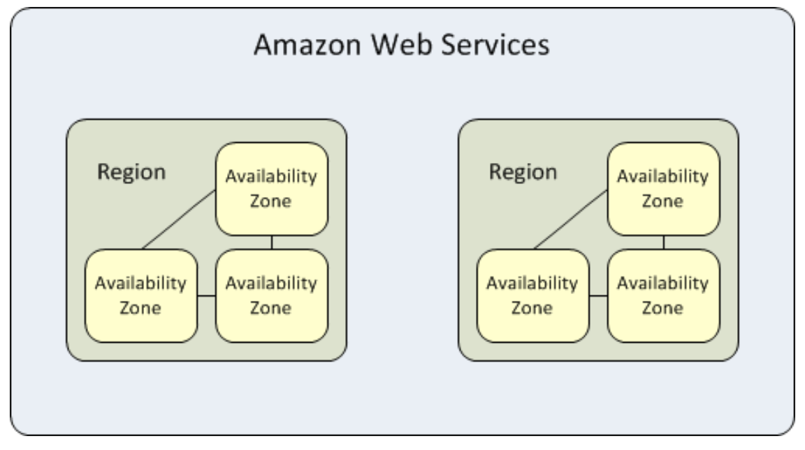

# RDS Overview
The following overview will cover:  
* What is Amazon RDS?
* Why use RDS?
* Regions & Availability Zones
* Security
* How to interact with Amazon RDS
* Using AWS RDS vs. Installing a database on an AWS EC2 Instance

## What Is Amazon Relational Database Service (Amazon RDS)?
Amazon Relational Database Service (Amazon RDS) is a web service that makes it easier to set up, operate, and scale a relational database in the AWS Cloud. It provides cost-efficient, resizable capacity for an industry-standard relational database and manages common database administration tasks.
 
 

 

* RDS **automates** expensive and time consuming tasks such as managing backups, software patching, automatic failure detection, and recovery.  

* You can help control who can access your RDS databases by using **AWS Identity and Access Management (IAM)** to define users and permissions.  

* RDS is available on several **database instance types**.  **Instance types** comprise varying combinations of CPU, memory, storage, and networking capacity and give you the flexibility to choose the appropriate mix of resources for your database.
    * Examples of instance types include `T3`, `T2`, `M6g`, `M5`, etc...You can read more about instance types [here](https://aws.amazon.com/rds/instance-types/).  
 

* RDS is **free to try** and you will be charged based on how much computational power you use per month (pay-as-you-go).  

* RDS provides you with six familiar database engines to choose from, including Amazon Aurora, PostgreSQL, MySQL, MariaDB, Oracle Database, and SQL Server. 
      

## Why Use RDS?
It's important to distinguish AWS RDS from *other database solutions offered through AWS*.

* AWS offers 15 database engines including *relational, key-value, document, in-memory, graph, time series, and ledger databases*.  

* With **RDS**, you don’t need to worry about database management tasks such as server provisioning, patching, setup, configuration, backups, or recovery. The RDS manages this for you.  

* **RDS** is a **relational** database service, therefore it organizes data within tables in rows and columns.  Compare this to non-relational or NoSQL databases which use different mechanisms to store and retrieve data through key-value pairs, document models, etc.  
 

See the image below to see how AWS RDS differs from other databases available in AWS.

  
 
 

## Regions & Availability Zones
* An **AWS Region** is a highly available data center that houses Amazon cloud computing resources in different areas of the world (for example, North America, Europe, or Asia).  

* Each AWS Region contains multiple distinct locations called **Availability Zones**, or AZs.  

* Each Availability Zone is engineered to be isolated from failures in other Availability Zones. Each is engineered to provide inexpensive, low-latency network connectivity to other Availability Zones in the same AWS Region. 

* By launching instances in separate Availability Zones, you can protect your applications from the failure of a single location.  This makes AWS fault-tolerant.
    * **Fault-tolerance** defines the ability for a system to remain in operation even if some of the components used to build the system fail.
 

  

## Security
* A **security group** controls the access to a DB instance. It does so by allowing access to IP address ranges or Amazon EC2 instances that you specify.

* You can set security groups when configuring your RDS instance.  

## How to Interact with Amazon RDS
There are several ways that you can interact with Amazon RDS.
##### 1. AWS Management Console
You can manage your DB instances from the console with no programming required. To access the Amazon RDS console, sign in to the AWS Management Console and open the Amazon RDS console at <a href="https://signin.aws.amazon.com/signin?redirect_uri=https%3A%2F%2Fconsole.aws.amazon.com%2Frds%2F%3Fstate%3DhashArgs%2523%26isauthcode%3Dtrue&client_id=arn%3Aaws%3Aiam%3A%3A015428540659%3Auser%2Frds&forceMobileApp=0">https://console.aws.amazon.com/rds/</a>

##### 2. Command Line Interface
You can use the AWS Command Line Interface (AWS CLI) to access the Amazon RDS API interactively.  Install the AWS CLI [here](https://docs.aws.amazon.com/cli/latest/userguide/cli-chap-install.html).  To begin using the AWS CLI with RDS, view the [AWS CLI Command Reference](https://docs.aws.amazon.com/cli/latest/reference/rds/index.html).

##### 3. Programatically Accessing Amazon RDS
While developing an application, developers may use the *AWS Software Development Kits (SDKs)* and utilize the [RDS Application Programming Interface (API)](https://docs.aws.amazon.com/AmazonRDS/latest/UserGuide/ProgrammingGuide.html) to automate tasks for managing DB instances and other objects in Amazon RDS.

## Using AWS RDS vs. Installing a database on an AWS EC2 Instance
DB services (like RDS) are *managed* services, meaning that you have limited control over the actual database. (i.e you can't install particular software you may need).

* **EC2 (Elastic Cloud Compute)**, on the otherhand, gives you maximum control over the software stack, database, and operating system.
* **EC2** allows you compute capacity and `SUPER` priveleges, increasing flexibility.

* **RDS** is more cost-effective and is automated, but limits your control over the database.
* **RDS** takes care of your database from end-to-end by managing, maintaining, and securing it, eliminating overhead costs and the role of a DBA (Database Administrator).  

> For a full comparison of AWS RDS vs. EC2 see [this article](https://medium.com/awesome-cloud/aws-amazon-rds-vs-amazon-ec2-relational-databases-comparison-b28eb0802355#:~:text=Whereas%2C%20for%20more%20control%20and,from%20end%2Dto%2Dend.&text=maintaining%2C%20and%20securing.-,Whereas%2C%20for%20more%20control%20and%20flexibility%2C%20EC2%20will%20be,better%20for%20your%20relational%20database.).  
> Find the EC2 overview module [here](https://gitlab.com/revature_training/aws-core-team/-/tree/master/modules/ec2).  

### References
* [Databases on AWS](https://aws.amazon.com/products/databases/?nc=sn&loc=0)
* [RDS Instance Types](https://aws.amazon.com/rds/instance-types/)
