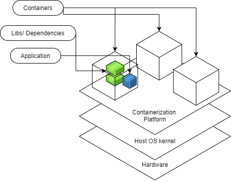
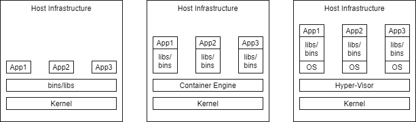

# Contanerization


## Introduction
A **container** is a mechanism for packaging an application(or limited number of processes) with its dependencies so that it runs in its own isolated sandbox. 

Containerization helps to ensure the application or set of processes can run reliably regardless of the host environment. The container shouldn't be able to modify or interact with it anything it doesn't need and, on the whole, changes in the container should not effect the Host or other containers (and vice versa). 

The following diagram illustrates the structure of containers- an application in a container is isolated to just what it needs.



## Foundations
### Linux
LinuX Containers, which provide the foundation for most modern container systems (including Docker), began with two key kernel tools in Linux: cgroups and namespaces
- Control groups (cgroups) is a kernel feature that allows you to exercise control over the resources used for a particular process-- via monitoring and limiting
	- Things like limiting the amount of memory for a process, determining the priority of a process- how much CPU time, and stopping/starting that process or set of processes. 

- Namespaces 
	- method of encapsulating a global resource 
	- Different types: 
		- mount: set of mount points exposed (First namespace type introduced)
		- PID: set of process IDs exposed, form a hierarchy 
		- Net (network): set of network resources exposed; routing tables; socket port member names etc. 
		- UTS: Unix timesharing system- defines visible host and domainname-- not related to DNS 
		- User: Isolates the user ID and group ID-- can make a user seem like the super user for its namespace, but in actuality the user has limited privileges in the context of the greater system
		- IPC
		- Cgroup 
		- and more

	- Namespaces determine what is visible to a particular process. A process begins as part of a single instance of each particular namespace type. 
		- can only see a certain set of other process IDs, network resources, mount points etc. 
		- namespaces also provide a layer of virtualization-- a process might see itself as having PID 1. In its namespace this may be "true", but there may be a namespace further up the heirarchy that understands this same process as having PID 312 

Take the cgroup management of resources + namespaces => the basics of a container  

=> Isolation and Virtualization => Containerization 

By packaging up an application in a container you ensure that it has all the needed dependencies and can modify/use only what it needs. You also ensure that the application is portable. 

### Windows Containers
As Linux containers gained popularity, Windows worked to keep up and find it's own solution to support containerization. While Windows met with some challenges since their operating system setup is a bit different from Linux, they were able to ultimately support the same functionality through tools that were analogous to cgroups and namespaces. Though, because of the manner in through which certain resources must be shared, they also came up with another version of containers that's based on the same technology used by virtual machines. As they got things working and were able to break down the problems they faced, in 2016, the question became how to make these features available to users of the Windows OS. The solution became to partner with Docker who by that point was already a huge driving force in the move toward containerization.  

As the diagram illustrates the docker engine runs upon the platform specific supports for containers within either the Windows OS or Linux OS. 
.png)

## Containers
- Built from images (template for the container)
- Run on an engine (on the host OS) i.e. Docker Engine
- Ideally stateless
	- State needed to persist for an application should be stored in a way that is essentially "detachable" from the actual container- otherwise state only persists so long as a container is running- volumes-- solve this 
- Virtualization
- Isolation

### Benefits 
- Secure 
    - Isolation and Virtualization keep your containerized apps more secure
- Standardized and thus Portable
    - Think write once run anywhere
- Lightweight 
	- shares the host operating system's kernel 
- Flexible and Loosely Coupled 
- Scalable
    - Easy to spin up and because of this lightweight ease they can be scaled up quickly 


# Containers vs. Virtual Machines 
## Overview 

Virtual machines and containers provide the ability to isolate processes from one another and provide some kind of virtualization, so that the processes can run in their own sandbox environment on the same host machine. However, virtual machines and containers do so in differing ways. 



**Note**, *virtualization* means to provide a virtualized view of some set of resources. For example, a process may have a virtualized view of a file system where it believes that it is manipulating the root of the system. Meanwhile, the directory that the process manipulates is many layers away from the root. 

## Virtual Machines
Virtual Machines simulate a physical server so that multiple "servers" can run on a single machine. 

They virtualize the entire supporting OS. Thus, using virtual machines your host computer could be windows based and you could still run a Linux OS and an application on top of it. 

Virtual machines are enabled by *hypervisors*, software that coordinates between multiple vms and interfaces with the underlying infrastructure. (Some hypervisors interact directly with the hardware, while others run on top of the underlying OS.)

### Pros
- near total isolation
- Provides virtualization
    -  virtualizing the entire OS
- Ensures an application runs reliably regardless of Host

### Cons
- considered "bulky", expensive in the context of resources 

## Containers
Containers bundle together applications with their supporting libraries and dependencies, allowing them to run isolated from one another. However, containers still share the underlying OS kernel and are, therefore, much lighter weight than virtual machines. 

Containers provide their processes a virtualized view of the underlying resources. Processes within a container only see a particular version of their environment and have limited access to resources- isolating them from the rest of the processes running on a given host. 

Containerization is enabled by an engine running on the host i.e. the Docker Engine. 

### Pros
- considered "light weight", because they don't require spinning up a whole guest OS
- they can enable layers of isolation or partial isolation-- depending on how they are implemented 
- provide a virtualized view of certain resources.
- Package an application in an isolated environment
- Ensure an application runs reliably regardless of Host

### Cons
- having layers of isolation
    - if you have need of very strict and complete isolation the ability to have layers can be a con

## Summary 
In most cases containers are preferable to virtual machines since they provide isolation and virtualization without the cost of having to spin up an entire OS on top of the host. They also enable you to vary the layers of isolation, occasionally sharing necessary resources between processes in differing containers. 

However, when a developer desires near total isolation then they may prefer to run their set of processes/application in a virtual machine. 

# Docker Architecture
## References
- [Docker Architecture from the Docker Getting Started Guide](https://docs.docker.com/get-started/overview/#docker-architecture)

## Overview
Docker adheres to a Client-Server Architecture. The client allows you to run commands and interact with the docker objects managed by the docker daemon, which is in effect the server. 

This architecture, consequently, translates into these *primary* components that allow you to run and interact with Dockerized applications (applications that have been packaged up and run in Docker containers.)
- [Docker Daemon](#docker-daemon) 
- [Rest API](#rest-api)
- [Docker CLI client](#docker-cli-command-line-interface-client)
- [Docker Registries](#docker-registries)
- [Docker objects](#docker-objects)  


As you can see from the diagram the *client* includes the commands that manage docker containers and images. The *docker host* is the computer on which the *docker daemon* runs, and the *docker daemon* is responsible for managing the *docker objects* i.e. containers and images. The *registry* is an additional/optional component that provides a centralized place to share docker images. Finally, while the *REST API* is not labeled in the diagram it's effectively the lines connecting the *client* and *docker daemon*.   

### Docker CLI (Command Line Interface) client
The command line interface is what Docker developers typically use for interactions with the Docker daemon. 

It's prefaced by the `docker` command. 

The CLI client may be on the same host machine as the Docker daemon with which it communicates, but it doesn't have to be. 

All the commands outlined in the [docker workflow module](../docker-workflow) notes are effectively part of the client. 

### [Docker Daemon](./docker-daemon.md)
The docker daemon is the long running process on the docker host that does all the heavy lifting of managing Docker objects- containers, images, etc. The docker daemon is at the core of running dockerized applications. 

### Rest API 
These are the underlying commands used by the CLI and other applications to interact with the Docker Daemon. 

### Docker registries 
Docker registries provide a centralized place to store images, allowing you to easily share images between docker hosts. The Docker Hub is a public registry managed by Docker that docker hosts can pull images from and push images to by default. 

For more info see [these notes.](../docker-workflow/dockerhub-container-registry.md)

### Docker objects
Docker objects are the building blocks that are managed by the docker daemon. The most fundamental docker objects are images and containers. Images are the templates that outline all dependencies for a particular container and it's primary process. Meanwhile the container is the runnable instance of a set of processes and their dependencies.   

For more info on some of the key docker objects see the notes on [docker containers](./docker-containers.md), [docker images](./docker-images.md), and [docker volumes](./docker-volumes.md). 

#### Typical Flow
1. Using CLI commands (in your command line, Terminal, Command Prompt etc.) such as `docker build ...` or `docker pull ...`, acquire an image. This image lays out everything needed to create and run a container. 
2. Behind the scenes the Docker daemon either pulls your image from a registry(repository of images) or it creates the image. (Depending on the command you gave.) 
3. Then you use the CLI again with a command such as `docker run ...`. (Note if you don't already have the image you were trying to run then the command will include that first step of pulling the image implicitly.) If you didn't already do this during the installation process, try the following command. 
```console
docker run hello-world
```
4. Thus, the CLI once again instructs the daemon. This time it tells the daemon to spin up a container from the image. 
    - The application or set of processes in the container are tied to its life cycle and have started with its instantiation. 
5. Finally, it's just a matter of using additional CLI commands to manage the now running container, unless the primary process of the container has already finished. In that case the container will exit on it's own.  


## References 
* [History of Containerization](https://blog.aquasec.com/a-brief-history-of-containers-from-1970s-chroot-to-docker-2016)
* [Video Explanation from VMWare](https://www.youtube.com/watch?v=EnJ7qX9fkcU)
* Docker for the Virtualization Admin Book
* [IBM learning Containerization](https://www.ibm.com/cloud/learn/containerization)
* [Namespaces Explained from NDC by Michael Kerrisk](./https://www.youtube.com/watch?v=0kJPa-1FuoI&list=RDCMUCTdw38Cw6jcm0atBPA39a0Q&start_radio=1)
* [Windows Containers](./https://docs.microsoft.com/en-us/virtualization/windowscontainers/manage-containers/hyperv-container)
* [Windows Containers Under the hood](https://medium.com/@justen.walker/a-short-introduction-to-windows-containers-db5adc0db536)
* [Windows Containers a History](https://docs.microsoft.com/en-us/archive/msdn-magazine/2017/april/containers-bringing-docker-to-windows-developers-with-windows-server-containers)
- [Containers explained in relation to VMs from F5 Dev Central](https://www.youtube.com/watch?v=wuhxSLapDe0)
- Docker for the Virtualization Admin Book- [View here](https://goto.docker.com/rs/929-FJL-178/images/docker-for-the-virtualization-admin.pdf)
- [IBM on VMs vs. Containers](https://www.ibm.com/cloud/learn/containerization#toc-virtualiza-jttBZ0x-)
- [IBM on Virtualization](https://www.ibm.com/cloud/learn/virtualization-a-complete-guide)
