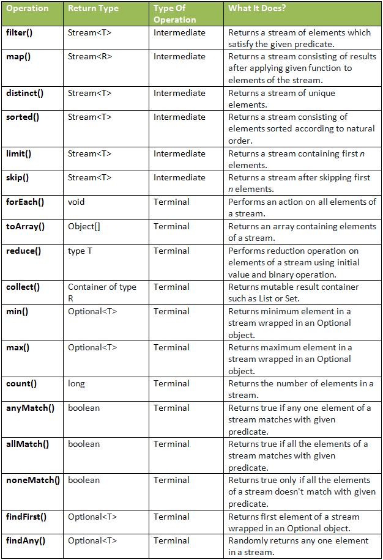

# Functional Programming in Java
From wikipedia: *In computer science, functional programming is a programming paradigm where programs are constructed by applying and composing functions. It is a declarative programming paradigm in which function definitions are trees of expressions that map values to other values, rather than a sequence of imperative statements which update the running state of the program.*

Java is not a "pure" functional programming language, but since version 8 Java has had functional programming features based on Lambda Calculus (the basis for funcitonal programming in general). We have, so far, been interested in Object-Orented Programming, which is a type of Procedural Programming. Functional Programming is a type of Declarative Programming. These categories of programming are complex, nuanced, and not really crucial for our needs. We are interested in three main facets: Functional Interfaces, Lambdas, and the Stream API.

## Lambda Expressions
Lambda expressions are one of the biggest new features of Java 8, and they introduce some important aspects of **functional programming** to Java. The most basic syntax of a lambda expression is:

```java
parameter(s) -> expression
```

For example, we can use the `.forEach` method of the `Iterable` interface, which accepts a lambda expression as its argument:

```java
List<String> names = new ArrayList<>();
names.add("Alice");
names.add("Bob");
names.add("Charlie");
names.forEach(str -> System.out.println(str));
```

This will print out the names just as if we had used a `for` loop. The lambda syntax could also be done with an explicit type declaration for the parameter, but the compiler can infer the type from the value used. For multiple parameters, parentheses are required around them. Also, curly braces are optional for single statements but required for multiple. Finally, the `return` keyword is also optional for a single expression because the value will be returned by default.

## Functional Interfaces
[Functional interfaces](https://docs.oracle.com/javase/8/docs/api/java/util/function/package-summary.html) are interfaces that **have only one abstract method**. This method is what lambdas are implementing when they are declared - the parameter types and return types of the lambda must match the functional interface method declaration. The Java 8 JDK comes with many built-in functional interfaces, listed in the Javadocs link above.

We can also use functional interfaces as types to which we can assign lambda functions, like so:

```java
interface MyFunctionalInt {
  int doMath(int number);
}

public class Execute {
  public static void main(String[] args) {
    MyFunctionalInt doubleIt = n -> n * 2;
	MyFunctionalInt subtractIt = n -> n - 2;
	int result1 = doubleIt.doMath(2);
	int result2 = subtractIt.doMath(8);
	System.out.println(result1); // 4
	System.out.println(result2); // 6
  }
}
```

## Stream API
The Java 8 [Stream API](https://docs.oracle.com/javase/8/docs/api/java/util/stream/package-summary.html) is a functional-style way of defining operations on a stream of elements. Streams are an abstraction which allow defining operations which do not modify the source data and are lazily executed. Streams **do not store data**, they simply define operations like filtering, mapping, or reducing, and can be combined with other operations and then executed. Some built-in `Stream`s are located in the `java.util.stream` package.

Streams are divided into *intermediate* and *terminal* operations. Intermediate operations return a new stream and are always lazy - they don't actually execute until a terminal operation is called. Terminal operations trigger the execution of the stream pipeline, which allows efficiency by perfoming all operations in a single pass over the data.

Finally, reduction operations take a sequence of elements and combine them into a single result. Stream classes have the `reduce()` and `collect()` methods for this purpose, with many built-in operations defined in the `Collectors` class.

```java
List<Student> students = new ArrayList<>();
// add students...
List<Double> grades = students.stream()
                          .filter(s -> s.isAttending())
						  .mapToDouble(s -> s.getGrade)
						  .collect(Collectors.toList());
```

### Intermediate Operations
Intermediate operations all take a stream and return a new stream. They are not actually invoked until a terminal operation is called.   
 - map()
 - filter()
 - distinct()
 - sorted()
 - limit()
 - skip()


### Terminal Operations
Terminal operations all take in a stream but do not return another stream. Once a series of streams hits a terminal operation, the intermediate operations are called and the final return type is produced.
 - forEach()
 - toArray()
 - reduce()
 - collect()
 - min()
 - max()
 - count()
 - anyMatch()
 - allMatch()
 - noneMatch()
 - findFirst()
 - findAny()

<div align="center"> </div>

	
## Optional Class
[The `Optional` class](https://docs.oracle.com/javase/8/docs/api/java/util/Optional.html) was introduced in Java 8 to reduce the need for excessive `null` value checking. An `Optional` is a kind of wrapper object which may or may not contain a value, with a few helper methods to handle existing or non-existent values (see Javadocs above).

Optionals are useful as replacements for `null` values when returning an "empty" response from a method. For example:

```java
public class OptionalExample {
  public Optional<String> getAmbiguousString(boolean b) {
    if (true) {
	  return Optional.of("awesome string!");
	} else {
	  return Optional.empty();
	}
  }
  
  public static void main(String[] args) {
    Optional<String> optString = getAmbiguousString(false);
	String theString = optString.orElse(""); // specify a fallback value
	System.out.println(theString);
	// we can use the String without fear of NullPointerException now
  }
}
```

## `default` and `static` methods in interfaces
Java 8 also adds new functionality to interfaces, by allowing interface methods to have implementations in some situations. By declaring a method as `default` in an interface, a "default" implementation of that method can be defined. The purpose of this is to allow additions to interfaces without breaking and having to change code in any of the classes which implement the interface. Thus, the `default` keyword allows updating existing interfaces in a way that is backwards compatible.

Methods can also now be declared as `static` in interfaces with an implementation. Since static methods belong to the interface, no overriding is necessary (or allowed, since it would simply be method hiding). `static` methods in interfaces are generally used as helper methods to assist with reusability of code.

The new features of interfaces in Java 8 bring them closer to the functionality of abstract classes, but there are still key differences. First, constructors are still not allowed in interfaces while they are in abstract classes. Secondly, interfaces allow for multiple inheritance while abstract classes cannot.

However, when two interfaces with `default` methods of the same method signature are implemented, the "diamond problem" - or multiple inheritance problem - can occur. The compiler will complain about duplicate default method inheritance, which can be resolved by overriding the default method with a custom implementation in the class.
