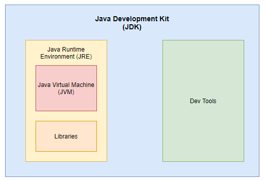

# Introduction to Java
Java is a high-level, class-based, object-oriented, programming language that is designed to have as few implementation dependencies as possible. 
 - **high level** - No direct memory management, abstracted away from hardware
 - **class based** - Everything written is inside a class, inheritance based on class
 - **object oriented** - Bundle data and behavior into a single logical unit, the class. (Encapsulation)

Java is a general-purpose programming language intended to let developers ***write once, run anywhere***. Compiled Java code can run on any **Java Virtual Machine (JVM)** regardless of the hardware and software environment.  
  
Java is a C derivative, which means its syntax is similar to that of C/C++. While Java has fewer low-level features such as direct memory access, it has high-level features C and C++ lack, such as reflection.  
  
## JVM, JRE, JDK
Java is write once, run anywhere (WORA) thanks to the JVM. Java code is compiled into **bytecode**, which are instructions the JVM understands. The JVM is specific to the operating system - there is a JVM for Windows, one for Mac, one for Linux, etc. The JVM reads the compiled Java bytecode and translates it to machine code to be executed on the given system.
  
In order to run Java code on a machine, the **JRE** or **Java Runtime Environment** is also required. The JRE contains all the runtime libraries that your code will be using. The JRE includes the JVM. When users talk about "installing Java" this usually refers to installing the JRE. In order to run Java applications, all you need is the JRE.
  
To develop Java applications you need the **JDK**, or **Java Development Kit**. The JDK provides developer tools like a compiler, debugger, documentation tools (javadoc), and other command-line utilities. The JDK also includes the JRE, and by extension the JVM, so when you write your code you can compile and run it as well. 
  
  

 

  
  
So, to recap - the JDK contains tools for Java development as well as a JRE, which contains the built-in Java libraries as well as a JVM, which actually executes our Java bytecode and runs it on the specific operating system it is installed upon.
