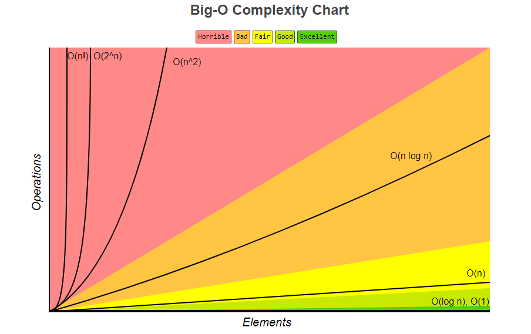
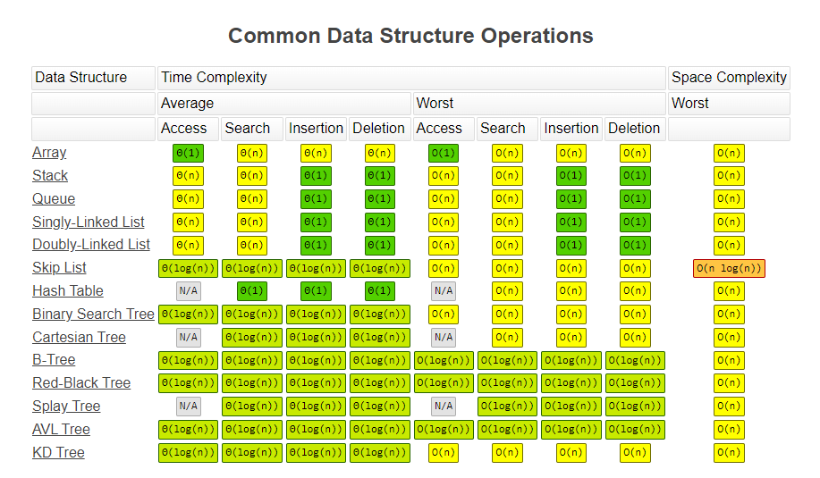
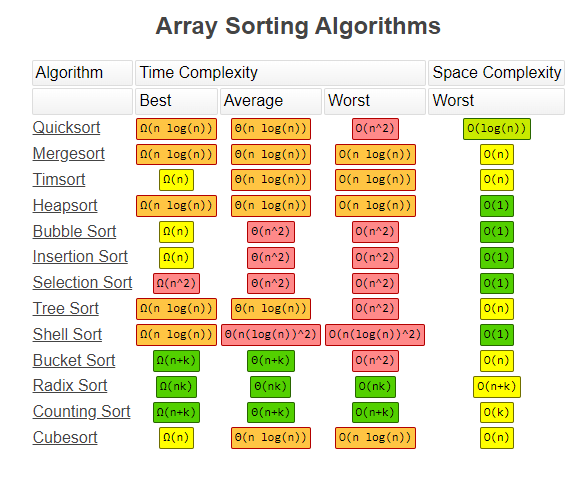

# Data Structures & Algorithms
Some of the most important and fundamental concepts in computer programming are data structures and algorithms. Data structures are any construct that can be used to keep data in memory in some ordered fashion. This includes arrays, lists, maps, sets, trees, queues, etc. These different structures have different properties which makes them better or worse at some tasks. For instance, arrays are great for rapid lookup by index. However, arrays are less than ideal for frequently inserting and removing elements. A linked list, on the other hand, can splice elements in and out fairly easily, but must traverse some portion of the list to retrieve an element by index. Data structures go hand-in-hand with algorithms, which are instructions that can be followed to complete some task. Many data structures are closely associated with particular algorithms, for instance depth-first and breadth-first are two ways to traverse a tree structure searching for a particular element. Any set of steps you can describe in order to complete some task is an algorithm.  

In this lesson we will take a look at a number of common data structures and algorithms, and learn to analyze their time and space complexity. This is a large topic, and we can only really scratch the surface. This is probably the area in computer science with the most academic potential. There are many (perhaps an infinite number of) problems that researchers continue to try and create more efficient solutions to.  

## Complexity
When we analyze algorithms we want to estimate "complexity", that is how much time and space will it take to complete the task. Time complexity is an estimate of how long a task will take, and space complexity is an estimate of how much memory is necessary. There are many factors involved in complexity. The size and structure of the inputs, the algorithm itself, the speed of the device performing the task, and more. When we analyze algorithms we want to ignore as many of these variables as possible. We don't estimate time complexity in terms of minutes and seconds, for instance, because we have no way of knowing how fast or slow some device will be. Instead we measure the number of operations that will take place. Furthermore the input is arbitrary, but the size of the input is important. As the input grows, the time and space complexity often grow as well. We are mostly interested in this rate of growth. As the inputs grow to be arbitrarily large, how does the amount of space and time needed to complete the task grow?  

Time complexity is usually the more important concern. Nowadays memory is cheap and ample, and we are less concerned with space complexity. There is also often a direct trade-off between time and space, where more space generally means less time and vice-versa.

## Asymptotic Notation - Big-O, Big-Theta, Big-Omega
Our goal is to classify complexity. We can't know it exactly, we can only estimate, but this isn't just a guess. When we analyze complexity we use mathematical concepts to not just guess, but prove, the classifications. These classifications have boundaries, and we prove that we are below some boundary (Big-O), above some boundary (Big-Omega), or within some tightly bounded range (Big-Theta). For programmers the most important of these is Big-O, or the worst-case scenario.  

 - The formal definition of Big-O: f(n) = O(g(n)) => there are positive constants c and k, such that 0 ≤ f(n) ≤ cg(n) for all n ≥ k.

What does this mean? This means that as n grows (n is the variable that represents the size of the input) two functions grow in complexity, f and g. Funciton f is the one we are measuring. Function g is some function who's complexity we are guaranteeing will be greater than or equal to f. We're saying that there is some other function, g, that we prove is always going to take longer or take up more space than funciton f. Variable c is an arbitrary factor that you can multiply by the output of fuinciton f to get the cooresponding output of function g. Variable k is some arbitrary minimum size for n, where after that point the predicate above holds true. 

So, saying some algorithm is O(n^2) "...is Oh of n squared" means that n squared is the upper bound. This is what "Big-O" notation says, that some function is the upper bound of our function.  
Function f is O(n^2)  =  "Function f is oh of n squared."  

We can similarly find the lower bound, the best-case scenario. This is written with Big-Omega, or Big-Ω. 
 - Formal definition of Big-Ω: f(n) = Ω(g(n)) => there are positive constants c and k, such that 0 ≤ cg(n) ≤ f(n) for all n ≥ k.  

And we can find tight bounds. This is a stronger measurement with more exact boundaries, written in Big-Theta, or Big-Θ notation.
 - Formal definition of Big-Θ: f(n) = Θ (g(n)) => there are positive constants c1, c2, and k, such that 0 ≤ c1g(n) ≤ f(n) ≤ c2g(n) for all n ≥ k.  

Think of these concepts like a ceiling and a floor. If you jump, no matter how high you are able to jump you can't go higher than the ceiling. When you come back down you can't go lower than the floor. Big-O guarantees that no matter how long it takes function f to run, it will be no worse than function g.  

## Classifying Complexity
Some common complexities found when analyzing algorithms include from best (least) to worst (greatest) complexity:
 - O(1) - Constant complexity
 - O(log(n)) - Logarithmic complexity
 - O(n) - Linear complexity
 - O(n^2) - Quadratic complexity
 - O(2^n) - Exponential complexity
 - O(n!) - Factorial complexity
 
If you have heard of polynomial time and nondeterministic polynomial time, or P and NP, these things refer to time complexity.  

When we analyze complexity we are looking for some other function which is guaranteed to be of greater or lesser complexity than the function we are analyzing. We also don't care about exact values. If some operation will take n hours plus 4 seconds, we don't care about those 4 seconds. We would say that the n hours "dominates" the growth, making that 4 completely unimportant. This is why we *ignore lower order terms*. A term is part of a mathematical expression, terms are separated by + and -. So, when analyzing complexity we drop all but the largest term. For instance:  

4x^3 + x^2 + 2x + 5  =>  4x^3  once the lower terms are dropped.  

For the same reason we don't care about the leading coefficient. Remember our definitions above include some arbitrary constant coefficient, so we don't really care about constant coefficients in our analysis.  

4x^3  =>  x^3 once we drop the leading coefficient.

So: 4x^3 + x^2 + 2x + 5  =>  4x^3  =>  x^3  =>  O(x^3)

## Analyzing Complexity
Finally we are ready to look at some code and try to determine it's complexity. We simply do this by reading the code and finding out how many instructions execute. Each time any instruction executes we add that to our total. If we were considering space complexity, we would need to consider if there is a space cost associated with each instruction. Consider the following code, analyze it for time-complexity:

```java
//function f
for (int i = 0; i < n; i++) {                   // 1
	int x = i;                              // 2
	for(int j = 0; j < n; j++) {            // 3
		System.out.println(x + j)       // 4
		x++;                            // 5
	}
}
```
1. We start at the top. We don't really need to count the loop, instead we will count how many times the things inside the loop occur.
2. x=1; is a constant time operation and happens as many times as the loop iterates, so it happens n times. 
3. Another loop, again we are interested in what's inside it. Everything inside the inner loop will occur n times for each of the n iterations of the outer loop, or n squared times.
4. Printing and summing are constant time operations.
5. x++; is constant time.

So everything inside the outer loop (line 2) occurs n times, and everything inside the inner loop (lines 4 & 5) occurs n^2 times. This gives us a time complexity of: 
 - O(n^2 + n^2 + n) - combine like terms
 - O(2n^2 + n) - drop all but highest order term
 - O(2n^2) - drop constant coefficients 
 - O(n^2)


The time complexity of this function is O(n^2) "Oh of n squared". Because this function is so simple we actually also know the lower boundary: it's the same. The runtime of this function is dependent only on n, nothing else. So we have the upper bound Big-O, and we also know that is the same as the lower bound Big-Ω. Because we have these boundaries and because they are tightly bounded we also know Big-Θ. 

So we can say that function f is O(n^2), and we can also say it is Ω(N^2), and Θ(n^2). Not all functions will be so simple. For instance, sorting algorithms often will perform better or worse not only based on the size of n, but how well sorted the input is. In those cases the upper and lower boundaries will be different, and the algorithm will fall somewhere in between.

## Analysis of Common Data Structures and Algorithms



