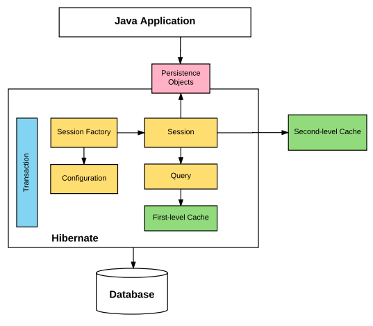
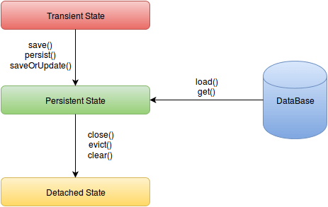

# Object Relational Mapping (ORM) 

Most object-oriented applications use a relational database to store and manage the application data. The relational database represents data in a table, whereas the data in object-oriented applications encapsulated in an object.

We can access a class by using its objects. However, to access the tabular data, we need to use a query language. Using tabular data in an object-oriented application requires a conversion between the two types of data.

As a result, it is not possible to store the objects directly in a relational database. These differences between object-oriented and relational database paradigms are called **impedance mismatch**.

[Impedance Mismatch](https://en.wikipedia.org/wiki/Object-relational_impedance_mismatch) can exist at the following points:

* **Granularity** - refers to the mismatch in the number of classes that are mapped with a certain number of tables in the database.
 
* **Inheritance** - Java classes in the application are commonly related to each other through an inheritance hierarchy. However, the tables within the database can't be represented through an inheritance hierarchy.
 
* **Identity** - The relational database distinguishes an object instance on the basis of their primary key. However, an object model distinguishes an object on the basis of object identity and object equality.

* **Association** - In the object model, two classes are linked by association. However, in relational databases, the linking of tables is achieved with the help of foreign keys.
 
* **Navigation** - The ways of accessing objects in Java and in RDBMS are fundamentally different.

To solve the impedance mismatch, we use an **ORM** tool that converts the **data between relational databases and object oriented programming languages**.

[ORM](https://en.wikipedia.org/wiki/Object-relational_mapping) stands for **O**bject-**R**elational **M**apping, uses objects to connect the Object-Oriented programming language and the database systems, which facilitates the SQL to work along with the object-oriented programming concepts. 


### Benefits of ORM

* ORM maps an object to the table.
* We can hide the details of SQL queries from OO logic. This propagates the idea of data abstraction.
* It provides methods for automatic versioning and timestamping.
* It provides caching support for better performance.
* Best suited for large projects
* Injected transaction management
* Configurable logging
* Faster development of applications

There are lots of ORM tools available such as Hibernate, JPA, Active JPA, iBATIS, IBM Pure Query, etc.


## JPA

The [Java Persistence API](https://en.wikipedia.org/wiki/Java_Persistence_API)(JPA) is a standard API for accessing, persisting and managing data between Java objects/classes and a relational database. 

It is defined in the **javax.persistence** package. It uses **Java Persistence Query Language** (JPQL), which is an object-oriented query language to perform database operations. It uses the **EntityManager** interface to create, read, and delete operations for instances of mapped entity classes.


## Hibernate

[Hibernate](https://en.wikipedia.org/wiki/Hibernate_(framework)) is an object-relational mapping tool for Java programming language. It is an open-source persistent framework introduced by **Gavin King** in 2001.  It is a flexible and powerful ORM solution to map Java classes to database tables. Hibernate is an **implementation of JPA**, so it follows the common standards provided by the JPA. Historically Hibernate provided its own extensions to JPA interfaces and syntax, but has started to return to a more JPA-friendly syntax. Because of this, you will find significant differences between older versions of Hibernate and newer versions, starting around Hibernate 5.2.

It is defined in the **org.hibernate** package. It uses **Hibernate Query Language** (HQL), which is very similar to JPQL. Hibernate's **Session** interface is an extension to JPA's **EntityManager** interface, and so can create, read, and delete operations for instances of mapped entity classes. 


Since we have used **JDBC** (Java Database Connectivity) for a long time, we know that JDBC provides a Java API for accessing relational databases from Java programs, to execute SQL statements. 

**Drawbacks  in the JDBC approach:**
* If we use JDBC in large applications, it results in significant complexity.
* If we need to change our database (for example, MySQL to Oracle, we might have to rewrite many SQL queries to satisfy differences in SQL syntax between the two databases 
* We need to convert database ResultSet objects to Java Objects manually, and vice-versa. If the schema changes, we need to change the DDL, the POJO classes, *and* the conversions between the two
* The developer requires database-specific knowledge to write queries.
* The states of Java Objects are fetched and managed by developers. In other words, changes to data by the application need to be saved to the database manually

Hibernate is used to overcome these drawbacks of JDBC.

Some of the **advantages** of Hibernate are:

* Hibernate’s **transparent persistence** ensures the automatic connection between the application’s objects with the database tables. It reduces the lines of connection code. 

* Hibernate is **database independent**. It can be used to connect with any database like Oracle, MySQL, Sybase, etc. Changing the SQL sent to a database is as simple as changing the *database dialect* in the configuration file.

* Hibernate framework provides an **abstraction** -  Many common tasks are implemented for us internally, like establishing a connection with the database, writing a query to perform CRUD operations, etc. 

* Hibernate supports **dual-level Caching** mechanism. Through the caching concept, Hibernate retains the objects in the cache to reduce repeated hits to the database. This feature makes Hibernate highly scalable and optimizes the application’s performance.

# Hibernate architecture 

Hibernate is a collection of various constituent components that work together to communicate with the database to ensure data integrity and consistency.

The following diagram illustrates the main building blocks of **Hibernate architecture**:



To persist data in the database, the application communicates with the Hibernate layer that contains the following core classes and interfaces of the Hibernate API:

* Configuration Class
* SessionFactory Interface
* Session Interface
* Transaction Interface
* Query Interfaces

**Persistent objects:** These are instances of POJO classes, that each represent a row in a table in the database. These objects get translated to a row in the related table in the database by the Hibernate. They are configured in mapping files (`YourClass.hbm.xml`) or annotated with `@Entity` annotation.


The following figure shows the working of the hibernate classes and interfaces :


## Object States in Hibernate 

The three Object States in Hibernate are:

* **Transient State**
* **Persistent State**
* **Detached State**

An object of a persistent class (a class mapped to a relational database table) can be in one of three different states. These states are defined in relation to a **persistence context** (Session object). 

### Transisent

* When an object is created using the `new` operator and not yet associated with a Hibernate Session, then the object state is transient.
* It doesn't represent a row in the database. 
* Transient instances are garbage collected if the application does not hold a reference anymore.


### Persistent

* The object state is persistent when it is associated with the hibernate session.
* The Persistent object represents a row in the database and has an identifier value. 
* Transient instances can be made persistent by associating them with a Session.
* The `save()`, `persist()` and `saveOrUpdate()` methods are used to associate a transient object with a session and make them persistent. 
* Hibernate detects the changes made to persistent objects and synchronizes the state with the database. 
* Whenever we get the data from the database using `get()` or `load()` methods, the data will be in the persistent state.

### Detached

* When a persistent object has its session closed, then it becomes detached. 
* Any changes made to detached objects will not be saved automatically to the database. 
* When a detached instance reattached with a new Session at a later point in time, it makes the object persistent again.
* The Session class' `close()`, `evict(Object)`, and `clear()` methods are used to move a persistent object to the detached state.
* The Session class' `update(Object)` and `merge(Object)` methods can used to reattach detached objects to a session. 

**Object states:**



# Hibernate Core Interfaces
The Hibernate core interfaces are used in just about every Hibernate application. Using these interfaces, you can store and retrieve persistent objects and control transactions.


## Configuration

[Configuration](https://docs.jboss.org/hibernate/orm/5.4/javadocs/org/hibernate/cfg/Configuration.html) is a class defined in `org.hibernate.cfg` package. It represents a **configuration** or **properties** file for Hibernate. The configuration object is created once during **application initialization**. It is the first object created by Hibernate. Using the Configuration object we can create a SessionFactory object, which is eventually used to create a Session object to perform the object persistence operations.

```java
Configuration config = new Configuration();
config.configure().addAnnotatedClass(Employee.class);
```

* The `configure()` method loads mappings and properties from the hibernate.cfg.xml or hibernate.properties file which should be present in the classpath. 
* The `addAnnotatedClass()` method used to specify the entity class. 
* We can also use `setProperty()` method to add properties like hibernate.connection.url, hibernate.connection.username, hibernate.connection.password, etc.
* If the config file is not valid then it will throw an exception. If it is valid then it creates a meta-data in memory and returns the meta-data to object to represent the config file.


## Session Factory

[SessionFactory](https://docs.jboss.org/hibernate/orm/5.4/javadocs/org/hibernate/SessionFactory.html) is an interface defined in the `org.hibernate` package, and is used to create the **Session** Object. The SessionFactory object is used by all threads of an application. It is a **thread-safe** and **immutable** object mapped to a single database. It holds the **second-level cache** of data in hibernate.

```java
StandardServiceRegistry registry = new StandardServiceRegistryBuilder().configure().build();
SessionFactory sessionFactory = new MetadataSources( registry ).buildMetadata().buildSessionFactory();
```

## Session

[Session](https://docs.jboss.org/hibernate/orm/5.4/javadocs/org/hibernate/Session.html) is an interface defined in the `org.hibernate` package. Session objects are created using the SessionFactory and are used to perform CRUD operations.

* Session Objects wrap the **JDBC connection** and serve as a factory of **Transaction**, **Query**, and **Criteria** objects.  
* Session Objects are not thread-safe.
* It is lightweight, and holds a mandatory **first-level cache** of persistence objects.

```java
Session session = sessionFactory.openSession();
```

## Transaction

[Transaction](https://docs.jboss.org/hibernate/orm/5.4/javadocs/org/hibernate/Transaction.html) is an interface defined in the `org.hibernate` package. A transaction is associated with a **Session** and usually instantiated by a call to `Session.beginTransaction()`.  

* Transaction object is used whenever we perform any operation and based upon that operation there is some change in database.
* Within one transaction you can do several operations and can **commit the transaction** once after completing all operations. 
* We can also **rollback** all previous uncommitted operations. Transactions are not automatically committed when their session gets flushed. 
* Transactions are handled by an underlying transaction manager and JDBC transaction or JTA transaction. 

```java
Transaction tx = session.beginTransaction();
//set of operation performed on DB
tx..commit();
```

## Query

[Query](https://docs.jboss.org/hibernate/orm/3.2/api/org/hibernate/Query.html) is an interface defined in the `org.hibernate` package.  A Query instance is obtained by calling `Session.createQuery()`.

* **Query** can be used to expose extra functionality beyond that provided by `Session.iterate()` and `Session.find()`.
* You may select a particular page of a result set by calling `setMaxResults()` or `setFirstResult()`.
* You may use named query parameters.
* Queries are written in HQL or Native SQL of your database

```java
Query query=session.createQuery();
```

## Criteria

[Criteria](https://docs.jboss.org/hibernate/orm/3.5/javadocs/org/hibernate/Criteria.html) is an interface defined in the `org.hibernate` package. Criteria is a simplified API for retrieving entities by composing Criterion objects.

* The **Session** is a factory for Criteria. Criterion instances are obtained via the factory methods.

```java
Criteria criteria=session.createCriteria();
```

## References
* [What is Object/Relational Mapping?](https://hibernate.org/orm/what-is-an-orm/)
* [Hibernate](https://docs.jboss.org/hibernate/orm/5.4/userguide/html_single/Hibernate_User_Guide.html)
* [Difference Between Hibernate and JPA](https://www.educba.com/hibernate-vs-jpa/)
* [Hibernate object states](https://docs.jboss.org/hibernate/core/3.3/reference/en/html/objectstate.html#objectstate-overview)
* [Modifying persistent state](https://docs.jboss.org/hibernate/orm/6.0/userguide/html_single/Hibernate_User_Guide.html#pc-managed-state)
* [Architecture](https://docs.jboss.org/hibernate/orm/5.4/userguide/html_single/Hibernate_User_Guide.html#architecture)
* [Further Reading on Hibernate Interfaces](https://www.geeksforgeeks.org/hibernate-architecture/)
* [Architecture](https://docs.jboss.org/hibernate/orm/5.4/userguide/html_single/Hibernate_User_Guide.html#architecture)
* [Hibernate Core Interfaces](https://www.decodejava.com/hibernate-architecture.htm)
