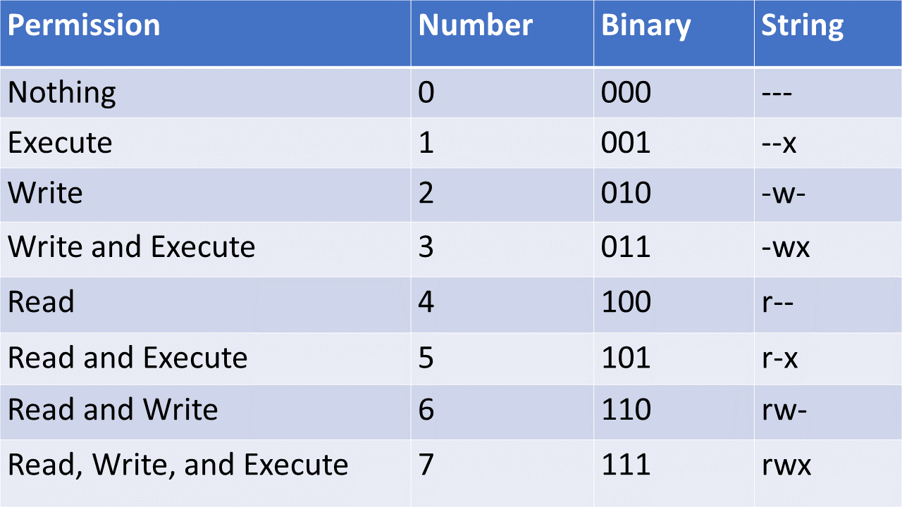

# Unix
Unix is a family of operating systems that derive from one built in the 1970s at Bell Labs by AT&T. The current owner of the Unix license is The Open Group, however, Novell, Inc currently holds the copyrights. Linux operating systems and OS X operating systems are based on Unix. One of Unix's standard features is the command-line shell that is used to interface with the operating system. In Linux, this shell is commonly Bash.

## Bash
The Bourne Again Shell or Bash is based on the original Unix shell, which was called sh. Bash is compatible with sh and incorporates other features as well. Bash was created in 1989.

# Commands
In this section, we'll be covering some basic Unix commands. Before we begin, we should cover the basic aliases for locations in your file system. A file system is generally comprised of a directory, or folder, that itself can contain files and directories in a tree structure. The top-level directory is known as the `root directory` and it is the folder that contains all of the other folders on the drive partition you are currently accessing. In Unix, your `root directory` is represented by the `/` character. For example, if you wished to change directory to the `root directory` from anywhere on the partition, you would issue the following command: `cd /`

That's all well and good, but what about the directory you're currently in? The `.` character represents the current directory. Furthermore, `..` represents the parent directory, so if you wanted to copy everything from the current directory up to the directory immediately above it, you would issue the following command: `cp -r . ..`

In Unix, we also have a directory called the `home directory`. This directory is usually the one that our terminal starts in and it is where our personal files are generally stored. This directory is represented by the `~` character.

Now, let's talk about some Unix commands:

## Arguments and Flags
In Unix, commands can be modified in two ways.
1. Commands can have arguments. Arguments given to a command take the form of strings written after the command. ex. `command arg1 arg2 arg3`
2. Commands can have flags. Flags are special arguments given to a command. There are two kinds of flags in Unix, short-hand or character flags, a single character (or group of characters), prefixed by a single dash `-c`, and full flags, the full name of the flag, prefixed by a double dash `--flag`.

Arguments to your command usually represent variables or targets for your command, and flags usually represent options you wish to enable for your command.

Ex. The following two commands do the same thing:
```
cp -r hi bye
cp --recursive hi bye
```
The above commands copy the contents of the `hi` directory to the `bye` directory recursively, using the `-r` and `--recursive` flags. This means that the `cp` command has been told to copy the contents of a directory instead of it's default mode which copies a specific file.

`hi` and `bye` are arguments to the command.

## The Most Important Command
`man` - The manual command will print to the terminal the manual for using a particular command. If you are unsure what flags or arguments a command takes, you simply type `man command`. For example, if you wished to see the manual for the copy command, you would issue the command: `man cp`

## Directory Commands
* `cd` - The change directory command allows us to navigate to a different directory on the drive. 
  * go to root directory: `cd /`
  * go to home directory: `cd` or `cd ~`
  * navigate one directory up: `cd ..`
  * navigate into the `hi` directory, which is inside the `bye` directory: `cd ./bye/hi`
  * change to the previous directory: `cd -`
* `ls` - The list directory command allows us to see the contents of a particular directory. When given no arguments, it lists the contents of the current directory. The `-a` flag allows you to see hidden items in the directory.
  * list the contents of the current directory: `ls`
  * list the contents of the `hi` directory: `ls hi` or `ls ./hi`
  * list the contents of the directory including the "hidden" contents: `ls -a`
* `mkdir` - The make directory command allows us to create a new directory. mkdir takes an argument representing the name of the directory you wish to create.
  * create a directory named `hi`: `mkdir hi`
* `pwd` - The print working directory command prints the full name of the directory you are currently working in. For example, if you were working in the `home` directory inside of the `root directory` the output of `pwd` might be `/home`.

## General Purpose Commands

* `su` - The substitute user command allows you to switch users. With no argument, this defaults to the root user, which has higher priveleges. This can be useful if you need to perform multiple commands with elevated priveleges but is generally considered to be bad practice in preference to `sudo`, for administrative logging purposes.
* `sudo` - the sudo command allows you to run a particular command as the root user.
* `clear` - the clear command usually prints a number of blank lines such that all previous commands are no longer on the screen. There is a shortcut for this command, `ctrl-l`
* `echo` - the echo command will print a string or the result of a command to the console.
* `>` - The `>` operator will redirect the output of a command to a file. The file will be created or overwritten if it already exists. ex. `ls . > log.txt`
* `>>` - The `>>` operator acts the same way as the `>` operator but appends output to the file instead of overwriting if it exists.
* `grep` - the grep command prints any lines in a file or files that match a given pattern. By default, grep interprets the pattern as a basic regular expression.
  * Print all lines in `hello.txt` that contain the word `goodbye`: `grep goodbye hello.txt`


## File Commands
* `cat` - the concatenate command prints the contents of a file to the console. `cat hello.txt`
* `head` - the head command prints the first ten lines of a file to the console. `head hello.txt`
* `tail` - the tail command prints the last ten lines of a file to the console. `tail hello.txt`
* `touch` - the touch command allows you to modify the timestamp of a file. This command is usually used to create empty files, as an empty file is created if touch is given a file name that does not exist. `touch hello.txt`
* `cp` - the copy command creates a copy of the specified file at the location specified. If the recursive glag is used, it will operate on directories.
  * copy a `hello.txt` to `goodbye.txt`: `cp hello.txt goodby.txt`
  * copy the `hello` directory to the `goodbye` directory: `cp -r hello goodbye`
* `mv` - the move command will rename or move a file or entire directory with the recursive flag.
  * rename a `hello.txt` to `goodbye.txt`: `mv hello.txt goodbye.txt`
  * move `hello.txt` to the `goodbye` directory: `mv hello.txt goodbye/.`
  * rename the `hello` directory to `goodbye`: `mv -r hello goodbye`
* `rm` - the remove command will delete a file. If you use the recursive flag, it can delete a directory. The force flag will cause the command to delete files without prompting the user if there are warnings. The command `rm -rf .` is extremely dangerous.
  * remove `hello.txt`: `rm hello.txt`
  * remove the `hello` directory: `rm -r hello`
* `wc` - the word count command will print the number of words in a file. This command has several flags available
  * `-c, --bytes` - prints the byte count
  * `-m, --chars` - prints the character count
  * `-l, --lines` - prints the lines
  * `-w, --words` - prints the word count (default)
* `ln` - the link command creates a link between files. This allows you to make a shortcut to a file in one location without copying it over.

# Environment Variables
Environment variables are values that are accessible in an entire working environment. In Unix, these values are set in the shell when it is started. For example, your home directory is an environment variable called `$HOME`. If you wish to see the value of a particular environment variable, you can use the `echo` command like so: `echo $HOME`.

To set your own environment variables, you can use the `export` command. For example, if you wanted to create an environment variable to store the password to your server, you could issue the following:
```
export SERVER_PASS=password
echo $SERVER_PASS
```

However, if you issue the above command into your console, when you close the shell and open it again, your environment will no longer be present. To keep these environment variables, you will have to place the command in one of your startup files, usually 
```
~/.bashrc
```

You can also remove environment variables with the `unset` command: 
```
unset SERVER_PASS
echo $SERVER_PASS
```


# Command-line Text Editors
You can write files in the shell by making use of built-in text editors such as `nano` and `vim` or `vi`.

## Guides
* [Beginner's Guide to Nano](https://www.howtogeek.com/howto/42980/the-beginners-guide-to-nano-the-linux-command-line-text-editor/)
* [Beginner's Guide to Vim](https://www.linux.com/training-tutorials/vim-101-beginners-guide-vim/)


# Package Managers
In Unix, if you wish to install software, you generally use a package manager. There are many package managers available and we will talk about a few.

## RPM
The Red Hat Package Manager or RPM is a package management system that manages `.rpm` files. It was created for Red Hat Linux but is used in many distributions.
## APT
Advanced Package Tool or APT is a package manager used on many Linux distributions. It allows you to retrieve, configure, and install/uninstall software packages.
## yum
The Yellowdog Updater, Modified or yum is a package-management utility for computers running RPM. When you create an EC2 using an Amazon Linux AMI, yum is installed.

As you are most likely to run into yum when you are working with Amazon linux, here are a few examples:
```
# update installed pacakges
sudo yum update
# Install git
sudo yum install git
# Uninstall git
sudo yum remove git
```
## dpkg
Debean Package is a low-level tool that manages `.deb` files. It was created for Debian and its derivatives.

# File Permissions
In Unix, file permissions can become very important. Every file in Unix has three types of permissions.
1. Owner permissions - What the owner of the file is allowed to do to the file.
2. Group permissions - What the group of users that the file belongs to is allowed to do to the file.
3. Other (world) permissions - What everyone else is allowed to do to the file.

Each type of permission can have any combination of read (`r` or `4`), write (`w` or `2`), and execute (`x` or `1`) permissions. You can represent these permissions as either a number or a string of characters. For example, someone with read and write permissions has `6` or `rw` permissions.



## Viewing permissions

You can see the permissions of files in a directory by using the `-l` flag on the `ls` command to get it to print the "long listing format"

`ls -l .`

## Changing permissions

You can change the permissions on a file using the `chmod` or change file mode bits command.

If you are using the numbers, it is as simple as specifying the correct permissions for the `owner`, `groups`, and `other` types and issuing the command targeting the file. For example, if I wished the owner to have read, write, and execute, groups to have read and execute, and other to have read permissions on `hello.text` I would issue the following command:

`chmod 754 hello.txt`

Otherwise, if you are using the strings, you have to specify which groups you are granting or revoking access to. Owner (u), group (g), and other (o) can be specified or all (a) can be used. The `+` indicates a granted privilege, `-` indicates a revoked privilege, and `=` allows you to set privileges.

Examples:
```
# Everyone has all permissions
chmod a+rwx hello.txt
# Revoke write access to other
chmod o-w hello.txt
# Set group access to be the same as other
chmod g=o hello.txt
```
