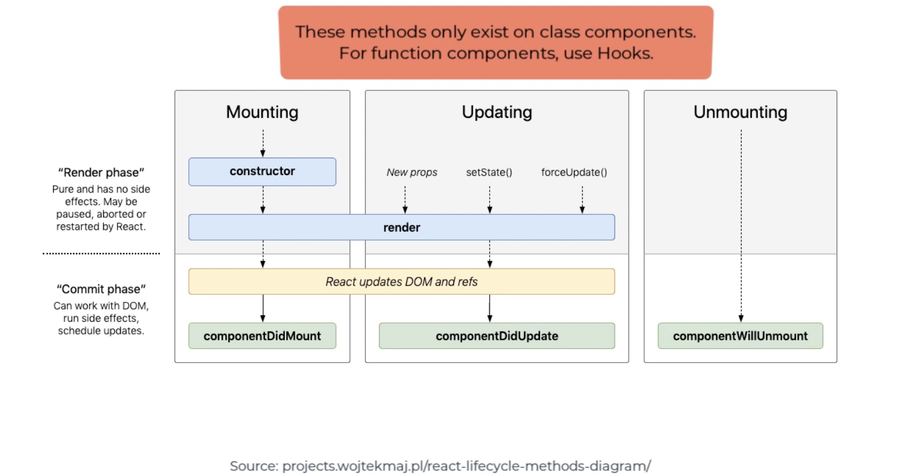

# React Components

In React, a component is a reusable piece of your UI. The idea is that grouping your front end into reusable pieces, will help with the maintainability of your code. Components should be architected based on the single responsibility principle, and should be broken apart if they grow beyond that scope.

React has the ability to render components in order to display the view. There are two main ways that Components are created nowadays. The traditional way of creating components was through declaring a Class-based component as seen below:

```JS
import React from 'react'

class Hello extends React.Component{
    render(){
        return <p>Hello World!</p>
    }
}
```

The alternative way of declaring an equivalent component is through using functions instead:

```JS
import React from 'react'

function Hello(){
    return <p>Hello World!</p>
}
```

note that you can also use arrow functions to create functional components:

```JS
import React from 'react'

const Hello = () => {
    return <p>Hello World!</p>
}
```

PascalCase is used for each of our component names.

Back in the day, class based components used to be considered as more powerful, but in recent releases of React, functional components should be able to achieve most of the same use cases as class based components (functional components used to not have the ability to deal with state, but that changed with React Hooks). In general, functional components can be used for almost every scenario where a class based component is needed, and are the preferred way of creating components in React because it requires less typing and is more concise (there is also some speculation that class based components might be deprecated at some point in the future).

## Component Lifecycle

There are several lifecycle steps that a component will go through. Knowing the names of methods or hooks that correspond to certain phases in the component lifecycle is useful for functions that you want to call during certain steps of the lifecycle.



- [React Component Lifecycle Docs](https://reactjs.org/docs/react-component.html)

## Container vs Presentation Components

React isn't very opinionated, so theoretically you could structure your components however you would like. However, over the years, there have been certain best practices that have emerged regarding how you should create your components. One popular pattern is to use one component for purely the presentation of the data, and another that manages the state and logic of that presentational component. Typically the 'presentational' component is made a child of the 'container' component. Note that this relationship has many names. Here are some common ones: Container and Presentation, Smart and Dumb, Controller and View, Data and Display.

There are also more advanced techniques for combining components called [_Higher order Components_](../04-advanced-react/high-order-components.md).

- [Types of Component Patterns](https://www.youtube.com/watch?v=YaZg8wg39QQ)
