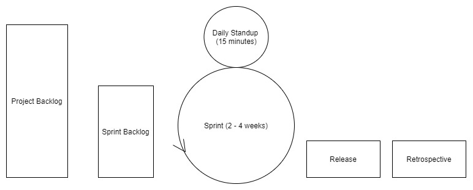
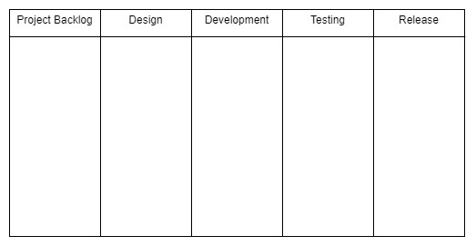

# SDLC - Software Development Life Cycle
 
### Helpful References/Links
 
* [SDLC - Waterfall Model (tutorialspoint)](https://www.tutorialspoint.com/sdlc/sdlc_waterfall_model.htm)
* [SDLC - Agile Model (tutorialspoint)](https://www.tutorialspoint.com/sdlc/sdlc_agile_model.htm)
* [Scrum - Framework (tutorialspoint)](https://www.tutorialspoint.com/scrum/scrum_framework.htm)
* [Kanban (Atlassian)](https://www.atlassian.com/agile/kanban)
* [The Benefits and Pitfalls of Pair Programming in the Workplace (freeCodeCamp)](https://www.freecodecamp.org/news/the-benefits-and-pitfalls-of-pair-programming-in-the-workplace-e68c3ed3c81f/)
* [Story points and estimation (Atlassian)](https://www.atlassian.com/agile/project-management/estimation)
* [Extreme Programming (Agile Alliance)](https://www.agilealliance.org/glossary/xp/#q=~(infinite~false~filters~(postType~(~'post~'aa_book~'aa_event_session~'aa_experience_report~'aa_glossary~'aa_research_paper~'aa_video)~tags~(~'xp))~searchTerm~'~sort~false~sortDirection~'asc~page~1))
 
## Software Development Lifecycle (SDLC)
 
SDLC is the series of steps that we go through when creating new products. It encompasses methodologies (broader categories of development concepts and practices) and frameworks (a more detailed implementation of a methodology's ideas). We will be discussing the Waterfall and Agile methodologies in addition to the Scrum, Kanban, Scrumban, and eXtreme Programming frameworks (all of which are frameworks of the Agile methodology). Although the order/repetition of the steps in the two methodologies is different, they both contain the same overarching steps that are characteristic of SDLC as a whole; these are gathering requirements, analyzing those requirements, designing a solution, developing the solution, testing the solution, user acceptance testing (UAT), releasing the solution, and finally maintaining the product. These eight steps can be categorized into three phases: the design phase (gathering/analyzing requirements and designing the solution), the development phase (developing, testing, and UAT), and the deliver phase (release and maintenance). We'll begin our journey into the methodologies and frameworks by first discussing the methodologies and how they implement/order these steps and phases.
 
## The Waterfall Methodology
 
Waterfall is a very rigid methodology that follows a strict series of steps. Waterfall practitioners follow each of the eight SDLC steps in order, never revisiting a previous stage; just like a natural waterfall, the methodology only flows in one direction. E.g. once development has begun, Waterfall practitioners accept no new requirements from the client. In fact, this exclusion of the client is one of the major drawbacks to Waterfall. Let's further explore Waterfall's drawbacks and benefits.
 
### Waterfall Drawbacks
 
As stated in the previous section, the Waterfall methodology excludes the client in every step between requirement gathering and deployment - your client better have given you a complete set of requirements at the beginning because once development starts, you're not accepting any new feature requests. Additionally, you should pray that they are satisfied with the end result because once you deploy the product, you are only maintaining existing features - never adding new ones. The one-direction flow makes changes to previous stages impossible. Finally, Waterfall practitioners do not test until all development has been completed, so a bug or problem that may have been developed months prior will not be noticed until the entire project has entered the testing phase.
 
### Benefits of Waterfall
 
The same rigidness that hinders the methodology can also work to its advantage. There is no room for confusion in Waterfall because there is a clear barrier between each step, making it easy for team members to keep track of where they are in the project. This clear barrier also allows for a clean transfer of knowledge between steps. For example, when moving from development to testing, team members will already know every aspect of the project that will _ever_ need to be tested; because there is no revisiting past steps, they do not have to worry about any future functionality in need of scrutiny. This clarity also applies to the entire Waterfall lifecycle - programmers have an understanding of what the finished product will look like and do as soon as the design phase has been completed because all requirements are gathered before design (or development, for that matter) begins. Lastly, unlike the Agile methodology (which we will detail in a bit), Waterfall does not require any specific procedural knowledge - followers simply intuitively move from one step and phase to the next.
 
## Term Definitions
 
Before we dive into Agile, let's define some basic terms that will help us understand and intelligently discuss Agile planning and analysis.
 
**User Story**: An individual feature of/requirement for a project in Agile development.
 
**Epic**: A group of related features that is broken down into multiple user stories.
 
**Story Point**: A level of difficulty assigned to a user story through the use of a sequence of numbers that increases with increasing difficulty.
 
**Sprint**: A brief period of development (almost always less than four weeks, sometimes as short as one week) generally culminating in a release of related features.
 
**Velocity**: The sum of story points of all user stories completed during a sprint. Velocity allows Agile teams to more accurately predict how many user stories can be completed in future sprints.
 
## The Agile Methodology
 
Where Waterfall is rigid, Agile is fluid. This fluidity has brought popularity, largely owing to the ability to adjust to changing requirements and requests from the client. For now, let's talk about the benefits and drawbacks of the methodology as a whole. Later, We will explore four Agile frameworks. 
 
### Agile Drawbacks
 
Although flexibility can be advantageous, it can also lead to bad practices. For example, developers may be tempted to avoid fully designing their solutions prior to implementation because they know that the methodology allows for revisiting past SDLC steps. _This is not how Agile should be utilized._ Rather, the Agile fluidity should be used to adapt to changing requirements from the client and unforeseen circumstances that are not simply the result of poor, or nonexistent, planning. Allowing for change can also encourage unpredictability - another drawback of the methodology. Finally, as we will detail when talking about the Agile frameworks, properly following Agile practices necessitates knowledge of those practices - the methodology is more complicated than the comparatively simple Waterfall approach.
 
### Benefits of Agile
 
Although we highlighted the dangers of allowing for changing feature requests in the last section, the ability to handle and respond to these shifts is a benefit. Additionally, the Agile flexibility extends to release times - because the Agile release cycle is iterative, any features that cannot be included in the upcoming release can simply be made as part of the following deployment. Multiple releases also allow for faster movement through the testing phase because developers are testing a small set of features, not the entire project at once as in Waterfall. Lastly, the methodology allows for initial ambiguity. For example, suppose Feature B is built on top of Feature A. Because we have the ability to put both features in separate releases, we can wait until the release containing Feature A is deployed and we are in the design phase of the following iteration before designing Feature B. This allows for the solution to Feature B to be modified based on an implementation of Feature A that may be different than we had originally planned.
 
### The Scrum Framework
 
We will first explore Scrum, arguably the simplest of the Agile frameworks. It enforces certain ceremonies, led by a Scrum Master who ensures that the team is following Scrum practices. Development is broken into two to four week sprints.
 

 
The above image shows the Scrum lifecycle. Before the sprint begins, the team moves some user stories from the project backlog (the list of user stories for the entire project) to the sprint backlog (the list of features that the team is planning to complete in the upcoming sprint). Throughout the sprint, the Scrum Master leads 15 minute daily standups, daily meetings where each team member details the progress they made the previous day, their plans for the coming day, and any roadblocks they have run into. The standup creates an environment where each team member knows how the project in totality is progressing, even though they may only be working on one component. It also allows for a set time where programmers can ask their peers, who may have more expertise and experience in a specific area, or simply a fresh pair of eyes, for help with any issues. As any programmer can attest, there are some bugs that you will never find by yourself.
 
After the product is released at the end of each sprint, the team holds a final Scrum ceremony: the retrospective. Here, teams put any unaccomplished tasks back into the project backlog and discuss what went well in the sprint and how to continue that success, as well as what was unsuccessful and how to improve on those setbacks.
 
#### Scrum Advantages
 
Daily standups bring many benefits, particularly the ability to quickly identify any setbacks that developers on the team are experiencing and then quickly solve those problems with the help of others. The relatively short sprints allow for constant releases, which in turn incorporate the client throughout the process of developing the entire project. Involving the client allows for the team to adjust to new client feedback and feature requests, which results in an end product that more accurately reflects their client's desires, leading to increased client satisfaction.
 
#### Scrum Disadvantages
 
As we touched on when discussing Agile, the very fluidity that gives Scrum benefits also brings in uncertainty. Because the final deadline and complete requirement list are not known at the beginning of the project, it is difficult to estimate costs or a final release date. Additionally, this fluidity results in feature creep, a continuous expansion of proposed functionalities. Feature creep occurs because Scrum followers are held to no firm deadlines, so there is no reason to exclude certain user stories in order to stick to a release date and they can unceasingly add new features, never truly completing the project. Finally, Scrum's ceremonies require engagement from all team members in order to properly function. For example, the daily standup loses its effectiveness if a developer is running into setbacks but never voices them to the group.
 
### Kanban
 
The Kanban board, a vehicle for a visual representation of the progress of a project, is the hallmark trait of the Kanban framework. The image below shows an empty example Kanban board.
 

 
There is no firm requirement for the number of columns on the board, but there should generally be at least one column per SDLC phase. Kanban cards, visual representations of a single user story or work item, are placed in the columns. Team members who have completed their current task can simply refer to the board and choose a new card from the backlog to work on. There should never be more tasks in progress - i.e. not in the backlog/equivalent column or release/equivalent column - than there are developers on the team.
 
#### Kanban Advantages
 
Kanban is event-driven, removing even the small pressure of sprint deadlines found in the Scrum framework. It also allows for specialists; for example, one team member can be a testing specialist. In this scenario, once user stories have been moved into the testing/equivalent column, the testing specialist can begin working on them and the developer who had previously been responsible for that task can start work on another card in the backlog. Specialization can result in developers building stronger expertise in a particular area. Additionally, the Kanban board can always take new client requirements and is persistent throughout releases. Finally, it allows the entire team to view the current state and progress of the project.
 
#### Kanban Disadvantages
 
The capacity of the Kanban board also brings drawbacks, particularly the danger that the board's size will grow to the point where it becomes unnecessarily complex and difficult to understand/navigate. Like Scrum, Kanban also requires commitment from its devotees - an out-of-date Kanban board doesn't help (and can even hurt) the team because developers will end up working on the same tasks and will not have an accurate picture of the evolution of the project. But unlike Scrum (with timed sprints) and Waterfall (with a set project deadline from the beginning), this framework has no timing element, which can result in an even more extreme version of feature creep and constant release delays/uncertainty.
 
### Scrumban
 
We will only briefly touch on Scrumban, a combination of Scrum and Kanban. Scrumban pairs the visual representation of Kanban with the ceremonies and sprints of Scrum. Doing so mitigates Kanban's timing issues with the help of Scrum's sprints. It also gives Scrum practitioners the specialization capabilities found in Kanban (an argument between specialization and cross-functionality can be reserved for another time).
 
### eXtreme Programming (XP)
 
XP is the most verbose of the Agile frameworks we have examined. There are strict procedures designed to encourage XP's values of communication, simplicity, feedback, courage, and respect. As these values would suggest, this framework seeks to go beyond improving product quality by also improving team cohesion and the lives and happiness of individual members. XP procedures include weekly cycles (one-week sprints), quarterly cycles (i.e. quarterly releases), continuous integration (ensuring that code from new sprints can easily be assimilated into the existing code base), incremental design (initial high-level design of features and functionalities, leaving the specifics for later), the use of user stories and epics, test-driven development (TDD), pair programming, and other practices. In addition, the XP team includes a member of the customer in order to fulfill the goal of faster feedback.
 
Let's further detail TDD and pair programming because we may be implementing these practices at various points throughout training. TDD is the approach of designing the tests that your code must pass before writing the actual code (in contrast to the usual practice of writing the code then writing the tests), allowing the developer to have a clearer understanding of what their program must accomplish. But take note that using TDD is not an invitation to write test-specific code, your code should still be able to handle a variety of input, not just the input that you know your tests will give.
 
Pair programming is an approach where teams are broken into groups of two while developing. Each group includes a pilot and a navigator. The pilot is actively writing code, while the navigator is planning how the code that the pilot is writing at that moment will tie into the larger user story, epic, and project codebase. Although this may seem like it will double development time, pair programming is actually more efficient than you may expect because the pairs can collaborate and solve issues faster and narrow their focus due to lessened responsibility.
 
#### XP Downsides
 
The amount of XP procedures and practices can make following the framework difficult even for dedicated teams. In addition, the involvement of the client on the development team can be a hindrance - non-technically inclined clients may insist on inefficient implementations or question logically sound programmatic approaches. XP's weekly iterations can cause developers to sacrifice general best practices in order to make deadlines. For example, documentation may be written hastily and be incomplete. The frameworks’ short sprints and intimate inclusion of the customer can invite frequent changes, meaning that documentation can quickly become outdated.
 
Frequent iterations combined with incremental design can also be a dangerous combination as programmers may not have time within a sprint to refine their solutions to maximize code efficiency and good design principles; they may only have time to write code that simply clears the bar set by the customer requirements. Observing these drawbacks as a whole, it becomes clear that ironically, despite its lofty goal of improving employee happiness, this framework can actually be quite stressful to use.
 
#### XP Benefits
 
That being said, XP is not irredeemable. There can be advantages to such a close relationship with the customer - the constant communication minimizes or even erases the danger of sunk costs due to time spent developing features that, upon delivery, the client decides they no longer want or need. The framework's focus on communication and pair programming can increase the group's cohesion, openness, awareness of the entire project, and commitment to each other. Finally, although its pace can be stressful, the brief development periods and focus on continuous integration result in the quick delivery of working solutions.
 
### Agile Planning
 
Now that we've explored various Agile frameworks. let's revisit the terms we defined at the beginning of this module and detail how they are used in project planning. At the beginning of a sprint (if using Scrum, Scrumban, or XP) or upon receiving a new feature request (if using Kanban), teams form client requirements into epics and then break those epics into individual user stories. After that process is complete, each user story is assigned story points. In our practices, we will be assigning story points using the Fibonacci sequence - i.e. a 1 will be the absolute easiest task, 2 the next most difficult, followed by 3, 5, 8, etc. Lastly, each story is given a time estimate.
 
The art of assigning story points and time estimates is just that - an art. It takes practice to gain a solid understanding of what tasks are easier/more difficult than others for your team of developers, so don't be discouraged if your initial attempts are not particularly accurate - that's part of the learning process. Even though these estimates will not be perfect, they allow the group to have a better idea of which tasks will be easier/more difficult and take more/less time, so they can plan accordingly and accomplish goals with more ease than they would by simply flying blindly into development.
 
## A Home for Waterfall
 
We'll end this module on the same methodology we started with: the Waterfall methodology. For the vast majority of this module, we have explored Agile and its frameworks. This deep focus may lead you to believe that Agile development is _always_ preferred and there is never a scenario appropriate for Waterfall use, but this is not the case. The Waterfall methodology thrives in the right situations, particularly those with a strict deadline for the final release of the product and strict budgetary constraints. Often, these circumstances can be found in government projects - government agencies and departments are under pressure from legislators and executives to stick to an allocated budget and fulfill requests within a set time frame.
 
Let's broaden the sentiment expressed in the last paragraph - there is no perfect, one size fits all SDLC approach. As you probably noticed throughout our discussion, many times the features of a particular methodology or framework also brought inherent difficulties. Some circumstances may call for one framework, others may necessitate the use of another. Although Agile and particularly Scrum are incredibly popular, the important thing is to find what works for you and your team and allows you to most successfully implement the phases of SDLC.
 
 
