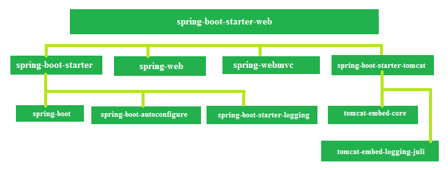

# Spring Boot Module - Spring Boot

Spring Boot is an open source Spring Framework project used to rapidly create Java based, production-grade applications utilizing Spring Framework's IOC and module integrations. Spring Boot simplifies the process of project startup and framework integration by applying highly opinionated auto-configurations for the different Spring Boot project modules like webmvc, data, security, messaging, etc... .

Spring Boot has really become popular as more and more companies create or convert their systems using microservice patterns.


### Spring Boot Dependency Management

Needless to say Spring and Spring Boot require an increasing number of dependencies. Spring Boot projects are built using dependency packages. The basic Spring Boot dependency packages are included in the project configuration (pom.xml or build.gradle) file and are called `spring-boot-starter-*`. Including one `spring-boot-starter-*` is enough to get your project started as it will include all the necessary pieces required to start developing and testing your solutions. A basic Spring Boot application configuration will container 4 parts:

- parent configuration
- spring-boot-starter
- spring-boot-starter-test
- spring-boot-maven-plugin

```xml
<parent>
    <groupId>org.springframework.boot</groupId>
    <artifactId>spring-boot-starter-parent</artifactId>
    <version>2.3.1.RELEASE</version>
    <relativePath/> <!-- lookup parent from repository -->
  </parent>
  <groupId>com.ex</groupId>
  <artifactId>phase-1</artifactId>
  <version>0.0.1-SNAPSHOT</version>
  <name>phase-1</name>
  <description>Spring boot demo phase 1</description>

  <properties>
    <java.version>1.8</java.version>
  </properties>

  <dependencies>
    <dependency>
      <groupId>org.springframework.boot</groupId>
      <artifactId>spring-boot-starter</artifactId>
    </dependency>

    <dependency>
      <groupId>org.springframework.boot</groupId>
      <artifactId>spring-boot-starter-test</artifactId>
      <scope>test</scope>
      <exclusions>
        <exclusion>
          <groupId>org.junit.vintage</groupId>
          <artifactId>junit-vintage-engine</artifactId>
        </exclusion>
      </exclusions>
    </dependency>
  </dependencies>

  <build>
    <plugins>
      <plugin>
        <groupId>org.springframework.boot</groupId>
        <artifactId>spring-boot-maven-plugin</artifactId>
      </plugin>
    </plugins>
  </build>
```

That will be all that you need for a basic Spring Boot project. Lets illustrate the difference between a basic project and more complicated one. A simple Spring Boot Web application will also have 4 parts:

- parent configuration
- spring-boot-starter-webmvc
- spring-boot-starter-test
- spring-boot-maven-plugin

And that is all the, `spring-boot-starter-webmvc` dependency replaces the `spring-boot-starter` dependency, but it contains all of the dependencies needed for the basic application and the web application.



In the diagram you can see how the `spring-boot-starter-webmvc` is an extension of the `spring-boot-starter`.

## AutoConfiguration

As we have covered the core Spring Framework and how to integrate different modules and wire dependencies, the biggest draw to using Spring Boot is the autoconfiguration. Spring Boot takes a highly opinionated stance on the module integrations reducing the amount of Spring Configuration needed to start developing and testing your solutions. Imagine integrating webmvc without having to start a server, or register your dispatcher servlet, or register your internal view resolver. Spring Boot automatically assumes you need all of these beans, creates them and wires them together. Better yet it automatically prescribes the solutions and its alternatives.

To further elaborate on this example if you include the Spring Boot WebMVC module you will automatically get:

- Embedded Tomcat Servlet Container (Jetty or UnderTow)
- Standard DispatcherServlet
- JSP Internal View Resolver

To enable auto configuration in Spring Boot, you need to include `@EnableAutoConfiguration` or `@SpringBootApplication` on a class. If you use `@EnableAutoConfiguration` then the class that the annotation is on must also be annotated with `@Configuration`. `@SpringBootApplication` doesn't require the same treatment, but it is important to note `@SpringBootApplication` is the combination of the `@SpringBootConfiguration`, `@EnableAutoConfiguration`, and `@ComponentScan` annotations.

The Spring team have created a tool call [Spring Initializr](https://start.spring.io) to help create Spring Boot application. Any application created using `Spring Initializr` either through the site or IDE plugin/integrations, will be create with a main class that is already annotated with `@SpringBootApplication`

## Overriding Configuration/Custom Configuration
Beside the features surrounding automatic configuration, Spring Boot offers a couple of other ways to configure the application in a manual way. Manual/Custom configuration can be done through either Java `code` configuration or `application.properties`.

Supplying custom configuration in the `application.properties` is the easier but less dynamic way of application configuration. The `application.properties` file is a set of key/value pairs that supply values for module beans or your own application beans.

### Overriding some Module bean configuration (application.properties)
```properties
server.port=80
server.servlet.context-path=/myapp
spring.application.name=My Super Awesome Application
```

The above snippet will override the server port of the embedded server and the application context of the embedded server, also it will change the default application name.

Using Java `code` configuration is a bit more complicated, but it is more dynamic than `application.properties`. Using `code` configuration requires the developer to understand a lot about the associated beans in the module in order to override the default configuration.

### Configuring Hibernate beans in code
```java
@Configuration
@EnableTransactionManagement
@EnableJpaRepositories
public class HibernateBeanConfiguration {
  
}
```


## Running a Spring Boot Application

Running a Spring Boot application is just a matter of either configuring your IDE to run the `main` method of the main class or using the included maven wrapper or gradle wrapper with the command `./mvnw spring-boot:run` or `./gradlew bootRun` respectively. It is important though to highlight the main method of the main class

```java
public static void main(String[] args) {
		SpringApplication.run(Application.class, args);
	}
```

The `main` method invokes the `SpringApplication.run` method which is passed the class type of the main class. This starts the Spring Boot application using the main class as the root class for configuration and component scanning.

It is super important to remember to keep classes and interfaces inside of the same root package of the project. Otherwise it will be required to include an additional `@ComponentScan` annotation to enumerate the other packages for scanning.

### Spring Boot CLI

Another, but not required tool, of Spring Boot is the Spring Boot CLI. The Spring Boot CLI allows for even faster application development or prototyping. The Spring Boot CLI runs groovy scripts, which gives Java-like syntax, but reduces the boilerplate code. [Spring Boot CLI](https://docs.spring.io/spring-boot/docs/current/reference/html/spring-boot-cli.html)


### References

- [Spring Boot docs](https://docs.spring.io/spring-boot/docs/current/reference/html/getting-started.html#getting-started-introducing-spring-boot)
- [AutoConfiguration with Spring Boot](https://docs.spring.io/spring-boot/docs/1.3.8.RELEASE/reference/html/using-boot-auto-configuration.html)
