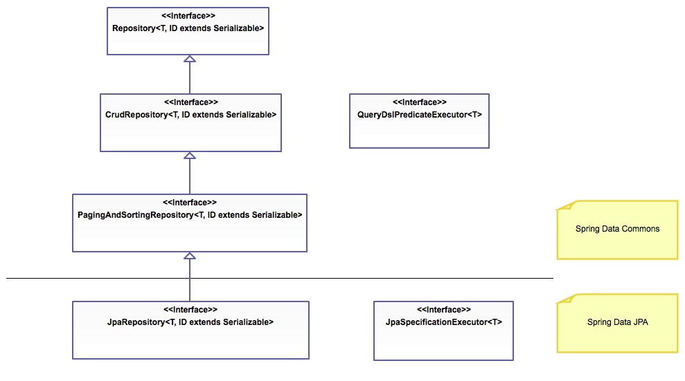

# Spring Data JPA
At this point, we have already utilized the Data Access Object (DAO) Layer to handle communication of data between our application and our repository. This DAO layer usually consists of a lot of boilerplate code, and as such can and should be simplified. There are numerous reasons to simplfy this code, including a decrease in the number of artifacts that need to be defined and maintained, consistency of data access patters, consistency of configuration, and quicker implementation for updated repository data.

The Spring Data module takes this simplification one step further by providing standard implementation for common DAO methods allowing for the removal of the DAO implementation and only requiring the definition of the DAO interface methods.

In order to leverage the Sping Data programming model with JPA, a DAO interface should extend the Spring _JpaRepository_ interface from the `org.springframework.data.jpa.repository` package. Note that it is possible to create a basic CRUD application by extending the spring _CrudRepository_ interface (from the `org.springframework.data.repository` package), though this only provides an interface for generic CRUD operations on a repository, and does not leverage the JPA.



Implementation of the Spring _JpaRepository_ provides the following:
* Sophisticated support to build repositories based on Spring and JPA
* Support for QueryDSL predicates and thus type-safe JPA queries 
  * QueryDSL is a framework which enables statically typed SQL-like queries, instead of requiring inline string queries or external XML files.
* Transparent auditing of Domain class
* Pagination (sequential numbering) support
* Dynamic query execution
* Support for integration of custom data access code
* Validation of `@Query` annotated queries during bootstrapping
* Support for XML based entity mapping
* JavaConfig based repository configuration by introducing `@EnableJpaRepositories`

# Spring Data Annotations

This page is a brief overview of the some of the Spring Data annotations. Please see the reference links for the official documentation

### References

- [Spring Data Annotations](https://docs.spring.io/spring-data/commons/docs/current/api/org/springframework/data/annotation/package-summary.html)

## Spring Data Annotations

Spring Data abstracts away the code required for data storage solutions, allowing us to focus more on the business logic. The following is a list and brief explanation of some common Spring Data annotations which allow us to configure how the queries are executed.

| Annotation                      | Purpose                                                                                   |
| ------------------------------- | ----------------------------------------------------------------------------------------- |
| @Transactional                  | Configure how the database transaction behaves. See the @Transactional notes.             |
| @NoRepositoryBean               | Creates and interface that provides common methods for child repositories                 |
| @Param                          | Parameters can be passed to queries defined with @Query                                   |
| @Id                             | Marks a field in a model class as the primary key                                         |
| @Transient                      | Mark a field as transient, to be ignored by the data store engine during reads and writes |
| @CreatedBy, @LastModifiedBy     | Auditing annotations that will automatically filled with the current principal            |
| @CreatedDate, @LastModifiedDate | Auditing annotations that will automatically fill with current date                       |
| @Query                          | Supply a JPQL query for repository methods                                                |

### @Transactional

See the notes on the @Transactional annotation for multiple examples

### NoRepositoryBean

```java
@NoRepositoryBean
public interface MyRepoBase<T, ID extends Serializable> extends JpaRepository<T, ID> {
    Optional<List<T>> findAllByPrice(Double price);
}

@Repository
public inteface BookRepo extends MyRepoBase<Book, Integer> {}
```

The interface `MyRepoBase` can now serve as a base for children repos like `BookRepo`. Spring will not create a bean of type `MyRepoBase`, but will create a `BookRepo` bean which will include all of the `JpaRepository` methods and also `findAllByPrice` from `MyBaseRepo`

### @Param

```java
@Repository
public inteface BookRepo extends MyRepoBase<Book, Integer> {

    @Query("FROM Book b WHERE b.title LIKE :title")
    Optional<List<T>> findBySimilarTitle(@Param("title") String title);
}
```

The `@Param` annotation binds the method parameter to the `title` parameter of `@Query`.

### @Id

This is essentially the same as the JPA annotation.

### @Transient

This is essentially the same as the JPA annotation.

### @CreatedBy, @LastModifiedBy, @CreatedDate, @LastModifiedDate

```java
public class Book {
    @CreateBy
    public User creator;

    @LastModifiedBy
    public User modifier;

    @CreatedDate
    public Date createdAt;

    @LastModifiedDate
    public Date modifiedAt;
}

```

### @Query

```java
@Query("SELECT COUNT(*) FROM Book b)
long getBookInventoryCount();
```

JPQL query.

```java
@Query("FROM Book b WHERE b.title LIKE :title")
Optional<List<T>> findBySimilarTitle(@Param("title") String title);
```

With named parameters.

```java
@Query("SELECT AVG(b.page_count) FROM Book b", nativeQuery=true)
int getAvgPageCount();
```

Natvie SQL query.


# JPA Example

Lets examine an example. First create a Spring project with the following dependencies:
* Spring Data JPA
* Spring Web (We will use this to interface with our application)
* H2 Database

If you choose to use Maven, the `pom.xml` file should look similar to this:
```
<?xml version="1.0" encoding="UTF-8"?>
<project xmlns="http://maven.apache.org/POM/4.0.0" xmlns:xsi="http://www.w3.org/2001/XMLSchema-instance"
    xsi:schemaLocation="http://maven.apache.org/POM/4.0.0 https://maven.apache.org/xsd/maven-4.0.0.xsd">
    <modelVersion>4.0.0</modelVersion>
    <parent>
        <groupId>org.springframework.boot</groupId>
        <artifactId>spring-boot-starter-parent</artifactId>
        <version>2.1.6.RELEASE</version>
        <relativePath/> <!-- lookup parent from repository -->
    </parent>
    <groupId>com.revature</groupId>
    <artifactId>JpaDemo</artifactId>
    <version>0.0.1-SNAPSHOT</version>
    <name>JpaDemo</name>
    <description>Demo project for Spring JPA - Spring Boot</description>

    <properties>
        <java.version>1.8</java.version>
    </properties>

    <dependencies>
        <dependency>
            <groupId>org.springframework.boot</groupId>
            <artifactId>spring-boot-starter-data-jpa</artifactId>
        </dependency>
	<dependency>
	    <groupId>org.springframework.boot</groupId>
	    <artifactId>spring-boot-starter-web</artifactId>
	</dependency>

        <dependency>
            <groupId>com.h2database</groupId>
            <artifactId>h2</artifactId>
            <scope>runtime</scope>
        </dependency>
	<dependency>
		<groupId>org.springframework.boot</groupId>
		<artifactId>spring-boot-starter-test</artifactId>
		<scope>test</scope>
	</dependency>
    </dependencies>

    <build>
        <plugins>
            <plugin>
                <groupId>org.springframework.boot</groupId>
                <artifactId>spring-boot-maven-plugin</artifactId>
            </plugin>
        </plugins>
    </build>

</project>
```

If you choose to use Gradle, the `build.gradle` file should look similar to this:
```
plugins {
    id 'org.springframework.boot' version '2.1.6.RELEASE'
    id 'io.spring.dependency-management' version '1.0.8.RELEASE'
    id 'java'
}

group = 'com.revature'
version = '0.0.1-SNAPSHOT'
sourceCompatibility = '1.8'

repositories {
    mavenCentral()
}

dependencies {
    implementation 'org.springframework.boot:spring-boot-starter-data-jpa'
    implementation 'org.springframework.boot:spring-boot-starter-web'
    runtimeOnly 'com.h2database:h2'
    testImplementation('org.springframework.boot:spring-boot-starter-test')
}

test {
	useJUnitPlatform()
}
```

Next, we must define a simple entity as a standard Bean. In this example, we will have a _Customer_ object associated with a _Customer_ table.
```
package com.revature.models;

import javax.persistence.Entity;
import javax.persistence.GeneratedValue;
import javax.persistence.Id;

@Entity
public class Customer {

  @Id // used to indicate field is the primary key
  @GeneratedValue // used to indicate property should be auto-generated
  private Integer id;

  private String firstName;
  private String lastName;

  // default constructor - for use by Spring JPA
  public Customer() {
    super();
    // TODO Auto-generated constructor sub
  }

  public Customer(String firstName, String lastName) {
    this.firstName = firstName;
    this.lastName = lastName;
  }

  @Override
  public String toString() {
    return "Customer[id=" + id + ", firstName=" + firstName + ", lastName=" + lastName + "]"
  }

  public Integer getId() {
    return id;
  }

  public void setId(Integer id) {
    this.id = id;
  }

  public String getFirstName() {
    return firstName;
  }

  public void setFirstName(String firstName) {
    this.firstName = firstName;
  }

  public String getLastName() {
    return lastName;
  }

  public void setLastName(String lastName) {
    this.lastName = lastName;
  }
}
```

Note that we have two constructors, the default no-args constructor exists for the sake of the JPA, and as such we will not use it directly. Instead, we will utilize the parameterized constructor to create instances of _Customer_ objects to be saved to the database.

Next, we create our repository interface:
```
package com.revature.repository;

import java.util.List;

import org.springframework.data.jpa.repository.JpaRepository;
import com.revature.models.Customer;

/*
 * Note that the generics for the JpaRepository should match the associated
 * model followed by the datatype of its id
 */
public interface CustomerRepository extends JpaRepository<Customer, Integer> {

  List<Customer> findByLastName(String lastName);

  Customer findById(Integer id);
}
```

Next, lets create a simple controller which we will use to interface with our application
```
package com.revature.controllers;

import java.util.List;

import org.springframework.beans.factory.annotation.Autowired;
import org.springframework.web.bind.annotation.GetMapping;
import org.springframework.web.bind.annotation.PathVariable;
import org.springframework.web.bind.annotation.PostMapping;
import org.springframework.web.bind.annotation.RequestBody;
import org.springframework.web.bind.annotation.RequestMapping;
import org.springframework.web.bind.annotation.RestController;

import com.revature.models.Customer;
import com.revature.repository.CustomerRepository;

@RestController
@RequestMapping
public class CustomerController {
	@Autowired
	private CustomerRepository customerRepository;
	
	@GetMapping(value="/all")
	public List<Customer> findAll(){
		return customerRepository.findAll();
	}
	
	@GetMapping(value="/last/{lastName}")
	public List<Customer> findByLastName(@PathVariable String lastName) {
		return customerRepository.findByLastName(lastName);
	}

	@GetMapping(value="/id/{id}")
	public Customer findById(@PathVariable Integer id) {
		return customerRepository.findById(id);
	}
	
	@PostMapping(value="/add")
	public Customer add(@RequestBody Customer customer) {
		customerRepository.save(customer);
		return customerRepository.findById(customer.getId());
	}
}
```

Note that this controller references a `findAll()` and `save()` method on our customerRepository though we have not defined these. These methods are already predefined in the JpaRepository Interface, so the only definitions we need to provide are ones which match properties of our Customer model object. A list of JPA methods can be [found here](https://docs.spring.io/spring-data/jpa/docs/current/api/org/springframework/data/jpa/repository/JpaRepository.html).

Make sure you configure your `application.properties` file:
```
#Configure DB connection
spring.h2.console.enabled=true
spring.datasource.platform=h2
spring.datasource.url=jdbc:h2:mem:testdb

#Configure the port and context path for app
server.port=8082
server.servlet.context-path=/customer
```

Finally, create the application class:
```
package com.revature;

import org.springframework.boot.SpringApplication;
import org.springframework.boot.autoconfigure.SpringBootApplication;

@SpringBootApplication
public class JpaDemoApplication {

  public static void main(String[] args) {
    SpringApplication.run(JpaDemoApplication.class, args);
  }

}
```

At this point you can add customers using postman to send `GET` and `POST` requests to save and retrieve customer data. If you would like to produce custom queries, you can do so using the `@Query` annotation in your repository interface. For example:
```
@Query("SELECT c FROM Customer c WHERE c.status = 1")
List<Customer> findAllActiveCustomers();
```

Here, we specify a "status" property for our class and utilize this to track "active" (1) or "inactive" (0) customers in our database.

Though the actual implementation of the Spring Data managed DAO is hidden (as we don't work with it directly) it is a simple enough implementation. In fact, Spring JPA provides a _SimpleJpaRepository_ interface, which extends the JpaRepository, that defines transaction semantics using annotations. Specifically, a read-only `@Transactional` annotation is used at the class level, which is then overridden for the nonread-only methods. The rest of the transaction semantics are default, but can easily be overridden manually on a per-method basis.

# JPQL Queries
JPQL is a SQL-like scripting language used by Spring JPA. Very similar to the prepared statements we used with JDBC code, JPQL can be parameterized. We basically write a JPQL template with variables inside, and then parameterize those variables before the query is executed. We can parameterize the template with indices or names, but we cannot do both in a single query. We must choose.

```java
@Query("SELECT u FROM User u WHERE u.status = :status and u.name = :name")
User findUserByStatusAndNameNamedParams(
  @Param("status") Integer status, 
  @Param("name") String name);
```

```java
@Query("SELECT u FROM User u WHERE u.status = ?1")
User findUserByStatus(Integer status);

@Query("SELECT u FROM User u WHERE u.status = ?1 and u.name = ?2")
User findUserByStatusAndName(Integer status, String name);
```


### References
* [Spring Data JPA - Reference Documentation](https://docs.spring.io/spring-data/jpa/docs/2.3.2.RELEASE/reference/html/#preface)
* [Spring JPA - API Docs](https://docs.spring.io/spring-data/jpa/docs/current/api/org/springframework/data/jpa/repository/JpaRepository.html)
* [Persistence with Spring Data JPA - Baeldung](https://www.baeldung.com/the-persistence-layer-with-spring-data-jpa)
* [Spring Data JPA - Github Repository](https://github.com/spring-projects/spring-data-jpa)
* [QueryDSL](http://www.querydsl.com/)
