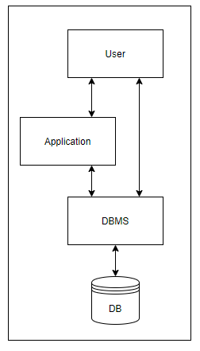

# Intro to DBMS
DBMS stands for DataBase Management System. A database is a collection of data, and the management system is a set of programs to store and access that data in a quick and effective manner. Database systems are developed to handle large amounts of data. There are many features to modern database management systems and we will only be touching on a little of the subject matter. When we talk about persisting data in a database, what we technically mean is allowing a DBMS to persist that data in an instance of a database. 

  

Relational databases are often contrasted with another category of databases - non-relational databases. We won't go into the details of non-relational databases here, but you should be aware that there are major differences. Nonrelational databases do not store data within tables that relate to each other, and thus do not use SQL to interact with the databse.

RDBMS systems are one of the key components of any enterprise application or system. Why is this the case? Think about it - data by itself doesn’t mean a lot or even have intrinsic value. A lot of data thrown in a bucket would it mean be meaningless unless some kind of processing and analysis was done on it. Related data is what provides meaning and organizes the structure of data. For example, “an employee is in one or more departments”. We might have one table to store employees and another to store departments, and then define some relationship between them.

Normally, relational databases are used in an OLTP (OnLine Transaction Processing) environment, which means that the idea of having related data is preferable in a very transactional system, and that are normally row-based.

For non-transactional environments, the counter part is OLAP (OnLine Analytic Processing) systems, which are normally columnar-based, which is faster for reading but slower for manipulation.
