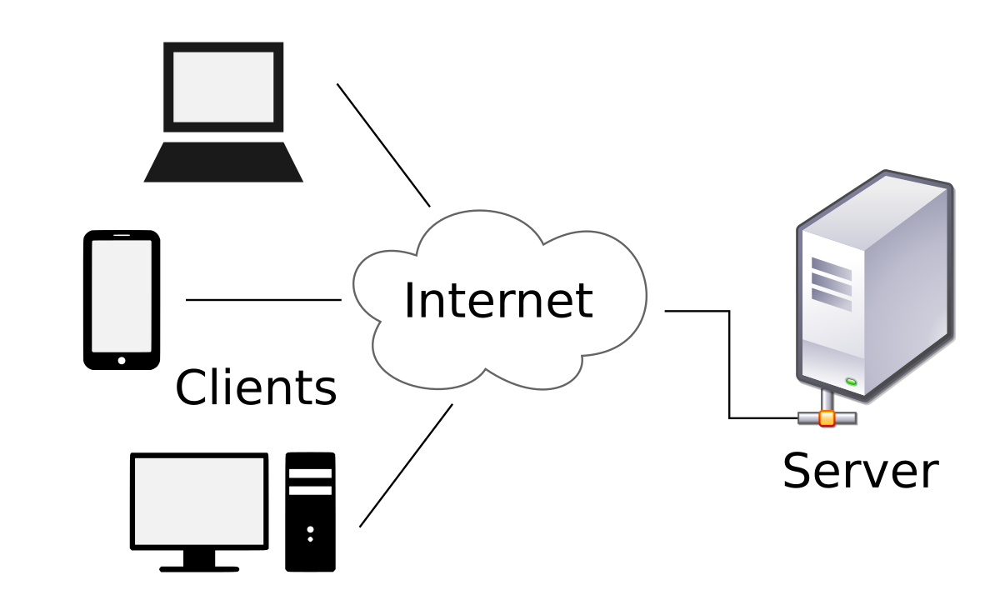

# Client / Server Architecture

A client-server architecture is a networking model in which the server provides services to clients to perform user-based tasks. A client and a server are two pieces of software that might be on the same computer, or two different computers that might be separated by miles but connected by the Internet.

**Server** - A server is software designed to process requests and deliver responses to another computer over the internet.

**Client** - A client is a program that runs on a local machine requesting service from the server.

  

A Client and a Server establish a connection according to a set of rules called a protocol. There are quite a few protocols for different purposes, but one of the most popular is the **HTTP protocol**. Once the connection is established, the Client sends **HTTP Requests** to the server in the form of XML or JSON, which both entities (Client and Server) understand. After parsing the request, the Server responds with appropriate data by sending back an **HTTP Response**.

### Types of Client-Server Architecture

**2 tier architecture** - The user interface stored at the client machine and the database stored on the server. If Business Logic & Data Logic collected at a client-side, then it is known as a *fat client thin server architecture*. If Business Logic & Data Logic handled on the server, then it is known as a *thin client fat server architecture*. 2 tier architecture has some limitations in performance, security, and portability.

**3 tier architecture** - Three-tier architecture has a middleware between the user interface and database. The 3 tiers are named the presentation tier, application tier, and data tier. The presentation tier is the front end layer and consists of the user interface. The application tier contains the functional business logic which drives an application’s core capabilities. The data tier consists of a database system and the data access layer.

**n-tier architecture** - In n-tier architecture, there are multiple Business Logic & Data Logic layers. It increases the flexibility and reusability of applications but can be difficult to implement.
