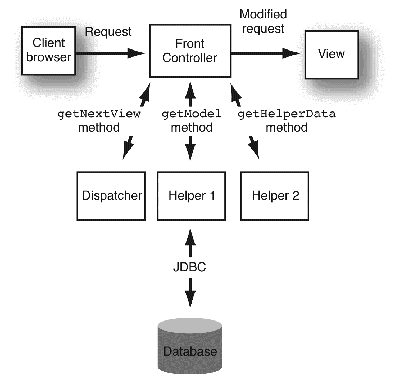

## Front Controller Design Pattern

The front controller design pattern provides a **single handler** for all the incoming requests for a resource in an application, and then **dispatches** the requests to the appropriate secondary handler for that type of request. The front controller may use other **helper** APIs to achieve the dispatching mechanism.





**Front Controller** - The Front controller is a single entry point for all requests, and routes incoming user requests.  It delegates to a dispatcher to perform action and view management.

**Dispatcher**  -  A dispatcher is responsible for the action and view management, including locating and routing to the specific actions that will service a request, and finding the appropriate view.

**Helper** - We use Helper classes to break out specific features and make the application easier to build and maintain.  They can be used for the retrieval of content, validation of user-entered information, processing of business logic, and data processing.

**View** - A view represents and displays information to the client - think an HTML/CSS/JS page. The view retrieves information from model objects. These model objects can be passed to the view from a Front Controller servlet through a request attribute, or by placement in the web application's session data.

The **benefits** of using the front controller design pattern:
* It provides centralized control for all requests, which helps for user tracking and security.
* It improves manageability, reusability, and role separation.

**The Program flow of a Front Controller within a Web Application is as follows:** The Front Controller uses the Dispatcher to delegate and identify which Helper can process the request and return the correct View. 

### Example

We will create a basic web application that allows a Customer to login to a basic <code>login.html</code> page.

The Web Application will have several packages to store our Models, Views, and Controllers.

1. Create a <code>Customer.java</code> class in a package called <code>com.revature.model</code>

```java
package com.revature.model;

/* Main Customer POJO (bean) needed for example */
public class Customer {
	private int id;
	private String firstName;
	private String lastName;
	private String username;
	private String password;
	
	public Customer() {
		this.firstName = "";
		this.lastName = "";
		this.username = "";
		this.password = "";
	}

	public Customer(int id) {
		this();
		this.id = id;
	}
	
	public Customer(String username, String password) {
		this();
		this.username = username;
		this.password = password;
	}
	
	public Customer(int id, String firstName, String lastName, String username, String password) {
		this.id = id;
		this.firstName = firstName;
		this.lastName = lastName;
		this.username = username;
		this.password = password;
	}
    
    // getters & setters and toString() method
}
```
2. Create a **Repository** package <code>com.revature.repository</code> which holds your repositories that follow the Data Access Object (DAO) design pattern.  The DAO separates your business logic from your persitence layer (database).

```java
package com.revature.repository;

import java.util.List;

import com.revature.model.Customer;

/* Contract interface that uses DAO design pattern rules that can be implemented
 * by many types of technologies like JDBC, Hibernate, MongoDB, etc.
 */
public interface CustomerRepository {
	public boolean insert(Customer customer);
	public boolean insertProcedure(Customer customer);
	public Customer select(Customer customer);
	public List<Customer> selectAll();
	public String getCustomerHash(Customer customer);
}
```

3. Create another class which will implement the <code>CustomerRepository</code> interface and establish connection to your database.  Create your ConnectionUtil class in a separate package to follow best practices.

```java
package com.revature.repository;

import java.sql.CallableStatement;
import java.sql.Connection;
import java.sql.PreparedStatement;
import java.sql.ResultSet;
import java.sql.SQLException;
import java.util.ArrayList;
import java.util.List;

import org.apache.log4j.Logger;

import com.revature.model.Customer;
import com.revature.util.ConnectionUtil;

/* JDBC implementation for DAO contract for Customers data access */
public class CustomerRepositoryJdbc implements CustomerRepository {
	
	private static Logger logger = Logger.getLogger(CustomerRepositoryJdbc.class);
	
	/*Singleton transformation of JDBC implementation object */
	private static CustomerRepository customerRepository;
	
	private CustomerRepositoryJdbc() {}
	
	public static CustomerRepository getInstance() {
		if(customerRepository == null) {
			customerRepository = new CustomerRepositoryJdbc();
		}
		
		return customerRepository;
	}
	
	/* Regular insert statement for Customer */
	@Override
	public boolean insert(Customer customer) {
		try(Connection connection = ConnectionUtil.getConnection()) {
			int statementIndex = 0;
			String command = "INSERT INTO CUSTOMER VALUES(NULL,?,?,?,?)";

			PreparedStatement statement = connection.prepareStatement(command);

			//Set attributes to be inserted
			statement.setString(++statementIndex, customer.getFirstName().toUpperCase());
			statement.setString(++statementIndex, customer.getLastName().toUpperCase());
			statement.setString(++statementIndex, customer.getUsername().toLowerCase());
			statement.setString(++statementIndex, customer.getPassword());

			if(statement.executeUpdate() > 0) {
				return true;
			}
		} catch (SQLException e) {
			logger.warn("Exception creating a new customer", e);
		}
		return false;
	}

	/* Insert a customer using the stored procedure we created */
	@Override
	public boolean insertProcedure(Customer customer) {
		try(Connection connection = ConnectionUtil.getConnection()) {
			int statementIndex = 0;
			
			//Pay attention to this syntax
			String command = "{CALL INSERT_CUSTOMER(?,?,?,?)}";
			
			//Notice the CallableStatement
			CallableStatement statement = connection.prepareCall(command);
			
			//Set attributes to be inserted
			statement.setString(++statementIndex, customer.getFirstName().toUpperCase());
			statement.setString(++statementIndex, customer.getLastName().toUpperCase());
			statement.setString(++statementIndex, customer.getUsername().toLowerCase());
			statement.setString(++statementIndex, customer.getPassword());
			
			if(statement.executeUpdate() > 0) {
				return true;
			}
		} catch (SQLException e) {
			logger.warn("Exception creating a new customer with stored procedure", e);
		}
		return false;
	}

	/* Select Customer based on his username */
	@Override
	public Customer select(Customer customer) {
		try(Connection connection = ConnectionUtil.getConnection()) {
			int statementIndex = 0;
			String command = "SELECT * FROM CUSTOMER WHERE C_USERNAME = ?";
			PreparedStatement statement = connection.prepareStatement(command);
			statement.setString(++statementIndex, customer.getUsername());
			ResultSet result = statement.executeQuery();

			while(result.next()) {
				return new Customer(
						result.getInt("C_ID"),
						result.getString("C_FIRST_NAME"),
						result.getString("C_LAST_NAME"),
						result.getString("C_USERNAME"),
						result.getString("C_PASSWORD")
						);
			}
		} catch (SQLException e) {
			logger.warn("Exception selecting a customer", e);
		}
		return new Customer();
	}

	/* Select all customers */
	public List<Customer> selectAll() {
		try(Connection connection = ConnectionUtil.getConnection()) {
			String command = "SELECT * FROM CUSTOMER";
			PreparedStatement statement = connection.prepareStatement(command);
			ResultSet result = statement.executeQuery();

			List<Customer> customerList = new ArrayList<>();
			while(result.next()) {
				customerList.add(new Customer(
						result.getInt("C_ID"),
						result.getString("C_FIRST_NAME"),
						result.getString("C_LAST_NAME"),
						result.getString("C_USERNAME"),
						result.getString("C_PASSWORD")
						));
			}

			return customerList;
		} catch (SQLException e) {
			logger.warn("Exception selecting all customers", e);
		} 
		return new ArrayList<>();
	}

	/* Get a customer hash consuming the user defined function we created */
	@Override
	public String getCustomerHash(Customer customer) {
		try(Connection connection = ConnectionUtil.getConnection()) {
			int statementIndex = 0;
			String command = "SELECT GET_CUSTOMER_HASH(?,?) AS HASH FROM DUAL";
			PreparedStatement statement = connection.prepareStatement(command);
			statement.setString(++statementIndex, customer.getUsername());
			statement.setString(++statementIndex, customer.getPassword());
			ResultSet result = statement.executeQuery();

			if(result.next()) {
				return result.getString("HASH");
			}
		} catch (SQLException e) {
			logger.warn("Exception getting customer hash", e);
		} 
		return new String();
	}
}
```

4. Your <code>ConnectionUtil.java</code> class will look like this:

```java
package com.revature.util;

import java.sql.Connection;
import java.sql.DriverManager;
import java.sql.SQLException;

import org.apache.log4j.Logger;

/* Final utility class to obtain connections in a modular way */
public final class ConnectionUtil {

	private static Logger logger = Logger.getLogger(ConnectionUtil.class);

	/* Make Tomcat now which database driver to use */
	static {
		try {
			Class.forName("oracle.jdbc.driver.OracleDriver");
		} catch (ClassNotFoundException e) {
			logger.warn("Exception thrown adding oracle driver.", e);
		}
	}

	/* Get connection to JDBC */
	public static Connection getConnection() throws SQLException {
		String url = "jdbc:oracle:thin:@myrevaturerds.cgmoq4yzdcov.us-east-1.rds.amazonaws.com:1521:ORCL";
		String username = "LOGIN_TEST_DB";
		String password = "p4ssw0rd";

		return DriverManager.getConnection(url, username, password);
	}
}
```


5. Create a **Service** layer between the controller and the model. Start with a <code>com.revature.service</code> package, and create an Interface called <code>CustomerService.java</code>.   

This allows us to encapsulate all of the business logic that could be in the controller.  This way, the only purpose of the controller is to forward and control the execution.

```java
package com.revature.service;

import java.util.List;

import com.revature.model.Customer;

public interface CustomerService {
	
	public boolean registerCustomer(Customer customer);
	
	public boolean registerCustomerSecure(Customer customer);
	
	public List<Customer> listAllCustomers();
	
	public Customer authenticate(Customer customer);
}
```


6. Create an implementation of your <code>CustomerService.java</code> Interface in a class called <code>CustomerServiceAlpha</code>.

```java
package com.revature.service;

import java.util.List;

import com.revature.model.Customer;
import com.revature.repository.CustomerRepositoryJdbc;

public class CustomerServiceAlpha implements CustomerService {

	/* Singleton */
	private static CustomerService customerService = new CustomerServiceAlpha();
	
	private CustomerServiceAlpha() { }
	
	public static CustomerService getInstance() {
		return customerService;
	}
	
	@Override
	public boolean registerCustomer(Customer customer) {
		return CustomerRepositoryJdbc.getInstance().insert(customer);
	}

	@Override
	public boolean registerCustomerSecure(Customer customer) {
		return CustomerRepositoryJdbc.getInstance().insertProcedure(customer);
	}

	@Override
	public List<Customer> listAllCustomers() {
		return CustomerRepositoryJdbc.getInstance().selectAll();
	}

	@Override
	public Customer authenticate(Customer customer) {
		//Information on the database
		Customer loggedCustomer = CustomerRepositoryJdbc.getInstance().select(customer);
		
		/*
		 * What we have stored in the database is the Username + Password hash.
		 * We can't compare the blank password provided by the user, against the hash.
		 * So we have to obtain the hash of the user input.
		 * 
		 * If the hashes are the same, user is authenticated.
		 */
		if(loggedCustomer.getPassword().equals(CustomerRepositoryJdbc.getInstance().getCustomerHash(customer))) {
			return loggedCustomer;
		}
		
		return null;
	}
}
```

7. Before we create a **Controller** Layer, let's create a package called <code>com.revature.ajax</code> which will hold the a <code>ClientMessage.java</code> that a controller could instantiate and return to the Client.


```java
package com.revature.ajax;

public class ClientMessage {
	private String message;
	
	public ClientMessage() {}
	
	public ClientMessage(String message) {
		this.message = message;
	}

	public String getMessage() {
		return message;
	}

	public void setMessage(String message) {
		this.message = message;
	}
}
```


8.  Next, create your **Controller** layer in a package called <code>com.revature.controller</code>. This will be an interface called <code>CustomerController.java</code> which we will implement later in another controller.

```java
package com.revature.controller;

import javax.servlet.http.HttpServletRequest;

public interface CustomerController {
	
	/**
	 * Registers the user.
	 * 
	 * -> If the method is GET, return the registration view.
	 * -> Else, return a message stating that registration was successful, or not.
	 */
	public Object register(HttpServletRequest request);
	
	/**
	 * Get all customers in the database.
	 * 
	 * -> If it's GET with no parameters, then we return the view.
	 * -> If it's GET with a paramter, then we return the list of users.
	 */
	public Object getAllCustomers(HttpServletRequest request);
}
```


9. Create another controller called <code>CustomerControllerAlpha</code> which implements the <code>CustomerController</code> interface we just creataed.

```java
package com.revature.controller;

import javax.servlet.http.HttpServletRequest;

import com.revature.ajax.ClientMessage;
import com.revature.model.Customer;
import com.revature.service.CustomerServiceAlpha;

public class CustomerControllerAlpha implements CustomerController {

	private static CustomerController customerController = new CustomerControllerAlpha();
	
	private CustomerControllerAlpha() {}
	
	public static CustomerController getInstance() {
		return customerController;
	}
	
	@Override
	public Object register(HttpServletRequest request) {
		if (request.getMethod().equals("GET")) {
			return "register.html";
		}

		/* Logic for POST */
		Customer customer = new Customer(0, request.getParameter("firstName"), request.getParameter("lastName"),
				request.getParameter("username"), request.getParameter("password"));

		if (CustomerServiceAlpha.getInstance().registerCustomerSecure(customer)) {
			return new ClientMessage("REGISTRATION SUCCESSFUL");
		} else {
			return new ClientMessage("SOMETHING WENT WRONG");
		}
	}

	@Override
	public Object getAllCustomers(HttpServletRequest request) {
		Customer loggedCustomer = (Customer) request.getSession().getAttribute("loggedCustomer");
		
		/* If customer is not logged in */
		if(loggedCustomer == null) {
			return "login.html";
		}
		
		/* Client is requesting the view. */
		if(request.getParameter("fetch") == null) {
			return "all-customers.html";
		} else {
		/* Client is requesting the list of customers */
			return CustomerServiceAlpha.getInstance().listAllCustomers();
		}
	}
}
```

10.  Similarly, we will need to create a <code>LoginController.java</code> interface and implementation to handle login requests.

```java
package com.revature.controller;

import javax.servlet.http.HttpServletRequest;

public interface LoginController {

	/**
	 * If the method is GET, it will return the login view.
	 * 
	 * If the method is POST.
	 * -> If service layer returns null, we return a message
	 * stating that authentication failed.
	 * 
	 * -> Else, it will return the Customer information
	 * (and store it in the session).
	 */
	public Object login(HttpServletRequest request);
	
	/**
	 * Invalidates the session and returns the login view.
	 */
	public String logout(HttpServletRequest request);
}
```

11. Create the controller implementation in a class called <code>LoginControllerAlpha</code>.

```java
package com.revature.controller;

import javax.servlet.http.HttpServletRequest;

import com.revature.ajax.ClientMessage;
import com.revature.model.Customer;
import com.revature.service.CustomerServiceAlpha;

public class LoginControllerAlpha implements LoginController {

	private static LoginController loginController = new LoginControllerAlpha();
	
	private LoginControllerAlpha() {}
	
	public static LoginController getInstance() {
		return loginController;
	}
	
	@Override
	public Object login(HttpServletRequest request) {
		if(request.getMethod().equals("GET")) {
			return "login.html";
		}
		
		Customer loggedCustomer = CustomerServiceAlpha.getInstance().authenticate(
					new Customer(request.getParameter("username"),
								 request.getParameter("password"))
				);
		
		/* If authentication failed */
		if(loggedCustomer == null) {
			return new ClientMessage("AUTHENTICATION FAILED");
		}
		
		/* Store the customer information on the session */
		request.getSession().setAttribute("loggedCustomer", loggedCustomer);
		return loggedCustomer;
	}

	@Override
	public String logout(HttpServletRequest request) {
		//throw new RuntimeException("Something went wrong");
		
		/*
		 * If session.invalidate() doesn't work for you
		 */
		
		request.getSession().invalidate();
		return "login.html";
	}
}
```

12. Create your **Dispatchers** to delegate to particular controllers. This acts as a **Front Controller**.  These are **Servlets** that redirect the user with the help of the logic incorporated in your controllers.

First create a <code>RequestHelper.java</code> class which will delegate to your DispatcherServlet (which we will create next).

```java
package com.revature.request;

import javax.servlet.http.HttpServletRequest;

import com.revature.controller.CustomerControllerAlpha;
import com.revature.controller.LoginControllerAlpha;

public class RequestHelper {
	
	private RequestHelper() {}
	
	public static Object process(HttpServletRequest request) {
		switch(request.getRequestURI()) {
		case "/FrontController/login.do":
			return LoginControllerAlpha.getInstance().login(request);
		case "/FrontController/logout.do":
			return LoginControllerAlpha.getInstance().logout(request);
		case "/FrontController/register.do":
			return CustomerControllerAlpha.getInstance().register(request);
		case "/FrontController/getAll.do":
			return CustomerControllerAlpha.getInstance().getAllCustomers(request);
		default:
			return "not-implemented.html";
		}
	}
}
```

13.  Then create your <code>DispatcherServlet</code>.

```java
package com.revature.request;

import java.io.IOException;

import javax.servlet.ServletException;
import javax.servlet.http.HttpServlet;
import javax.servlet.http.HttpServletRequest;
import javax.servlet.http.HttpServletResponse;

import com.fasterxml.jackson.databind.ObjectMapper;

public class DispatcherServlet extends HttpServlet {
	
	private static final long serialVersionUID = 5244611926643604805L;

	protected void doGet(HttpServletRequest request, HttpServletResponse response) throws ServletException, IOException {
		Object data = RequestHelper.process(request);
		
		/* If what the controllers return is a String, we forward to an HTML file. */
		if(data instanceof String) {
			String URI = (String) data;
			request.getRequestDispatcher(URI).forward(request, response);
		}
		/* Else, we marshall the given POJO */
		else {
			response.getWriter().write(new ObjectMapper().writeValueAsString(data));
		}
	}
	
	protected void doPost(HttpServletRequest request, HttpServletResponse response) throws ServletException, IOException {
		doGet(request, response);
	}
}
```

14. In your **web.xml**, you can also map to error pages.  It will look like this:

```xml
<?xml version="1.0" encoding="UTF-8"?>
<web-app xmlns:xsi="http://www.w3.org/2001/XMLSchema-instance" xmlns="http://java.sun.com/xml/ns/javaee" xsi:schemaLocation="http://java.sun.com/xml/ns/javaee http://java.sun.com/xml/ns/javaee/web-app_2_5.xsd" version="2.5">
  <display-name>FrontController</display-name>
  
  <welcome-file-list>
  	<welcome-file>login.html</welcome-file>
  </welcome-file-list>
  
  <servlet>
  	<servlet-name>DispatcherServlet</servlet-name>
  	<servlet-class>com.revature.request.DispatcherServlet</servlet-class>
  </servlet>
  
  <servlet-mapping>
  	<servlet-name>DispatcherServlet</servlet-name>
  	<!-- * it's a Wildcard (which means "anything") -->
  	<!-- .something it's called Extended Mapping -->
  	<url-pattern>*.do</url-pattern>
  </servlet-mapping>
  
  <!-- ERROR PAGES -->
  
  <!-- For 500 (Exceptions Thrown) -->
  <error-page>
  	<exception-type>java.lang.Throwable</exception-type>
  	<location>/oops.html</location>
  </error-page>
  
  <!-- For a specific status code -->
  <error-page>
  	<error-code>404</error-code>
  	<location>/404.html</location>
  </error-page>
  
  <!-- Session Objects will expire in 30 minutes -->
  <session-config>
  	<session-timeout>30</session-timeout>
  </session-config>
</web-app>
```

15. You should have a <code>login.html</code>, <code>register.html</code>, <code>all-customers.html</code>, <code>404.html</code>, and an error page titled <code>oops.html</code> for any exceptions (as mapped in our **web.xml** page). 


### References

* [Further Reading on FrontController Design Pattern](https://www.geeksforgeeks.org/front-controller-design-pattern/)


