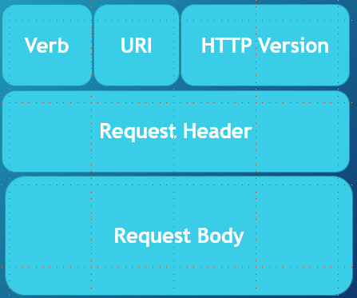

# Intro to HTTP

HTTP, or HyperText Transfer Protocol, is the protocol we use to browse the web. HTTP is a client-server protocol where the client must initiate communication. Every HTTP communication is made up of a client request, and a server response. HTTP is stateless, which means the server should be able to handle each request separately and only with the information provided in the request. The server should not have to maintain any state in order for any individual request to be processed.  
  
## HTTP Messages
### HTTP Request
Each HTTP request is composed of:
 - HTTP Verb - the HTTP method to execute
 - URI - indicates the endpoint used to access the resource
 - HTTP Version - in order to be certain of communication protocol
 - Request Header - Metadata (info) about the request represented as key-value pairs
 - Request Body - message content (resource representation in REST)

  

  
  
### HTTP Response  
Each HTTP response is composed of:
 - HTTP Response Code - code indicating the status of the request
 - HTTP Version - in order to be certain of communication protocol
 - Response Header - Metadata (info) about the response represented as key-value pairs
 - Response Body - message content (resource representation in REST)

  

  
  
## HTTP Verbs
Each HTTP request includes a verb, which describes the type of request and how it should be processed. Requests have certain characteristics. Each may or may not be:
 - Idempotent - if the same operation is repeated, the same output is produced
 - Safe - read-only, will not alter the server/resource state
 - Cacheable - response to this request can be cached
 - HTML form allowed - only some verbs are allowed as a method attribute in an HTML form
 - Has request body - the request can contain content in the request body
 - Has response body - a successful response should contain content in the response body
  
  
  
### GET
Used to retrieve data.
 - Idempotent
 - Safe
 - Cacheable
 - Form allowed
 - No request body
 - Has response body
  
  
  
### HEAD
Basically identical to GET, except the response should not include a body. Info from server will be in response header. Can also be used to test an endpoint before requesting a large payload.
 - Idempotent
 - Safe
 - Cacheable
 - Not form allowed
 - No request body
 - No response body
  
  
  
### POST
Sends data to he server. Commonly used for creation of and updating resources. Response body generally contains the updated resource representation.
 - Not idempotent
 - Not safe
 - Typically not cacheable
 - Form allowed
 - Has request body
 - Has response body
  
  
  
### PUT
Sends data to server. Commonly used to replace current resource representation with the content contained in this request.
 - Idempotent
 - Not safe
 - Not cacheable
 - Not form allowed
 - Has request body
 - No response body
  
  
  
### PATCH
Sends data to the server. Similar to PUT but may not contain complete resource representation. May only include information needed to update some part of the current resource state.
 - Idempotent
 - Not safe
 - Not cacheable
 - Not form allowed
 - Has request body
 - Has response body
  
  
  
### DELETE
Used to delete a resource. 
 - Idempotent
 - Not safe
 - Not cacheable
 - Not form allowed
 - May have request body
 - May have response body
  
  
  
### CONNECT
Initiates a "tunnel" - bi-directional communication with the resource.
 - Not idempotent
 - Not safe
 - Not cacheable
 - Not form allowed
 - No request body
 - Has response body
  
  
  
### OPTIONS
Get options for communication with a specific resource.
 - Idempotent
 - Safe
 - Not cacheable
 - Not form allowed
 - No request body
 - Has response body
  
  
  
### TRACE
Loop-back test between client and resource. Useful tool for debugging.
 - Idempotent
 - Safe
 - Not cacheable
 - Not form allowed
 - No request body
 - Has response body
  
  
## HTTP Status Codes
As part of every response, the server gives a status code that describes the status of the request.  
  
### 100 - Informational
 - 100 - Continue
 - 102 - Processing

### 200 - Success
 - 200 - OK
 - 202 - Accepted
 - 203 - Created  
  
### 300 - Redirect
 - 301 - Moved Permenantly
 - 303 - See Other
 - 304 - Not Modified  
  
### 400 - Client Error
 - 401 - Unauthorized
 - 403 - Forbidden
 - 404 - Not Found  
  
### 500 - Server Error
 - 500 - Internal Server Error
 - 502 - Bad Gateway
 - 503 - Service Unavailable
