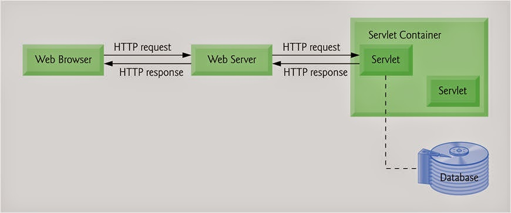
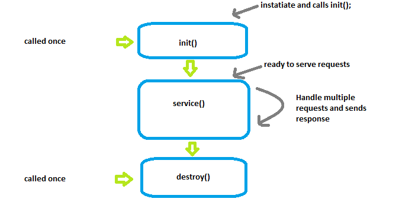

# Servlets

## Servlet API

The [Servlet API](https://docs.oracle.com/javaee/6/api/javax/servlet/package-tree.html) provides interfaces and classes that are required to build servlets. These interfaces and classes represented in  two packages:

1. **`java.servlet`** package -  used by the servlet or web container.
2. **`javax.servlet.http`** package - used for handling http requests.

## Servlet Class Hierarchy:

The Servlet interface is the root interface of the servlet class hierarchy. The GenericServlet class implements Servlet, ServletConfig, and Serializable interfaces. The HttpServlet class extends the GenericServlet class and implements the Serializable interface. It provides HTTP methods such as doGet, doPost, doHead, doTrace, etc.

Java Servlet Class Hiearchy:
```

   Servlet    ServletConfig       Serializable                    {Built-in Interfaces}
     |             |                   |
     -----------------------------------
                    |
                    V
              GenericServlet                                       {Built-in Class}
                    |
                    V
               HttpServlet                                         {Built-in Class}
                    |
                    V
             UserDefinedServlet                                     {User defined servlet Class}        

```

The user defined servlet class is created by implementing the *Servlet* interface, usually by extending the *GenericServlet* class or (more commonly) the *HttpServlet* class.

In order to initialize a Servlet, a server application loads the user-defined servlet class and creates an instance. Then it calls the Servlet’s `init (ServletConfig config)` method. Since the `init()` method is run once, it stores the initial parameters or configuration information in the *ServletConfig*  object. This information can be retrieved later by calling the Servlet’s `getServletConfig()` method. This is implemented in the *GenericServlet* class definition. The *ServletConfig* object contains Servlet parameters and a reference to the Servlet’s *ServletContext*. The **ServletContext** is an interface which helps to communicate with other servlets. Then, the `service (ServletRequest request, ServletResponse response)` method is called for every request to the Servlet. When the Servlet needs to be unloaded the `destroy()` method is called. 
 


A website can consist of both static and dynamic webpages. A static webpage is a pre-built HTML page with the content explicitly written into the code, and stored in the webserver. Static web pages display the same content each time we visit. A dynamic webpage loads dynamic content *such as stock prices, weather information, news, and sports updates* at different points of time.  In Java, there exists a way to generate static webpages with dynamic data, and that's with **Java Servlets**.

A **Servlet** is a Java class that takes incoming requests, processes them, and generates a response to send back to the user. For example, an `HttpServlet` takes an HTTP request, processes its headers and content, and uses that information to write HTML, CSS, and JavaScript code into an HTTP response that can be sent back to the user's browser. The **Servlet container** is the component of an **application server** that interacts with Java servlets and is responsible for managing the execution of servlets and JSP pages for Java applications.

```
User  -->  HTTP Request  -->   Application Server  -->  Servlet Container  
                                                               |
                                                               V   
User  <--  HTTP Response  <--  Application Server    <--   Servlet(s)  
``` 

## How do servlets work?

When a client sends a request to the application server, the application server receives and passes the request to the appropriate servlet. The servlet processes the request, generates the response, and sends the response back to the application server.  The application server sends the response back to the client. Most servlets are HTTPServlets, which receive HTTP requests and generate HTTP Responses out of HTML, CSS, and JavaScript code. 

<div align="center">  </div>


### Life Cycle of a Servlet


A **servlet container** manages the life cycle of a servlet. [Servlet](https://docs.oracle.com/javaee/1.4/api/javax/servlet/Servlet.html) is an interface defined in **`javax.servlet`** package. A servlet container uses the Servlet interface to understand a specific Servlet object and manage it.

There are three life cycle methods of a Servlet :
* `init()`
* `service()`
* `destroy()`


The steps involved in the servlet life cycle are listed below:

**Step-1 : Loading of Servlet**  

When the application server (e.g. Apache Tomcat) starts up, the servlet container deploys and loads all the servlet classes.

**Step-2 : Creating an instance of Servlet** 

Once all the Servlet classes are loaded, the servlet container creates only one instance for each servlet class. All requests to the servlet are executed on that same servlet instance. Some application servers can create multiple instances of a servlet to handle a high volume of incoming requests, but that is not the default behavior.

**Step-3 : Invoke `init()` method once**

Once all the servlet classes are instantiated, the init() method is invoked for each instantiated servlet. The `init()` method is used to initialize the servlet. The `init()` method is called only once. 


**The `init()` method signature:** 
```java
public void init() throws ServletException {
}
```

**Step-4 : Invoke `service()` method repeatedly for each client request** 

The servlet container calls the service method each time a request for the servlet is received. The service() method determines the type of Http request (GET, POST, PUT, DELETE, etc.) also calls `doGet()`, `doPost()`, `doPut()`, `doDelete()`, etc. methods as appropriate. 

**The `service()` method signature:** 
```java
public void service(ServletRequest req, ServletResponse resp) throws ServletException, IOException { 
}
```

**Step-5 : Invoke destroy() method once**

The `destroy()` method is called only once at the end of the a servlet's life. The servlet container calls this method before removing the servlet instance from the service.

**The `destroy()` method signature:** 
```java
public void destroy() {
}
```


**Life Cycle of a Servlet:**




### References

* [Java Servlet Technology Overview](https://www.oracle.com/java/technologies/servlet-technology.html)
* [Introduction to Servlets](https://www.edureka.co/blog/java-servlets) - [Video Tutorial](https://youtu.be/ewiOaDitBBw)
* [Servlet Documentation - Oracle](https://javaee.github.io/servlet-spec/downloads/servlet-3.1/Final/servlet-3_1-final.pdf)
