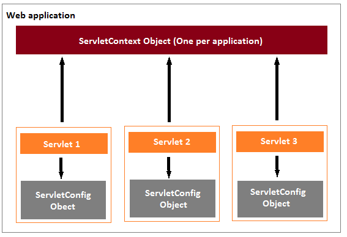

# Servlet Config

## Deployment descriptor

Java web applications use a **deployment descriptor file** to define the URLs that map to servlets, and to determine which URLs require authentication and additional information.

A deployment descriptor file specifies the classes, resources, and configuration of the application and how the web server uses them to serve HTTP requests. 

The deployment descriptor is a file named **web.xml**. It resides within the app's WAR beneath the WEB-INF/ directory.The root element of the web.xml file is `<web-app>`.

The **web.xml** file defines mappings between URL paths and the servlets that will handle requests with those paths. The application server uses this configuration to find the servlet that handles a given request, and calls the servlet method that corresponds to the HTTP request method used. 

To map a URL to a servlet, you declare the servlet with the `<servlet>` element, then define a mapping from a URL path to a servlet declaration with the `<servlet-mapping>` element.

To configure a servlet in the Deployment Descriptor (web.xml) file,
1. Configure the servlet using the `<servlet>` element. 
2. Map the servlet to a URL or URL pattern using the `<servlet-mapping>` element.


The `<servlet>` element is used to declare the servlet name, the fully-qualified class name of the servlet, and any initialization parameters. The name for every servlet must be unique across the deployment descriptor.

The `<servlet-mapping>` element is used to specify a URL pattern, and the name of the servlet which handles requests whose URL matches the given pattern. The URL pattern uses an asterisk (*) at the beginning or end of the pattern to indicate zero or more of any character. 


**Example:** A simple *web.xml* file which has `<servlet>` and `<servlet-mapping>` for *servlet1*. 
```xml
<web-app xmlns="http://xmlns.jcp.org/xml/ns/javaee"
         xmlns:xsi="http://www.w3.org/2001/XMLSchema-instance"
         xsi:schemaLocation="http://xmlns.jcp.org/xml/ns/javaee
         http://xmlns.jcp.org/xml/ns/javaee/web-app_3_1.xsd"
         version="3.1">
    <servlet>
        <servlet-name>servlet1</servlet-name>
        <servlet-class>com.revature.MyFirstServlet</servlet-class>
    </servlet>
    <servlet-mapping>
        <servlet-name>servlet1</servlet-name>
        <url-pattern>/*</url-pattern>
    </servlet-mapping>
</web-app>
```


### ServletConfig 

ServletConfig is an object created by the Servlet Container, used to pass initial parameters or configuration information to a particular servlet during initialization.  The `<servlet>` XML element in the deployment descriptor (web.xml) has a subelement called `<init-param> ` used to pass parameters to a servlet from the web.xml file. The ServletConfig object is returned by the `getServletConfig()` method of HttpServlet, and so the XML properties added to ServletConfig are only shared with the single servlet indicated.


### ServletContext

ServletContext is the object created by the Servlet Container to share initial parameters or configuration information to *all* servlets and other components. The `<context-param>` element used to declare the parameters of ServletContext. It present outside the `<servlet>` element and inside the `<web-app>` element. This object is returned by the `getServletContext()` method of HttpServlet.

The `<param-name>` and `<param-value>` used to declare the parameter name and its value. 


**ServletConfig vs ServletContext**




### Example

Here '**message**' parameter can be accessed only by *servlet1*. The '**username**' and '**password**' parameters can be accessed by both *servlet1* and *servlet2*.

```xml
<web-app xmlns="http://xmlns.jcp.org/xml/ns/javaee"
         xmlns:xsi="http://www.w3.org/2001/XMLSchema-instance"
         xsi:schemaLocation="http://xmlns.jcp.org/xml/ns/javaee
         http://xmlns.jcp.org/xml/ns/javaee/web-app_3_1.xsd"
         version="3.1">

	<servlet>
		<servlet-name>servlet1</servlet-name>
		<servlet-class>com.revature.MyFirstServlet</servlet-class>
		<init-param>
			<param-name>message</param-name>
			<param-value>Hello World</param-value>
		</init-param>
	</servlet>
	<servlet-mapping>
			<servlet-name>servlet1</servlet-name>
			<url-pattern>/FirstServlet</url-pattern>
	</servlet-mapping>

	<servlet>
			<servlet-name>servlet2</servlet-name>
			<servlet-class>com.revature.MySecondServlet</servlet-class>
	</servlet>
	<servlet-mapping>
			<servlet-name>servlet2</servlet-name>
			<url-pattern>/secondServlet</url-pattern>
	</servlet-mapping>

	<context-param>  
		<param-name>username</param-name>  
		<param-value>system</param-value>  
	</context-param>  
	  
	<context-param>  
		<param-name>password</param-name>  
		<param-value>pass123</param-value>  
	</context-param>  

</web-app>
```
