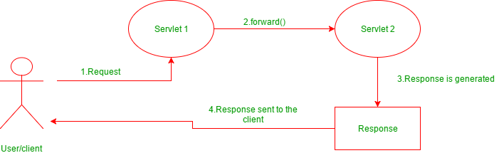

## Request Dispatcher

The Request Dispatcher interface defines an object that passes along the client's request to any other resources (servlet, JSP file, or HTML file) on the server. 

The servlet container creates the RequestDispatcher object. The `getRequestDispatcher(String)` method of the **ServletRequest** interface returns the Request Dispatcher object.

[RequestDispatcher interface](https://docs.oracle.com/javaee/7/api/javax/servlet/RequestDispatcher.html) defined in the *javax.servlet* package provides two methods:

### 1. forward(ServletRequest request, ServletResponse response)

<code>forward()</code> passes a request from one servlet to another resource on the server. The contents of the request and response are preserved and forwarded to the next resource which will process the data and return the response to the client.




**Example for forward() method:**
``` java
//"request" is a HttpServletRequest Object and "Welcome.html" is a resoure name
RequestDispatcher rd = request.getRequestDispatcher("Welcome.html");

//forward the request and response to "Welcome.html" page
rd.forward(request,response);
```


### 2. include(ServletRequest request, ServletResponse response)

<code>include()</code> does not entirely transfer control over the request and reponse object to the next resource.  Instead, this method *includes* the content of the original resource in the reponse returned to the client. 
If you <code>include()</code> a servlet or JSP document, the included resource may not change the response code or HTTP headers.


**Example for include() method:**
```java
//"request" is a HttpServletRequest Object and "hello.html" is a resoure name
RequestDispatcher rd = request.getRequestDispatcher("hello.html");

//includes the response of "hello.html" page in current servlet response
rd.include(request,response);
```

### References

* [RequestDispatcher Documentation](https://docs.oracle.com/javaee/7/api/javax/servlet/RequestDispatcher.html)


## Writing plain text to the response Object

The Servlet API provides *HttpServletResponse* interface which extends the *ServletResponse* interface to assist in sending a response to the client.

The Servlet Container informs the client browser about the type of data in the response before sending it. The Servlet container uses the` setContentType()` method to set the type of data in the response object. The response data can be in simple plain text format, HTML format, XML format, an image format, etc. 

The `setContentType(String type)` method **sets the content type** of the response being sent to the client before sending the response. The`response.getWriter()` method returns a **PrintWriter** object, which sends character text to the client. 

**Example:**

```java
public class HelloWorld extends HttpServlet { 

    public void doGet(HttpServletRequest req,HttpServletResponse res) throws ServletException,IOException
       {
    	// set the content type as plain text
    	res.setContentType("text/plain");
            
        PrintWriter out = response.getWriter();
        out.println("Hello World");  // writes a plain text to the response object
     }
}
```


In the above code, the MIME type "*text/plain*" can be broken down as follows: "text" is known as the **type** and "plain" is known as a **subtype**. A type contains many subtypes. Some of the types used in the `setContentType()` method are "*text/html*"  used for writing HTML content to the response object, "*text/css*" for writing CSS content to the response object, etc.


## SendRedirect in servlets

**sendRedirect(String URL)** - This method defined in  **HttpServletResponse** interface and used to redirect a response to another resource. It uses the URL to make another request. Therefore, it works at the client-side also can work inside and outside the server.

The `RequestDispatcher.forward()` method is used to pass the same request to a new destination resource, but the `Response.sendRedirect()` method is used to send an entirely new request for the destination resource. Any request attributes or parameters from the original request are lost.


**Example for sendRedirect():**
```java 
//"response" is a HttpServletRequest Object redirected to the google server.
response.sendRedirect("http://www.google.com");  
```

### Resources

* [ServletResponse Oracle Documentation](https://docs.oracle.com/javaee/7/api/javax/servlet/ServletResponse.html)
* [PrintWriter Oracle Documentation](https://docs.oracle.com/javase/7/docs/api/java/io/PrintWriter.html)
* [HttpResponse Object Examples](http://tutorials.jenkov.com/java-servlets/httpresponse.html)


## Exception and Error Handling

The Servlet API allows us to handle exceptions and errors caused during the execution of a servlet and still send a useful response to the user. The **deployment descriptor** file just needs to be configured to handle the exceptions/errors thrown by a servlet. 

The **`<error-page>`** element used to specify the invocation of servlets in response to certain **exceptions** or **HTTP status codes**. The following elements are used within an `<error-page>` element to handle error or exception:

* `<error-code>` - used to specify a valid HTTP error code. *For example, 404, 403, 500, etc.*
* `<exception-type>` - used to specify a fully-qualified class name of a Java exception type. *For example, `javax.servlet.ServletException,java.io.IOException`, `java.lang.RuntimeException`, etc.*
* `<location>` - used to specify the location of the resource which is displayed to the user in case of an error. *This might be a servlet, an HTML page, a JSP page, or something else.*

**Request Attributes for Errors/Exceptions:**

Before the servlet container invokes the servlet to handle the exception, it sets some attributes in the request to get useful information about the exception. Some of these are:

* javax.servlet.error.status_code
* javax.servlet.error.servlet_name 
* javax.servlet.error.exception 
* javax.servlet.error.request_uri
* javax.servlet.error.exception_type
* javax.servlet.error.message

Note that while these appear to be fully-qualified class names, they are neither packages, classes, nor variables. They are the names of attributes, and are treated as Strings.

### Example 

The web.xml file for mapping an exception to a servlet.

```xml
<error-page>
      <exception-type>java.lang.ArithmeticException</exception-type>
     <location>/errorHandler</location>
</error-page>
```
The Servlet class which throws an exception: 
```java
@WebServlet(name = "testServlet", urlPatterns = {"/test"}, loadOnStartup = 1)
public class TestServlet extends HttpServlet {
  
    protected void doGet (HttpServletRequest request, HttpServletResponse resp)throws ServletException, IOException {

        int i = 1 / 0;
    }
}
```
Here, we use [@WebServlet](https://docs.oracle.com/javaee/7/api/javax/servlet/annotation/WebServlet.html) annotation to declare a servlet.

The servlet class that handles the error caused by the above servlet:

```java
@WebServlet(name = "errorHandlerServlet", urlPatterns = {"/errorHandler"}, loadOnStartup = 1)
public class ErrorHandlerServlet extends HttpServlet {

    @Override
    protected void doGet (HttpServletRequest request, HttpServletResponse response) throws ServletException, IOException {


        PrintWriter out = response.getWriter();

        Exception exception = (Exception) req.getAttribute("javax.servlet.error.exception");

        Class exceptionClass = (Class) req.getAttribute("javax.servlet.error.exception_type");
      
        Integer status_code = (Integer) req.getAttribute("javax.servlet.error.status_code");       

        String errorMessage = (String) req.getAttribute("javax.servlet.error.message");
       
        String requestUri = (String) req.getAttribute("javax.servlet.error.request_uri"

        String servletName = (String) req.getAttribute("javax.servlet.error.servlet_name");
       
	out.println("Exception: " + exception);
	out.println("Exception Type: " + exceptionClass);
	out.println("HttpError Status code: " + status_code);
	out.println("ErrorMessage: " + errorMessage);
	out.println("Request URI: " + requestUri);
	out.println("Servlet Name: " + servletName);
    }

}
```

### References

* [Further Reading on Servlet Exception Handling](https://www.tutorialspoint.com/servlets/servlets-exception-handling.htm#:~:text=If%20the%20web%20application%20throws,explain%20you%20the%20basic%20concept.) 
