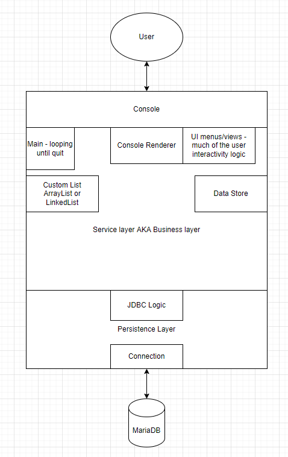

# Project 0

## Description

Your first project should demonstrate your knowledge of the following topics: 
 - Java
 - SQL
 - JDBC
 - Basic Data Structures
 - Basic File I/O

You will be building a console application that persists data in a database with at least 3 tables which adhere to 3rd normal form (3NF). The basic form of this project should be that of a console-based banking app. If you want to mix it up a bit and can come up with a project idea that meets all the same requirements, contact your trainer to discuss and develop user stories. If you decide to go with the bank app, it should implement all of the required user stories listed below.
  
You will be expected to complete the minimum viable product by the deadline and give a brief 5 minute presentation demonstrating your project and answering questions from the QC team.

### Minimum Requirements
1. Basic validation (no negative deposits/withdrawals, malformed emails, names with numbers, etc.)
1. All exceptions are properly caught and handled (for this project printing the stack trace is a fine way to handle these)
1. Proper use of OOP principles
1. Documentation (all classes and methods have basic inline documentation)
1. Use of custom data structures (do not use java.util Collection types! Implement your own List)
1. SQL Data Persistance (at least 2 tables; all 3NF (normal form))

### Bonus Features
1. Unit tests for service-layer classes
1. Logging messages and exceptions to a file

## Banking App User Stories
These are user stories to describe the banking app. If you are not building the banking app for your project, you will need to discuss with your trainer to establish proper user stories.

### Minimum Viable Product
* As a user, I can register for an account.
* As a user, I can login to my account.
* As a user, I can create one or more bank accounts.
* As a user, I can deposit funds into my account(s).
* As a user, I can withdraw funds from my account(s).
* As a user, I can display all of my accounts in a list which includes current balance.
* All monetary amounts should be displayed in a proper currency format ($1,234.56).

### Bonus Stories
 - As a user, I can view the transaction history for an account.
 - As a user, I can share an account with another user.
 - As a user, I can transfer funds between accounts.

## Tech Stack
You should be employing the following technologies in your project.
 - Java 8
 - Apache Maven
 - MariaDB deployed on AWS RDS

## High-level Visualization of Possible P0 Structure

## Deadline & Presentation
 - Finalized version of your project must be pushed to your repository within the training originzation by 9:00 AM Central time on the date of the presentation showcase. Commits after that time will not be considered. The most recent commit submitted before that time will be the version of the project that is graded.
   - Presentation Showcase (Due Date): Thursday, January 27th 2022, 9:00 AM CST.
 - You will give a brief (<=5 minute) presentation of your project. Be prepared to answer questions about your work from the QC team.
 - Your work **MUST BE YOUR OWN**. Collaboration is allowed and encouraged, but at the end of the project you must have an excellent understanding of every line of code in your project and be able to answer questions about any part of it.
